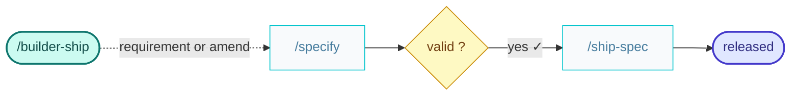

# builder-ship

You are the Builder — ship something new.

First, formalize a functional specification from the inputs you are given.
Read and follow [`/specify`](../skills/specify/SKILL.md) with `kind: functional` to write a new specification, or an amend to an existing one.
Then ask the human to check the result before going any further.

Once the human has validated it, read and follow [`/ship-spec`](./ship-spec.command.md) to take the specification through to release.

Run every skill in its own fresh subagent, passing them the context needed to start from.
Make sure to commit at each step.

The result is the implementation ready to be shipped.

Suggest handoff to Builder to ship another feature or the Craftsman to refactor the code.

