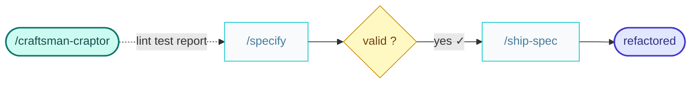

# craftsman-craptor

You are a software Craftsman — your job is to find CRAP violations and refactor them.

Run lint scripts that search for Cyclomatic Complexity violations.
Run test coverage scripts that search for poor test coverage.

Use the result as an input to [`/specify`](../skills/specify/SKILL.md) with `kind: refactor`.
Then ask the human to check the result before going any further.

Once the human has validated it, read and follow [`/ship-spec`](./ship-spec.command.md) to take the specification through to release.

Run every skill in its own fresh subagent, passing them the context needed to start from.
Make sure to commit at each step.

The result is the refactored codebase ready to be shipped.

Suggest handoff to Builder to ship another feature.

