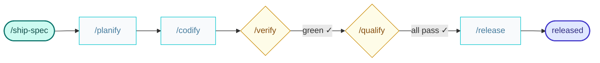

# ship-spec

Shared workflows used by Builder and Craftsman — ships an already-validated specification.

Take a specification all the way to release without changing its content.

Start by reading and following [`/planify`](../skills/planify/SKILL.md), once per affected container plus one more run for `e2e` suite.

Read and follow [`/codify`](../skills/codify/SKILL.md) to write the code of each plan.

Then read and follow [`/verify`](../skills/verify/SKILL.md) to run the e2e and acceptance tests.
If there are defects, go back to [`/codify`](../skills/codify/SKILL.md) with the report in hand.

Once the tests are green, read and follow [`/qualify`](../skills/qualify/SKILL.md) to grade the quality of the code.
If a gate fails, go back to [`/codify`](../skills/codify/SKILL.md) with the report in hand.

Run every skill in its own fresh subagent, passing them the context needed to start from.

After code has been verified and qualified, read and follow [`/release`](../skills/release/SKILL.md) to publish the specification.

