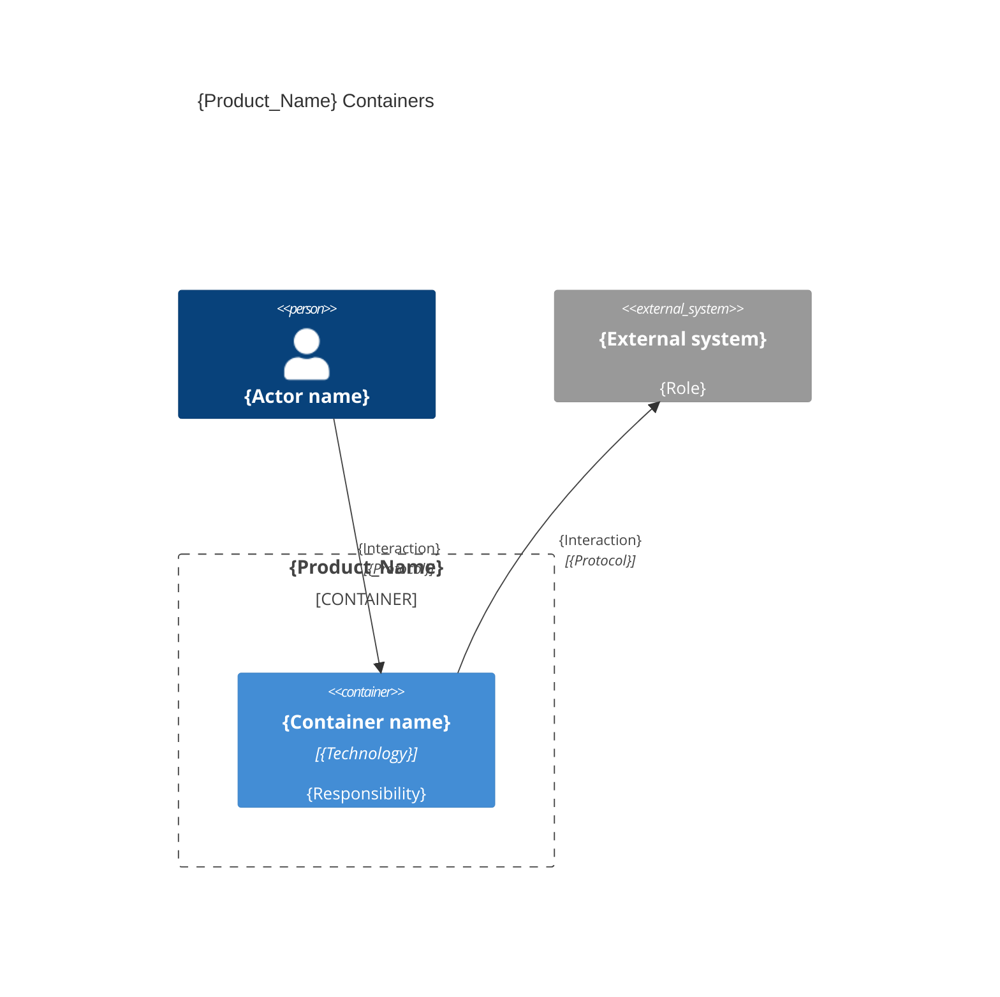

# Agents Instructions

- [SOUL.md](./SOUL.md) captures your personality and boundaries.

## Conventions

- Replace `{placeholders}` when using templates.
- `{slug}`: a short (≤20 chars), readable identifier derived from a title (e.g. `login-page`).

### Environment
- **Git** : {Remote URL for the git repository} - {Git default branch} `main` | `master`
- **Starting point** : `{Greenfield}` | `{Brownfield}`
- **Monorepo** : `{Yes}` | `{No}`
- **Tiers** — logical code groups that run separately: `[back, front, fullstack, cli, e2e, db, ...]`

#### Local environment
- **OS** `Windows` | `Linux` | `MacOS` 
- **Shell** `cmd` | `PowerShell` | `bash` | `zsh`

### Paths
- **{Agents_Folder}** — `.agents/` | {user choose}
- **{Product_Folder}** — `.product/` | `docs/`| {user choose}
- **{Rules_Folder}** — `{Agents_Folder}/rules/` | `{Product_Folder}/rules/` | {user chosen}
- **{Source_Folders}** — [`back/`, `front/`] | [`src/`] | [`app/`] | {user chosen}
- **{Business_Domain_Language}** — `English` | `Spanish` | {user chosen}

```txt
{Project_Root}
├── `{Agents_Folder}`  # the agents configuration folder
├── `{Product_Folder}`  # this particular product content folder
├── `{Source_Folders}`  # the source code folders (can be multiple)
├── `AGENTS.md`  # project environment, product, and workflow paths
├── `SOUL.md`  # agent personality, git rules, and boundaries
├── `CHANGELOG.md`  # the changelog file
├── `README.md`  # the readme file
```

---

## Product

### Problem
{short description of the product, e.g. "The product is a web application that allows users to manage their tasks."}

### Solution
{short description of the technology stack, e.g. "An Angular web app with a Node API and a PostgreSQL database."}

### Verification
{short description of the e2e testing capabilities, e.g. "The product should be verified with a playwright test suite."}

```bash
{list of commands to start servers/apps and run the e2e tests}
```
---

## Architecture

> C4 L2 (containers) + the few decisions that constrain planning. Greenfield prescribes; brownfield describes from the code. Only include containers that actually exist or are planned.

### Containers



{One row per container: name, the tier it belongs to, its folder, and archetype (language — framework).}

| Container | Tier | Folder | Archetype |
|-----------|------|--------|-----------|
| {Container name} | {back \| front \| fullstack \| cli \| e2e \| db} | `{folder}/` | {language} — {framework} |

### Inter-container communication

| Source | Target | Protocol | Contract |
|--------|--------|----------|----------|
| {Container A} | {Container B} | {Protocol} | {Contract summary} |

### Decisions

> Only decisions that constrain planning (stack, API style, auth, data access, code organization). Status: `Decided` (greenfield) | `Inferred` (brownfield). Skip trivial or easily reversible choices.

- **{Short title}** ({Decided | Inferred}) — {what was decided}; {why}; {what it constrains}.

---

> last updated: {Date of last update, e.g., May 2026}
