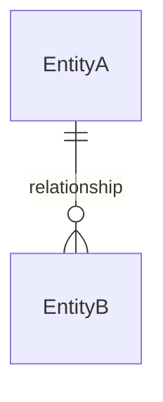

# Domain Model (E-R) — {Product_Name}

## Overview

{One paragraph: what this domain model represents, where entities are defined (e.g. Java records, TS interfaces), and the storage strategy.}

## E-R Diagram

{Entities and relationships only — fields and constraints live in the detail tables below.}

## Entities — Detail

### {Entity_Name}

| Field | Type | Constraints |
|-------|------|-------------|
| `{field}` | {Type} | {PK, FK → Target, unique, required, range, enum values, etc.} |

{Repeat one section per entity.}

## Integrity & business rules

- {Per-relationship integrity rule (cardinality is already in the diagram) — e.g. cascade/restrict on delete via `{fk_field}`.}
- {Rules that span multiple entities — capacity limits, state-dependent constraints, uniqueness across related entities — that agents must enforce during `/codify`.}
