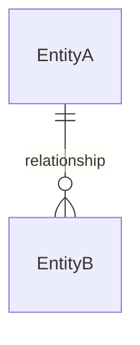

# Entity-Relationship diagram — {Product_Name}

```mermaid
erDiagram
    EntityA ||--o{ EntityB : "relationship"
```

## Entities

| Entity | Description |
|--------|-------------|
| {Entity} | {What it represents in the domain} |

---

> last updated: {Date}