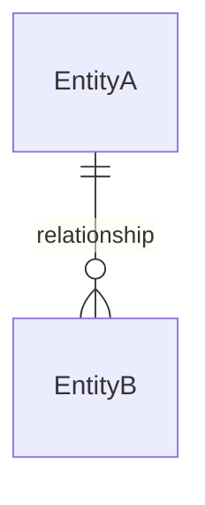

# Entity-Relationship diagram — {Product_Name}

> Domain data model: conceptual entities and their relationships across all containers.
> Kept in its own file because the model grows large; no attributes or constraints here — schemas live in the relevant `{container}.arch.md`.

### Entities

| Entity | Description |
|--------|-------------|
| {Entity} | {What it represents in the domain} |
