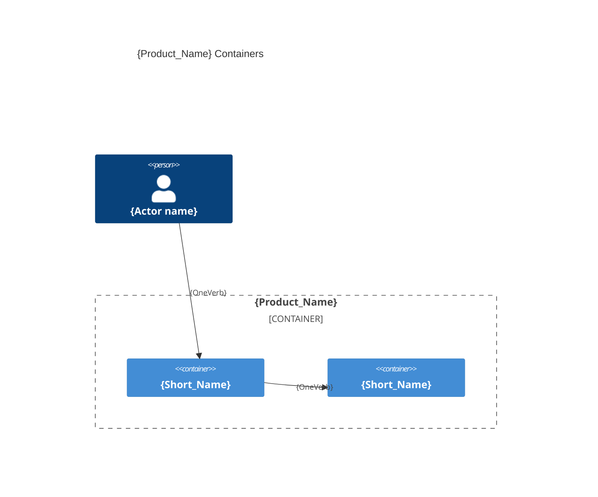

# System architecture — {Product_Name}

## Overview

{One paragraph: what the system does}

---

## Containers diagram



## {container_a}

- **Folder**: `{source_root}/`
- **Tier**: `{front | back | db | e2e | fullstack}`
- **Archetype**: {language} — {framework}
- **Detail**: [`{container}.arch.md`](./{container}.arch.md) |
  [`../model/db.schema.md`](../model/db.schema.md)

### Scripts
```bash
# command to compile, test, format, lint, etc.
```

---

> last updated: {DateTime}
