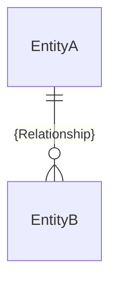

# Entity-Relationship diagram — {Product_Name}

- No attributes; only entities and relationships.

```mermaid
erDiagram
    EntityA ||--o{ EntityB : "{Relationship}"
```

---

> last updated: {DateTime}