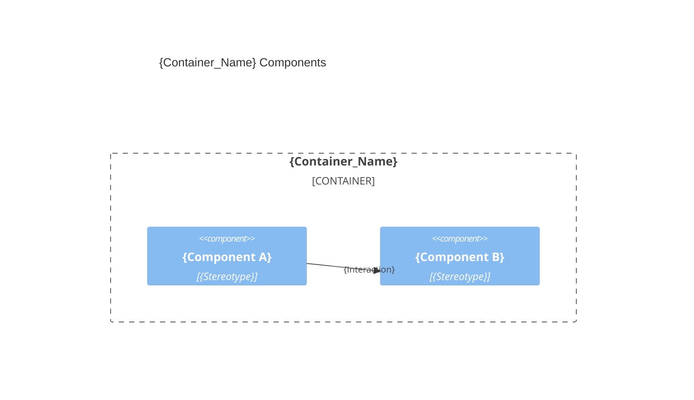

# {Container_Name} architecture — {Product_Name}

> Container `{container}` from [`system.arch.md`](./system.arch.md). Tier: `{front | back | db | e2e | fullstack}`.

## Overview

{One paragraph: this container's responsibility and main technology.}

- **Folder**: `{source_root}/`
- **Archetype**: {language} — {framework}
- **Talks to**: {sibling containers / external systems it depends on}

---

## Components diagram (C4 L3)



### Code organization

**Pattern**: {Layer-based | Feature-based | Hybrid}.

```text
{source_root}/
├── {folder_or_file}    # {one-line responsibility}
└── {folder_or_file}    # {one-line responsibility}
```

---

> last updated: {DateTime}
