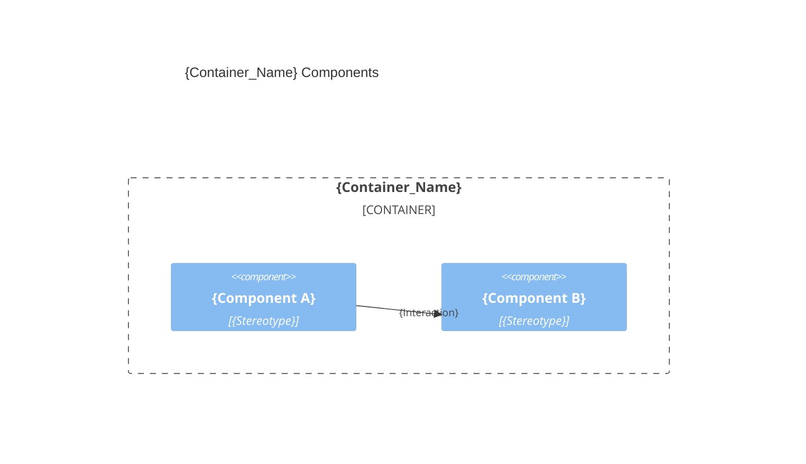

# {Container_Name} architecture — {Product_Name}

> Container `{container}` from [`system.arch.md`](./system.arch.md). Tier: `{front | back | db | e2e | fullstack}`.

## Overview

{One paragraph: this container's responsibility and main technology.}

- **Folder**: `{source_root}/`
- **Archetype**: {language} — {framework}
- **Talks to**: {sibling containers / external systems it depends on}

---

## Components diagram (C4 L3)



---

## Contracts & data

{Contract surface only — the full field-level shapes live in the linked schema files.}

- **Exposes**: {endpoints / interfaces / events this container provides}; full shapes in [`{container}.api.schema.md`](./{container}.api.schema.md).
- **Consumes**: {contracts from sibling containers or external systems}; see the owning sibling's `{container}.api.schema.md`.
- **Persists**: {entities/tables this container owns or reads}; full schema in [`{container}.db.schema.md`](./{container}.db.schema.md).
- **Models**: {business entities/relationships this container owns}; full diagram in [`ER.md`](./ER.md).

> Omit any line that doesn't apply, and link `{container}.api.schema.md` / `{container}.db.schema.md` / `ER.md` only when this container exposes/consumes an API, touches the persistence store, or owns the domain model.

---

## Code organization

**Pattern**: {Layer-based | Feature-based | Hybrid}.

```text
{source_root}/
├── {folder_or_file}    # {one-line responsibility}
└── {folder_or_file}    # {one-line responsibility}
```

---

> last updated: {DateTime}
