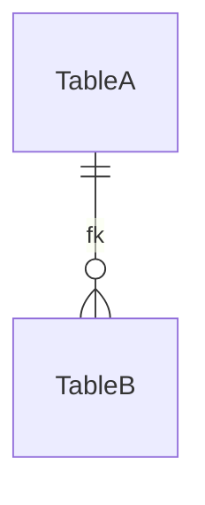

# Database schema — {Product_Name}

> Persistence schema across the system: tables, key fields, and relationships.
> Kept in its own file because it grows large for real projects; the migrations/DDL remain the canonical source.
> Written when the persistence container is extracted; linked from any container that reads or writes it.

### Tables

| Table | Key fields | Notes |
|-------|-----------|-------|
| {table} | {pk / fk / important columns} | {purpose, indexes, constraints} |

> Canonical source: {path to migrations / DDL}.

---

> last updated: {DateTime}