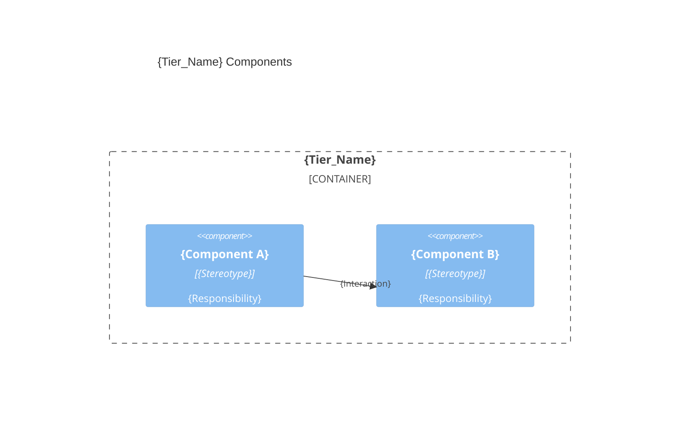
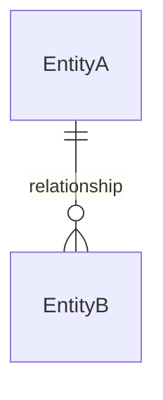

# {Tier_Name} — {Product_Name}

> Everything an agent needs to plan and code this tier: structure, contracts, domain, and conventions. Greenfield prescribes; brownfield describes from the code.

## Summary

{One paragraph: role of this tier, key technology, and the dominant code style / key principle (e.g. "immutable models with factory methods" or "standalone components with signals").}

## Technology stack

| Area | Choice |
|------|--------|
| Language | {language and version} |
| Framework | {framework and version} |
| Testing | {unit/integration test stack} |
| Storage | {databases, caches, files — or N/A} |
| Security | {auth, secrets, transport — summary} |

### Development workflow

| Step | Command |
|------|---------|
| Init | `{init command or N/A}` |
| Build | `{build command}` |
| Run | `{run/dev command}` |
| Test | `{test command}` |
| Lint | `{lint command or N/A}` |

## Components & organization



**Pattern**: {Layer-based | Feature-based | Hybrid}. {One sentence on folder organization.}

```text
{source_root}/
├── {folder_or_file}    # {One-line responsibility}
└── {folder_or_file}    # {One-line responsibility}
```

### Key contracts

{API routes, interfaces, event schemas, DB access patterns, or models exposed to other tiers. Use a table for structured contracts. Omit if this tier exposes nothing.}

## Domain entities

> Entities this tier owns or persists. Omit for tiers with no domain responsibility (e.g. e2e).



### {Entity_Name}

| Field | Type | Constraints |
|-------|------|-------------|
| `{field}` | {Type} | {PK, FK → Target, unique, required, range, enum, etc.} |

{Repeat one section per entity.}

**Integrity & business rules**: {per-relationship integrity (cascade/restrict), and cross-entity rules — capacity limits, state-dependent constraints — that agents must enforce during `/codify`.}

## Naming

| Element | Convention | Example |
|---------|------------|---------|
| Folders | {pattern + casing} | `{example}` |
| Files | {pattern per role} | `{example}` |
| Types / Classes / Components | {PascalCase} | `{example}` |
| Functions / Methods | {camelCase} | `{example}` |
| Constants / Enums | {UPPER_SNAKE / PascalCase} | `{example}` |

## Artifact roles

{One row per role. Order: model → DTO → repository → service → controller (backend) or model → service → component → form (frontend). Adapt to the tier.}

| Role | Structural rule (one line) |
|------|----------------------------|
| {role} | {dominant pattern for this role} |

**Canonical example** — {most representative role}:

```{language}
{Single cleanest example for the tier — real (brownfield, cite the file) or illustrative (greenfield). ≤ 20 lines; trim imports and boilerplate.}
```

**Avoid**: {2-4 concrete anti-patterns, each with a one-clause reason.}

## Conventions

- **Wiring**: {injection style / how features reference each other.}
- **Errors**: {dominant error-handling rule.}
- **Testing**: {placement & naming (colocated / mirrored, file pattern e.g. `*.spec.ts`); dominant setup/mocking style; what to cover and skip.}

## Known deviations

- `{file}` — {what differs}; expected {dominant pattern}.

{If none: "No deviations detected." On greenfield: "No deviations yet — greenfield baseline."}

> last updated: {Date of last update, e.g., May 2026}
