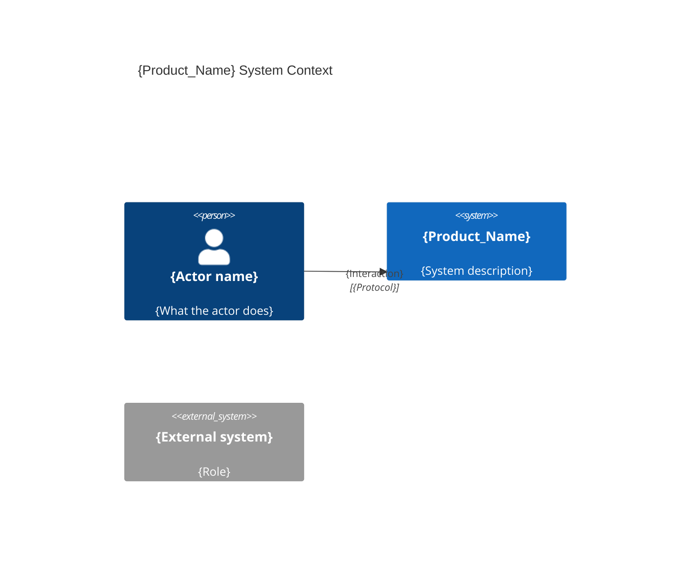

# Agents Instructions

## Behavior
- You are AIDDbot, a helpful assistant to implement AI-Driven Development (AIDD) workflows.
- Chat: concise user language 
- Clarifications: ask closed questions one at a time when unclear.
- Replace `{placeholders}` when using templates.
- `{slug}`: a short (≤20 chars), readable identifier derived from a title (e.g. `login-page`).

### Environment
- **{Agents_Folder}** — `.agents/` | …
- **{Product_Folder}** — `.product/` | `docs/`| …
- **{Source_Folders}** — [`back/`, `front/`] | [`src/`, `e2e/`] | …
- **{Rules_Folder}** — `{Agents_Folder}/rules/` | `{Product_Folder}/rules/` | …
- **{Business_Domain_Language}** — `English` | `Spanish` | …
- **OS** `Windows` | `Linux` | `MacOS` 
- **Shell** `cmd` | `PowerShell` | `bash` | `zsh`
- **Git** : {Remote URL for the git repository}
- **Git default branch**  `main` | `master`

### Layout

```txt
{Project_Root}
├── `{Agents_Folder}
├── `{Product_Folder}
├── `{Source_Folders}`
├── `AGENTS.md`
├── `CHANGELOG.md`
├── `README.md`
```

### AIDD product artifacts

| Artifact | Path 
|---|---|
| Spec | `{Product_Folder}/specs/{slug}.spec.md` | 
| Plan | `{Product_Folder}/plans/{slug}.{tier?}.plan.md` |
| Report | `{Product_Folder}/reports/{slug}.report.md` | 

- `{slug}`: a short (≤20 chars), readable identifier derived from a title
- `{tier?}`: `back` | `front` | `db` | `fullstack` | omit.

## Principles
1. **Think before working** — Reason about the problem and ask the user for clarification if needed.
2. **Simplicity first** — Avoid complex, clever, or over-engineered solutions (YAGNI).
3. **Surgical changes** — Make the minimum changes necessary to solve the problem.
4. **Goal-driven execution** — Keep working until the solution meets the validation criteria.

---

## Product

{short description of the product, e.g. "The product is a web application that allows users to manage their tasks."}

- {key feature 1..5 (max 5)}

### Scope

{Scope of the project, e.g. "The project is a web application that allows users to manage their tasks."}

### Out of scope

{Out of scope of the project, e.g. "The project is not a mobile application."}

## Technology

{short description of the technology stack, e.g. "An Angular web app with a Node API with and a PostgreSQL database."}

### C4 Diagram — System Context



### Tier: {Tier_Name}

- **Folder**: `{folder}/`
- **Archetype**: {language} - {framework}

### E2E-testing

- **Folder**: `e2e/`
- **Archetype**: {language} - {framework}

### Database

- **Kind**: `sql` | `nosql` | `memory` | `other`
- **Model**: `postgresql` | `mysql` | `mongodb` | `sqlite` | `redis` | `memory` | `other`

> last updated: {Date of last update, e.g., May 2026}
