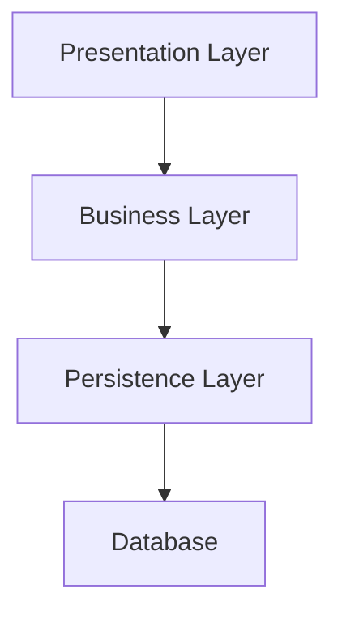

# Software Architecture Best Practices

## Concepts

- **Tier**: A tier is a physical separation of software systems, involving different applications, servers or processes. Each tier can contain one or more layers.
- **Layer**: A layer is a logical separation of concerns within a software system involving classes, modules and types. Each layer exposes a callable surface, called API, and can consume other layer APIs.
- **Component**: A component is a single file that exposes a class or a module.
- **Dependency**: A dependency is a relationship between two software components, where one component requires the other to function properly. Both components can reside in the same or in different layers.
- **Layered architecture**: Is a software design pattern that organizes code into distinct layers, and specifies the way these layers interact with each other via APIs and dependencies.
- **Dependency flow**: Only one direction of dependency is allowed between layers, drawing them from top to bottom.



Keep dependencies to a minimum and ensure a single direction of dependencies.

Use the DI of your framework to manage dependencies or pass dependencies explicitly to functions and classes.

## Structure

### Tier Systems

Tiers are physical separations of software systems, create them in separate directories or repositories. Call them a **system**.

> Example for a monorepo:

```txt
my-monorepo-project/
├── docs/
├── system1/
│   ├── src/
│   └── README.md
├── system2/
│   ├── src/
│   └── README.md
└── README.md
```

> Example for multi-repo:

```txt
# Repo 1
system1/
  ├── src/
  └── README.md
# Repo 2
system2/
  ├── src/
  └── README.md
```

### Layers

Layers are abstract concepts: 
- do not create folders for each layer
- Follow screaming structure : GROUP BY FEATURE not by type.
- Organize when growing in three levels: `core`, `routes | commands`, and `shared`

> Example inside one system:  

```txt
# Simple Structure
src/
├── feature1/
├── feature2/
└── feature3/

# Complex Structure
src/
├── core/             # Setup and general features
│   ├── feature1/
│   └── feature2/
├── routes/           # Routed, usually business logic feature
│   ├── feature3/
│   └── feature4/
└── shared/           # Common features used by core and routes
    ├── feature5/
    └── feature6/
```

## Concrete examples

Inside each feature folder there are one or more components that belongs to a specific layer.

Here you can find examples of features grouped in levels for different types of applications and their specific layers with their responsibilities.

### API server:

> Example of features grouped in levels for an API server

```txt
src/
├── core/                # Core application logic
│   ├── middlewares/     # Middleware functions
│   └── config/          # Configuration files
├── routes/              # API Route handlers
│   ├── users/           # User-related routes
│   └── products/        # Product-related routes
└── shared/              # Shared utilities and components
    ├── utils/           # Utility functions
    └── logger/          # Logging system
```

#### Presentation Layer

- **Responsibilities**:
  - Handles HTTP requests and responses.
  - Contains route handlers, and controllers.
  - Define DTOs (Data Transfer Objects) for request and response data.
  - Perform input validation and sanitization; including authentication and authorization.
  - Handle error responses and logging.
  - Return structured JSON responses and status codes.

- **Components**:
  - Route handlers
  - Controllers
  - Middleware
  - DTOs

#### Business Layer

- **Responsibilities**:
  - Contains the core business logic and application rules.
  - Use entities, services, and use cases to encapsulate business operations.
  - Orchestrate operations between repositories
  - Return structured data objects

- **Components**:
  - Entities
  - Services
  - Use Cases

#### Persistence Layer

- **Responsibilities**:
  - Responsible for data storage and retrieval, typically interacting with a database.
  - Use repositories and data transfer objects (DTOs) to abstract database operations.
  - Handle data access and external integrations.
  - Return primitive data or simple objects.
  - Is the only layer that knows about data sources.
  - Handle data transformation if needed. 

- **Components**:
  - Repositories
  - Data Transfer Objects (DTOs)


### Web SPA:

> Example of features grouped in levels for a Web SPA

```txt
src/
├── core/                # Core application logic
│   ├── interceptors/    # Api call interceptors
│   └── layout/          # Main layout components
├── routes/              # Page Route handlers
│   ├── users/           # User-related routes
│   └── products/        # Product-related routes
└── shared/              # Shared utilities and components
    ├── ui/              # UI components
    └── logger/          # Logging utilities
```

#### Presentation Layer

- **Responsibilities**:
  - Handles user interactions and displays data.
  - Contains components, templates, and styles specific to the UI.
  - Manages routing and navigation within the application.

- **Components**:
  - Containers
  - Presenters
  - UI Components
  - Templates

- **Best Practices**:
  - Use the Container/Presenter pattern to separate UI logic from business logic.
  - All components will be standalone by default.
  - Use Signals to communicate between components and with templates.
  - Define and use shared components, directives, and pipes.

#### Business Layer

- **Responsibilities**:
  - Contains state management and application logic.
  - Orchestrate operations between repositories
  - Return signals  

- **Components**:
  - Services

- **Best Practices**:
  - Use services to encapsulate business logic and state management.
  - Use Signals for reactive state management.

#### Persistence Layer

- **Responsibilities**:
  - Responsible for data storage and retrieval, typically interacting with a remote API.
  - Define repositories and data transfer objects (DTOs) to abstract API operations.
  - Return primitive data or simple objects.
  - Is the only layer that knows about async operations.
  - Handle data transformation if needed.

- **Components**:
  - Repositories
  - Data Transfer Objects (DTOs)

### CLI application:

```txt
src/
├── core/                # Core application logic
│   └── config/          # Configuration files
├── commands/            # Command handlers
│   ├── users/           # User-related commands
│   └── products/        # Product-related commands
└── shared/              # Shared utilities and components
    ├── utils/           # Utility functions
    └── logger/          # Logging utilities
```

> End of Software Architecture best practices
