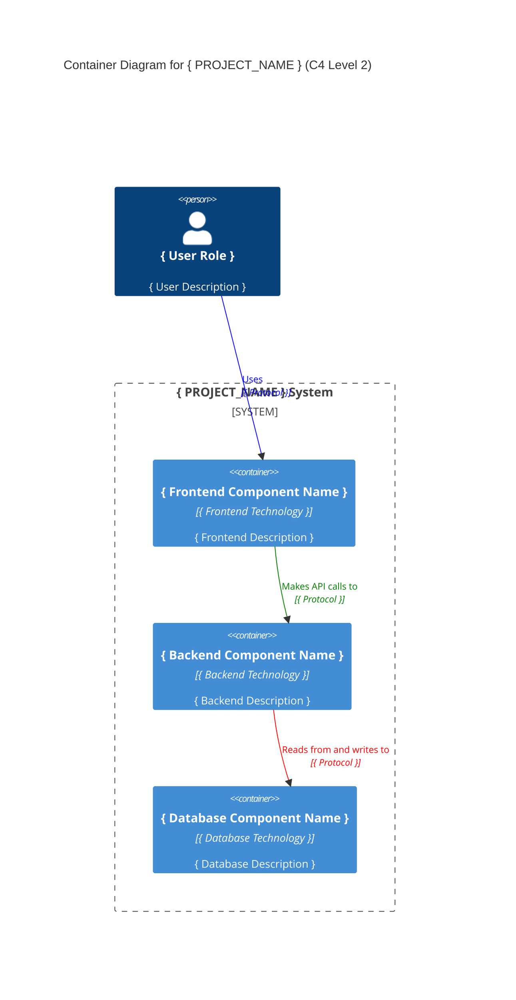

# SYSTEMS Instructions

Create a Systems Architecture Document that defines the project's technical architecture, technology stack, and deployment design.

## Context

- Use the current `PRD.md` and `DOMAIN.md` as primary sources for requirements and business logic.
- Use the current `/README.md` and `/docs` folder to add context to your responses.
- DO NOT WRITE TECHNOLOGY CHOICES OR ARCHITECTURE DECISIONS BY YOURSELF.
- Instead, 
  - Offer the user the option to add files to the `/docs` folder for additional technical context.
  - Offer #Notion tools for gathering existing technical documentation.
  - Offer the #fetch tool for retrieving existing architecture documents or technical specifications from a URL.
  - Ask for any missing technical information to complete the systems design.

## Template

Use the following template to create the SYSTEMS document. Fill in the placeholders with relevant information about the project's technical architecture.

The template is a Markdown format. 
Includes placeholders for you to fill.
Includes comments to guide you on what to include in each section.
Do not include the comments in the final document.

```markdown
# Systems Architecture for { PROJECT_NAME }

## Overview

<!-- Questions to consider:
 - What is the overall system architecture style?
 - What are the main technical components?
 - What are the integration patterns? -->

**{ Project name }** follows a { architecture_style } architecture, designed for { primary_characteristics } with { technology_approach }.

## System Components

<!-- Questions to consider:
- What are the main system layers/tiers?
- What technologies will be used for each component?
- How do components communicate with each other? -->

<!-- 
  Write between 3 and 5 main system components.
  Use the format S1, S2, etc. to name each component.
-->

### { S1 } { Component 1 Name }

**Purpose:** { Brief description of component responsibility }

**Technology Stack:**
- **Language**: { programming_language }
- **Framework**: { main_framework }
- **Key Libraries**: { library1 }, { library2 }

**Responsibilities:**
- { responsibility1 }
- { responsibility2 }

### { S2 } { Component 2 Name }

**Purpose:** { Brief description of component responsibility }

**Technology Stack:**
- **Language**: { programming_language }
- **Framework**: { main_framework }
- **Key Libraries**: { library1 }, { library2 }

**Responsibilities:**
- { responsibility1 }
- { responsibility2 }

## Data Layer

<!-- Questions to consider:
- What database technology will be used?
- How will data be structured and accessed?
- What are the data persistence patterns? -->

### Database Design

**Database Type:** { database_type }
**Technology:** { database_technology }

**Data Access Patterns:**
- { pattern1 }: { description }
- { pattern2 }: { description }

**Key Design Decisions:**
- { decision1 }
- { decision2 }

## Integration Patterns

<!-- Questions to consider:
- How do system components communicate?
- What APIs or interfaces are exposed?
- What are the data exchange formats? -->

### { I1 } { Integration Pattern 1 }

**Type:** { REST API | GraphQL | Message Queue | etc. }
**Purpose:** { What this integration accomplishes }
**Protocol:** { HTTP | WebSocket | etc. }
**Data Format:** { JSON | XML | etc. }

### { I2 } { Integration Pattern 2 }

**Type:** { REST API | GraphQL | Message Queue | etc. }
**Purpose:** { What this integration accomplishes }
**Protocol:** { HTTP | WebSocket | etc. }
**Data Format:** { JSON | XML | etc. }

## Deployment Architecture

<!-- Questions to consider:
- How will the system be deployed?
- What infrastructure is required?
- What are the scalability considerations? -->

### Infrastructure Requirements

**Deployment Model:** { Cloud | On-premise | Hybrid }
**Platform:** { AWS | Azure | Docker | etc. }

**Environment Setup:**
- **Development**: { development_setup }
- **Staging**: { staging_setup }
- **Production**: { production_setup }

**Scalability Approach:**
- { scalability_strategy }

## Security Architecture

<!-- Questions to consider:
- How is authentication and authorization handled?
- What are the security protocols?
- How is sensitive data protected? -->

### Authentication & Authorization

**Authentication Method:** { auth_method }
**Session Management:** { session_approach }
**Authorization Pattern:** { authorization_pattern }

### Data Security

**Encryption:** { encryption_details }
**Data Protection:** { protection_measures }

## System Architecture Diagram



### Container Responsibilities

**{ Frontend Component Name }:**
- { frontend_responsibility_1 }
- { frontend_responsibility_2 }
- { frontend_responsibility_3 }
- { frontend_responsibility_4 }
- { frontend_responsibility_5 }

**{ Backend Component Name }:**
- { backend_responsibility_1 }
- { backend_responsibility_2 }
- { backend_responsibility_3 }
- { backend_responsibility_4 }
- { backend_responsibility_5 }

**{ Database Component Name }:**
- { database_responsibility_1 }
- { database_responsibility_2 }
- { database_responsibility_3 }
- { database_responsibility_4 }

## Technical Constraints and Decisions

<!-- Questions to consider:
- What technical limitations exist?
- What architectural decisions were made and why?
- What trade-offs were considered? -->

### Architectural Decisions

1. **{ Decision Category 1 }**
   - **Decision**: { decision_made }
   - **Rationale**: { why_this_decision }
   - **Trade-offs**: { what_was_sacrificed }

2. **{ Decision Category 2 }**
   - **Decision**: { decision_made }
   - **Rationale**: { why_this_decision }
   - **Trade-offs**: { what_was_sacrificed }

### Technical Constraints

- { constraint1 }
- { constraint2 }
- { constraint3 }

## Additional Information

<!-- Add any additional technical information -->

- [PRD Document](./PRD.md)
- [DOMAIN Models](./DOMAIN.md)
- [API Documentation](./API.md)

> End of SYSTEMS for { PROJECT_NAME }, last updated on { DATE }.

```

> End of SYSTEMS instructions.
