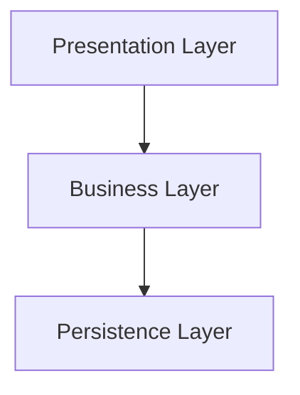

# Software Architecture Best Practices

This guide provides a clear and actionable framework for developing robust, scalable, and maintainable applications. It establishes a consistent vocabulary and structure to ensure clarity and predictability across projects.

## 1. Core Principles

These are the foundational principles that govern our architectural decisions.

*   **Separation of Concerns (SoC)**: Each part of the system should have a distinct responsibility. This is achieved by organizing code into layers and feature-focused modules.
*   **Screaming Architecture**: The project structure should immediately reveal its purpose and business domain. We achieve this by **grouping by feature**, not by technical type.
*   **Unidirectional Dependency Flow**: Dependencies must flow in a single direction. Higher-level modules should not depend on lower-level implementation details. This promotes decoupling and testability.
*   **Dependency Inversion Principle (DIP)**: High-level modules (e.g., business logic) should not depend on low-level modules (e.g., data access). Both should depend on abstractions (interfaces).

## 2. Architectural Vocabulary (C4 Model)

We use concepts from the C4 model to discuss and visualize our architecture at different levels of detail.

*   **Context (C1)**: The highest-level view, showing the system as a whole and its interactions with users and external systems.
*   **Container (C2)**: An independently deployable unit, such as an API server, a single-page application (SPA), a database, or a command-line interface (CLI).
*   **Component (C3)**: A functional block of software within a container, typically representing a single feature or a shared capability.
*   **Code (C4)**: The lowest-level view, representing the actual implementation of a component (classes, functions, etc.).

## 3. Project Structure: Group by Feature

The project's directory structure must reflect its features.

### Simple Structure

For smaller projects, a flat list of features is sufficient.

```txt
src/
├── feature-a/
├── feature-b/
└── feature-c/
```

### Complex Structure

For larger projects, features can be organized into logical groups.

```txt
src/
├── core/             # Application setup, configuration, and core features
│   ├── config/
│   └── startup/
├── features/         # Main business logic features
│   ├── users/
│   └── products/
└── shared/           # Common utilities and components used across features
    ├── ui-components/
    └── logger/
```

## 4. Layered Architecture

Within each feature, code is organized into three logical layers. **Do not create explicit folders for these layers**. Instead, use file naming conventions to identify a component's layer.



### Presentation Layer

Handles all interactions with the outside world (e.g., users, other systems).

*   **Responsibilities**:
    *   Handle incoming requests (HTTP, CLI commands, UI events).
    *   Perform input validation and authentication.
    *   Translate data between the external format (e.g., JSON) and the format required by the Business Layer.
    *   Return responses.
*   **Typical Components**: Controllers, Route Handlers, UI Components, Presenters, DTOs.

### Business Layer

Contains the core application logic and business rules. This layer is the heart of the application.

*   **Responsibilities**:
    *   Execute business workflows and use cases.
    *   Orchestrate operations between different data sources via the Persistence Layer.
    *   Enforce business rules and constraints.
*   **Typical Components**: Services, Use Cases, Entities.

### Persistence Layer

Responsible for all data storage and retrieval operations.

*   **Responsibilities**:
    *   Abstract data sources (databases, external APIs, file systems).
    *   Perform data access operations (CRUD).
    *   Translate data between the storage format and the format required by the Business Layer.
*   **Typical Components**: Repositories, Data Mappers.

## 5. File Naming Convention

Files should be named to clearly express their feature, type, and layer.

**Pattern**: `{feature}.{type}.{ext}`

*   **`{feature}`**: The business feature (e.g., `user-profile`).
*   **`{type}`**: The component type (e.g., `service`, `controller`, `repository`).

**Examples for TypeScript**:

*   `user-profile.controller.ts`
*   `user-profile.service.ts`
*   `user-profile.repository.ts`
*   `auth.middleware.ts`

**Examples for Java or C#**:

*   `UserProfileController.java`
*   `UserProfileService.java`
*   `UserProfileRepository.java`
*   `AuthMiddleware.java`

## 6. Cross-Cutting Concerns

While the layered architecture organizes the primary application logic, some concerns apply across all layers. These should be handled in dedicated, shared modules.

*   **Logging**: Centralized and structured logging.
*   **Configuration**: Loading and providing access to configuration values.
*   **Security**: Cross-cutting security rules and utilities.
*   **Testing**: A comprehensive testing strategy including unit, integration, and end-to-end tests is crucial for validating the architecture.
