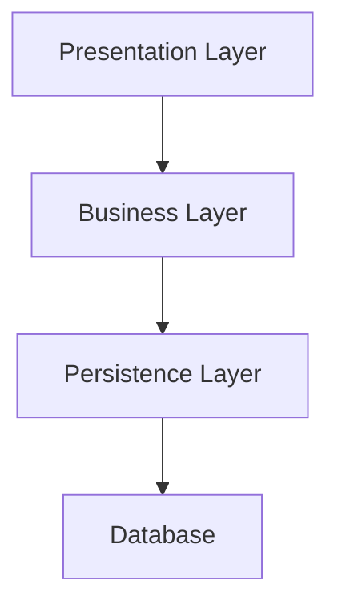

# Architecture Best Practices

Use a layered architecture to separate concerns and improve maintainability.

Keep dependencies to a minimum and ensure a single direction of dependencies.

Use the DI of your framework to manage dependencies or pass dependencies explicitly to functions and classes.

## Back End

### Presentation Layer

- Handles HTTP requests and responses.

- Contains route handlers, and controllers.

- Define DTOs (Data Transfer Objects) for request and response data.

- Perform input validation and sanitization; including authentication and authorization.

- Handle error responses and logging.

- Return structured JSON responses and status codes.

### Business Layer

- Contains the core business logic and application rules.

- Use entities, services, and use cases to encapsulate business operations.

- Orchestrate operations between repositories

- Return structured data objects

### Persistence Layer

- Responsible for data storage and retrieval, typically interacting with a database.

- Use repositories and data transfer objects (DTOs) to abstract database operations.

- Handle data access and external integrations.

- Return primitive data or simple objects.

- Is the only layer that knows about data sources..

- Handle data transformation if needed.

## Front End

To be defined based on the specific front-end framework or library used (e.g., React, Angular, Vue.js).

> End of Architecture best practices