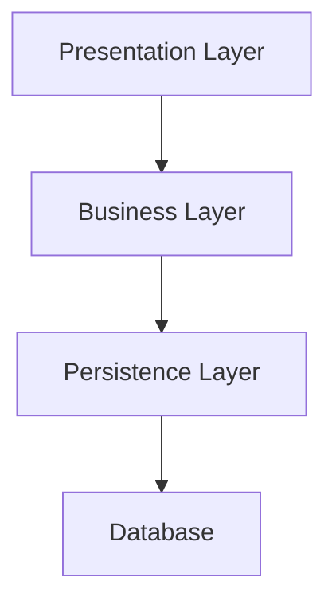

# Architecture Best Practices

Use a layered architecture to separate concerns and improve maintainability.

Keep dependencies to a minimum and ensure a single direction of dependencies.

Use the DI of your framework to manage dependencies or pass dependencies explicitly to functions and classes.

Layers are abstract concepts, do not create folders for each layer; instead use a flat structure with files named after their purpose.

### Folder Structure
- Place all source code in a dedicated `src` directory.
- Use a flat structure for files, grouping them by feature or module rather than by layer.
- Organize feature folders in three main directories: `core`, `routes | commands`, and `shared`.
- Use descriptive names for files and directories to indicate their purpose.

## Back End

### Presentation Layer

- Handles HTTP requests and responses.

- Contains route handlers, and controllers.

- Define DTOs (Data Transfer Objects) for request and response data.

- Perform input validation and sanitization; including authentication and authorization.

- Handle error responses and logging.

- Return structured JSON responses and status codes.

### Business Layer

- Contains the core business logic and application rules.

- Use entities, services, and use cases to encapsulate business operations.

- Orchestrate operations between repositories

- Return structured data objects

### Persistence Layer

- Responsible for data storage and retrieval, typically interacting with a database.

- Use repositories and data transfer objects (DTOs) to abstract database operations.

- Handle data access and external integrations.

- Return primitive data or simple objects.

- Is the only layer that knows about data sources..

- Handle data transformation if needed.

## Front End

For Angular projects.

### Presentation Layer

Use the Container/Presenter pattern to separate UI logic from business logic.

All components will be standalone by default.

Use Signals to communicate between components and with templates.

Define and use shared components, directives, and pipes.

### Business Layer

Use services to encapsulate business logic and state management.

Use Signals for reactive state management.

### Persistence Layer

Use repositories to abstract data access and API calls.

Encapsulate HttpClient calls and URLs within those repository services.

Define and use Angular Interceptors for common HTTP operations like authentication, error handling, and logging.

> End of Architecture best practices