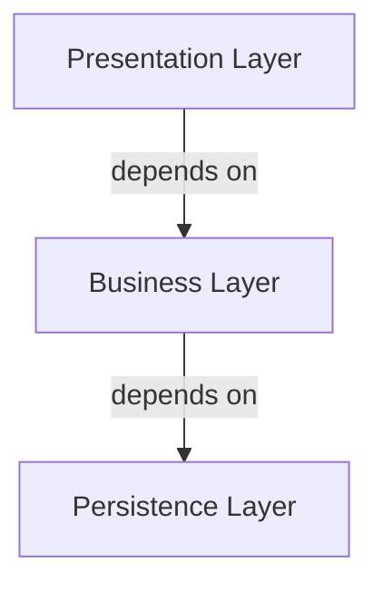
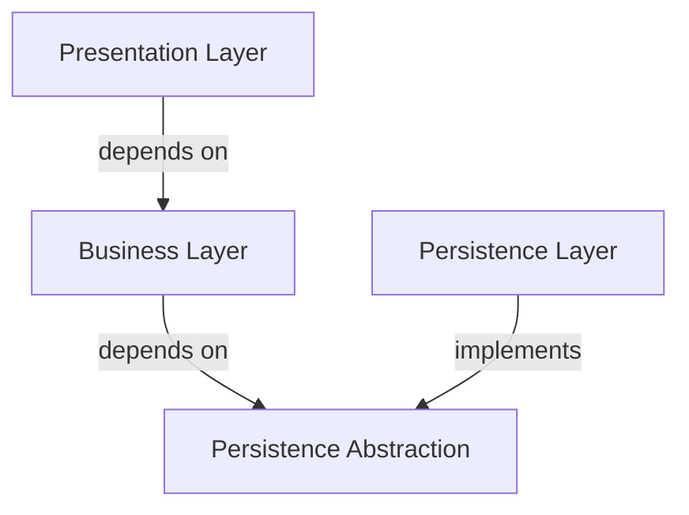

# Software Architecture Best Practices

This guide provides clear and actionable instructions for developing robust, scalable, and maintainable applications. 

Follows the glossary of terms and concepts from [AIDDbot Glossary](./std_aidd-glossary.instructions.md)

These are the foundational principles that govern our architectural decisions.

## 1. Separation of Concerns (SoC)

-  Each _module_ of the system should have a distinct functional and technical responsibility. 
-  This is achieved by organizing code into _features and layers_.


| Layer↓ \ Feature→   | Users                   | Orders           | Logs                 |
| -------------------:| ----------------------- | ---------------- | -------------------- |
| Presentation        | UserForm, UserDTO       | OrdersList       |                      |
| BusinessLogic       | UserService, UserEntity | OrdersService    | LogUtil, LogEntryDTO |
| DataAccess          | UsersRepository         | OrdersRepository | LogFile              |

## 2. Screaming Architecture

- The folder structure should immediately reveal its purpose and business domain. 
- We achieve this by _grouping by features_, not by layers.

> Example for a TypeScript project

```txt
src/
├── users/
│   ├── user.form.ts
│   ├── user.dto.ts
│   ├── user.service.ts
│   ├── user.entity.ts
│   └── user.repository.ts
├── orders/
│   ├── orders.list.ts
│   ├── orders.service.ts
│   └── orders.repository.ts
└── logs/
    ├── log.util.ts
    ├── log-entry.dto.ts
    └── log.file.ts
```

### _✨ Optional: Grouping features for big projects_

When the number of features grows, organize them into three levels: `core`, `domain`, and `shared`.

- **Core**: Contains the essential components, usually required at startup or called from frameworks.
- **Domain**: Contains the application-specific logic, such as use cases, API endpoints, and UI components.
- **Shared**: Contains reusable components called by core or feature modules.

```txt
src/
├── core/             # Setup and framework features
│   ├── feature1/
│   └── feature2/
├── domain/           # Business or user features
│   ├── feature3/
│   └── feature4/
└── shared/           # Reusable cross-cutting features
    ├── feature5/
    └── feature6/
```

## 3. Unidirectional Dependency Flow

- Dependencies must flow in a single direction between layers, typically from higher-level layers (e.g., presentation) to lower-level layers (e.g., data access).
- This is achieved with _discipline_ and/or enforced by tools.



### _✨ Optional: Dependency Inversion Principle (DIP) for clean Architectures_

- The Dependency Inversion Principle states that:

High-level (business) modules should not depend on low-level (infrastructure) modules. Both should depend on abstractions.
Abstractions should not depend on details. Details should depend on abstractions.

This means the business layer defines interfaces for what it needs, and the persistence layer implements those interfaces.



- Frameworks should provide the necessary infrastructure to support this principle.

## 4. Repository Strategy

Choose your repository strategy based on team size, coupling requirements, and tooling needs:

### Single Repository per Application (Default)
- **When to use**: Independent applications with different release cycles
- **Benefits**: Clear ownership, independent deployments, simpler CI/CD
- **Structure**: Each application has its own repository with links to shared documentation

### Monorepo (When Appropriate)
- **When to use**: Highly coupled applications, shared libraries, consistent tech stack
- **Benefits**: Simplified dependency management, atomic changes across services
- **Requirements**: Robust tooling for build optimization and selective testing
- **Trade-offs**: Increased complexity in CI/CD and repository management

## 5. Error Handling and Resilience Patterns

- Systems must be designed to handle failures gracefully and recover automatically when possible.
- Error handling should be consistent across layers and features.
- Implement defensive programming practices to prevent cascading failures.

### Core Resilience Strategies

- **Fail Fast**: Detect errors early and fail immediately rather than propagating invalid state.
- **Circuit Breaker**: Prevent repeated calls to failing external services.
- **Retry with Backoff**: Automatically retry failed operations with increasing delays.
- **Timeout Patterns**: Set explicit timeouts for all external calls and long-running operations.

### Error Propagation Strategy

- **Technical Errors**: Log detailed information, return generic user-friendly messages.
- **Business Errors**: Propagate meaningful error codes and messages to the presentation layer.
- **Critical Errors**: Implement alerting mechanisms for system-threatening issues.

