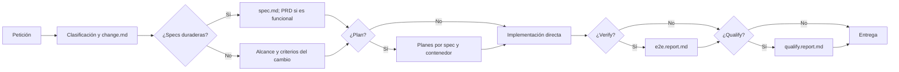

# Informe histórico del workflow `/build-requested-change`

> Este documento describe el contrato anterior. La documentación vigente está en [AIDD workflow](./AIDD.workflow.md) y el [plan de simplificación](./build-requested-change.simplification.plan.md).

Este informe describe el **contrato vigente de los skills**, no una ejecución observada en un producto. Este repositorio contiene los skills y sus plantillas, pero no un árbol de documentación de producto generado por el workflow. `{Product_Folder}` es la carpeta elegida para cada proyecto en su `AGENTS.md` (por ejemplo, `.product/` o `docs/`); todas las rutas siguientes son relativas a ella.

## Qué hace y cómo avanza

`/build-requested-change` entrega **un cambio clasificado**. Un Architect lee el PRD, las specs, los hallazgos y la arquitectura; determina `origin`, `kind`, `intent` y `complexity`, reserva `C{nnn}-{slug}`, crea la rama `change/{change_key}` y persiste su manifiesto. El cambio puede referenciar cero, una o varias specs. Por cada spec referenciada, otro paso Architect la crea o enmienda y valida. Un Builder planifica cuando corresponde e implementa por contenedor. Un Craftsman ejecuta las pruebas y la calificación habilitadas, repara mediante Builder si aparecen defectos corregibles y, con evidencia vigente, integra y libera el cambio.



La cadena de estado del manifiesto es `pending → in-progress → ready → released`. Una spec pasa de `draft` a `active` al validarse y sigue siendo un contrato duradero tras el release. Una spec nueva o enmendada requiere validación humana salvo que aplique YOLO. Los reportes rojos abren reparación y nueva comprobación; un control bloqueado devuelve el impedimento. Cada reporte identifica la revisión evaluada, por lo que cambios semánticos posteriores invalidan la evidencia afectada. Los pasos omitidos no producen reportes vacíos ni “green”.

## Inventario exacto de rutas

| Artefacto | Ruta bajo `{Product_Folder}` | Lo escribe | Cuándo / función |
| --- | --- | --- | --- |
| Manifiesto de cambio | `changes/{change_key}/change.md` | Clasificación de `/build-requested-change` | **Siempre**, uno por entrega; contiene identidad, clasificación, alcance, impacto, etapas, estado y release. |
| Spec funcional | `specs/{spec_key}/spec.md` | `/specify` mediante `specify-spec` | Si se crea o enmienda un contrato funcional; lleva criterios `AC-F{nnn}.n`. |
| Spec técnica | `specs/{spec_key}/spec.md` | `/specify` mediante `specify-spec` | Si se crea o enmienda una política técnica duradera; lleva criterios `AC-T{nnn}.n`. |
| Plan de contenedor | `specs/{spec_key}/{container}.plan.md` | `/planify` mediante `implement-spec` | Solo si `stages.plan: true`, por spec y contenedor afectado. |
| Plan E2E | `specs/{spec_key}/e2e.plan.md` | `/planify` | Solo para spec funcional planificada con contenedor `e2e`; un escenario por criterio funcional. |
| Reporte E2E | `changes/{change_key}/e2e.report.md` | `/verify` | Solo si `stages.verify: true`; un reporte de la suite aplicable al cambio completo. |
| Reporte de calidad | `changes/{change_key}/qualify.report.md` | `/qualify` | Solo si `stages.qualify: true`; evalúa el diff completo y seis gates. |
| Índice PRD | `specs/PRD.md` | `/explore` lo crea; `/specify` añade specs funcionales nuevas | Un índice funcional **global al producto**, no un documento por cambio. Las specs técnicas no se indexan aquí. |
| Registro de hallazgos Craft | `arch/crap.findings.md` | `/craft-lasting-quality` | Solo en revisiones Craft; sus IDs pueden figurar en el manifiesto del batch. |
| Arquitectura y modelo base | `arch/system.arch.md`, `model/model.schema.md` | `/explore` | Contexto previo al cambio, no artefactos generados por cada entrega. |
| Arquitectura detallada / esquemas | `arch/{container}.arch.md`, `model/db.schema.md`, `model/api.schema.md` | `/extract`; `/shipify` reconcilia arquitectura relevante | Documentación de producto que puede actualizarse, no un reporte por cambio. |

La estructura resultante, si un cambio funcional complejo `C012-pagos` crea `F007-pagos` y toca `api` y `e2e`, sería:

```text
{Product_Folder}/
├── arch/
│   └── system.arch.md
├── model/
│   └── model.schema.md
├── changes/
│   └── C012-pagos/
│       ├── change.md
│       ├── e2e.report.md
│       └── qualify.report.md
└── specs/
    ├── PRD.md
    └── F007-pagos/
        ├── spec.md
        ├── api.plan.md
        └── e2e.plan.md
```

El ejemplo muestra una posibilidad, **no una estructura obligatoria para todo cambio**. Si se enmienda una spec existente, se reutiliza su identidad y su carpeta. Un cambio sin spec no crea carpeta de spec. El formato `F{nnn}`/`T{nnn}` está definido para los IDs, pero el contrato no fija explícitamente la composición completa de `spec_key`; el sufijo del ejemplo ilustra un nombre posible. La clave de cambio sí se define como `{change_id}-{slug}`.

## Catálogo de tipos de cambios y etapas

Las cuatro dimensiones son independientes: `origin = requested | craft`, `kind = functional | technical | mixed`, `intent = modify | fix` y `complexity = simple | complex`. `kind` describe el efecto del cambio; `intent: fix` identifica una corrección, no una cuarta clase de `kind`. “Simple” describe el alcance y el riesgo, no si la petición es pequeña en líneas de código.

| Origen | Kind | Intent | Complejidad | Plan | Verify E2E | Qualify | Ejemplo orientativo |
| --- | --- | --- | --- | --- | --- | --- | --- |
| requested | functional | modify | simple | No | Sí | No | Ajuste acotado de comportamiento en un contenedor. |
| requested | functional | modify | complex | Sí | Sí | Sí | Función nueva entre varios contenedores. |
| requested | functional | fix | simple | No | Sí | No | Corregir un fallo visible para el usuario. |
| requested | functional | fix | complex | No | Sí | Sí | Corregir un fallo funcional que afecta arquitectura o contratos. |
| requested | technical | modify | simple | No | No | No | Ajuste técnico local con comprobación enfocada. |
| requested | technical | modify | complex | Sí | No | Sí | Cambiar dependencias, infraestructura o esquema. |
| requested | technical | fix | simple | No | No | No | Corregir una regla técnica local. |
| requested | technical | fix | complex | No | No | Sí | Reparar un defecto de seguridad o concurrencia. |
| requested | mixed | modify | simple | No | Sí | No | Cambio acotado con efecto funcional y técnico. |
| requested | mixed | modify | complex | Sí | Sí | Sí | Evolución funcional con nuevo contrato técnico. |
| requested | mixed | fix | simple | No | Sí | No | Reparación local con criterios de ambos tipos. |
| requested | mixed | fix | complex | No | Sí | Sí | Reparación transversal con criterios de ambos tipos. |
| craft | functional / technical / mixed | fix | simple | No | Sí | No | Batch autónomo de hallazgos; una verificación final. |
| craft | functional / technical / mixed | fix | complex | No | Sí | Sí | Batch autónomo que afecta un área compleja. |

En la ruta solicitada por una persona, `origin` es `requested`; también entran aquí sus correcciones con `intent: fix`. `origin: craft` nace del orchestrator `/craft-lasting-quality`, que selecciona hallazgos y llama al mismo circuito de entrega. La matriz solo decide etapas: **no decide cuántas specs hay**. Se crea o enmienda una spec cuando hay un contrato duradero nuevo o existente; un ajuste simple acotado o una corrección que restaura el contrato puede llevar sus criterios en el cambio sin nueva spec.

Para ser `simple` deben cumplirse simultáneamente: un solo contenedor, como máximo una spec duradera, criterios completos, solución conocida, checks automatizados enfocados y reversibilidad local. Arquitectura, contratos compartidos, esquemas, migraciones, dependencias, infraestructura, seguridad, privacidad, concurrencia, transacciones, accesibilidad, rutas sensibles al rendimiento, varios contenedores o varias specs fuerzan `complex`. En ausencia de calificación, `/codify` aporta evidencia de los criterios técnicos; `/verify` aporta la funcional cuando está habilitada. Todos los criterios activos deben tener evidencia vigente antes de liberar.

## Puntos de fricción para reorganizar la documentación

1. **Dos ejes de agrupación conviven.** `changes/` agrupa intervención y pruebas por `change_key`; `specs/` agrupa contratos duraderos y planes por `spec_key`. Un cambio puede tener varias specs y una spec puede enmendarse en sucesivos cambios. Una mudanza debe preservar esa relación muchos-a-muchos y los IDs de criterios.
2. **El PRD ocupa el espacio de specs pero tiene otro alcance.** `specs/PRD.md` es un índice global solo de specs funcionales, creado inicialmente como shell por `/explore` y ampliado en la creación funcional. No es un PRD completo de cada cambio ni el manifiesto de entrega. El flujo de enmienda no exige actualizar su línea salvo que cambie el índice.
3. **Los planes están junto al contrato, mientras los reportes están junto a la entrega.** Esto permite reutilizar la spec, pero obliga a seguir el manifiesto para saber qué planes y qué revisiones de reporte corresponden al cambio actual. Los planes enmendados clasifican pasos previos `keep`, `redo` o `drop`; el reporte siempre cubre el cambio completo.
4. **Hay huecos contractuales para cambios sin spec.** El triage permite cero specs y afirma que sus criterios pueden ir en `change.md`, pero la [plantilla del manifiesto](../.agents/skills/build-requested-change/assets/change.manifest.template.md) no tiene una sección explícita de criterios. Además, un cambio `complex` con `intent: modify` activa `plan`, pero `/planify` solo permite `specs/{spec_key}/{container}.plan.md`; si no hay `spec_key`, no hay destino definido. Son decisiones de diseño que conviene cerrar antes de mover carpetas.
5. **Hay una convención de rama discrepante.** `/build-requested-change` fija `change/{change_key}`, mientras la [plantilla de `AGENTS.md`](../.agents/skills/explore/assets/AGENTS.template.md) muestra `{feat|bu|chore}/{change_key|short-slug}`. La migración debería fijar una autoridad única antes de automatizar rutas ligadas a la rama.

Este mapa deja separadas las tres preguntas para un rediseño: **qué pertenece a la entrega** (`change.md` y reportes), **qué permanece como contrato** (`spec.md` y criterios) y **qué es navegación global** (`PRD.md`). Las rutas actuales y las excepciones anteriores proceden de los [skills de entrega](../.agents/skills/build-requested-change/SKILL.md), su [triage](../.agents/skills/build-requested-change/references/triage.md), los skills [specify](../.agents/skills/specify/SKILL.md), [planify](../.agents/skills/planify/SKILL.md), [verify](../.agents/skills/verify/SKILL.md), [qualify](../.agents/skills/qualify/SKILL.md) y el [catálogo](../.agents/skills/skills.catalog.md).
