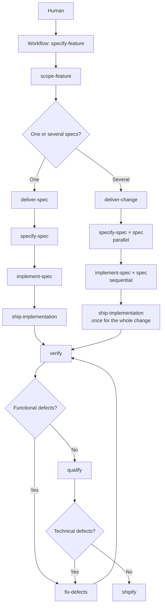

# Specify feature

```mermaid
flowchart TD
    H[Human] --> W[Workflow: specify-feature]
    W --> S[scope-feature]
    S --> T{One or several specs?}

    T -->|One| DS[deliver-spec]
    DS --> SS1[specify-spec]
    SS1 --> IS1[implement-spec]
    IS1 --> SH1[ship-implementation]

    T -->|Several| DC[deliver-change]
    DC --> SSN[specify-spec × spec<br/>parallel]
    SSN --> ISN[implement-spec × spec<br/>sequential]
    ISN --> SHN[ship-implementation<br/>once for the whole change]

    SH1 --> V
    SHN --> V
    V[verify] --> VR{Functional defects?}
    VR -->|Yes| F[fix-defects]
    F --> V
    VR -->|No| Q[qualify]
    Q --> QR{Technical defects?}
    QR -->|Yes| F
    QR -->|No| P[shipify]
```

Branches:

- `deliver-spec` works on `feat/{spec-key}`.
- `deliver-change` works on `change/{change-key}`.
