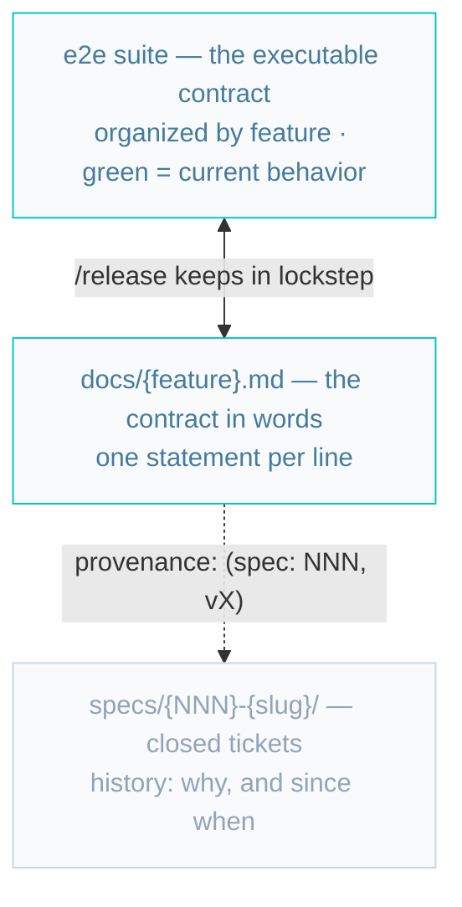
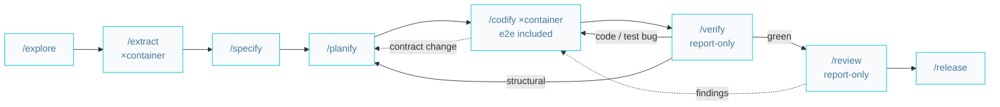
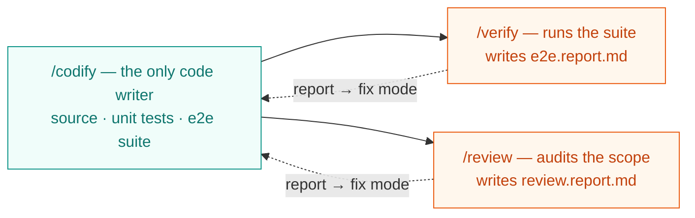
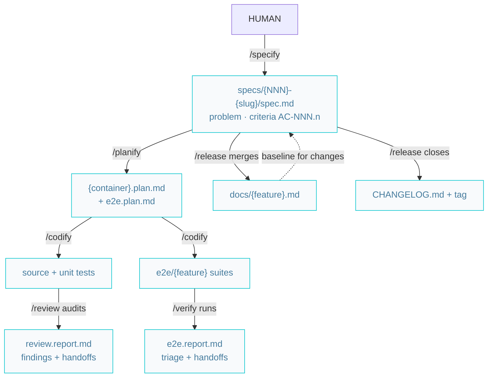
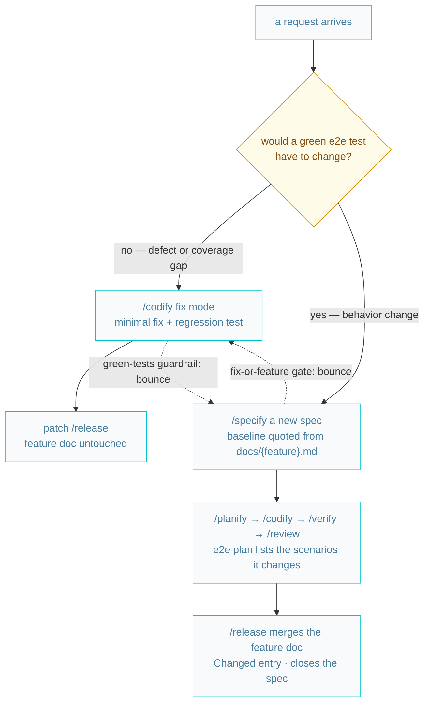
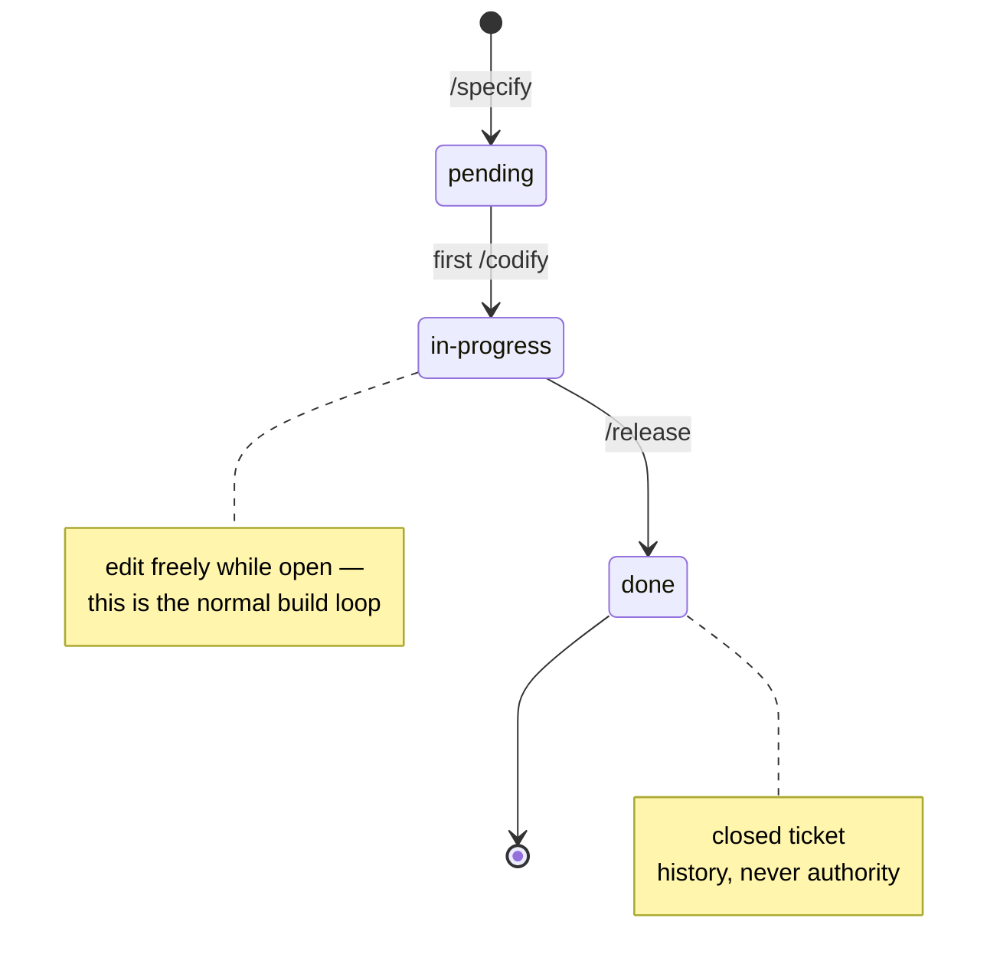
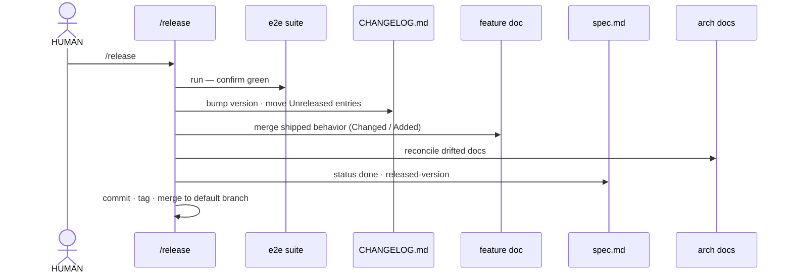

# AIDD in diagrams

A visual tour of the whole system: the contract model, the pipeline, the artifacts, the
routing, and the lifecycles. The [catalog](../.agents/skills/skills.catalog.md) is the
inventory, the [lifecycle](../.agents/skills/skills.lifecycle.md) is the map, the
[design decisions](./design.decisions.md) are the why — this is the picture.

## 1. The contract model

**The green e2e suite is the contract.** The feature docs state the same behavior in
words; released specs are closed tickets — history, never authority.

Green tests change only through a plan — a plan step authorizes a test edit exactly the
way it authorizes a code edit.

## 2. The build pipeline

Eight skills: two set up the context, four build and prove, two guard and ship.
`/codify` is the only skill that writes code; `/verify` and `/review` only evaluate and
report.

Every feedback edge is a **report**, and every fix lands through `/codify` — the skill
that wrote the code fixes the code; the evaluators never touch what they judge.

## 3. One writer, two evaluators

Each report entry carries a **kind** and a **handoff**: `code bug` / `test bug` →
`/codify` (per container); `structural` → `/planify`; `behavioral` → `/specify`;
`mechanical` → `/review --fix` or `/codify`.

## 4. The artifacts

Who writes what, in pipeline order. All spec artifacts live in `specs/{NNN}-{slug}/`,
indexed by feature area in `specs/PRD.md` (written only by `/specify`); the
contract artifacts (suite, feature docs) live with the product.

## 5. The routing — no triage skill

Any request, new or about released behavior, routes on one mechanical question. Either
door bounces a misrouted request to the other, so the human never has to choose right.

The old "no silent behavior changes" rule is now structural: `/codify` cannot flip a
green test without a plan, and a plan needs a spec — a disguised behavior change has no
hot-fix path through the system.

## 6. The spec lifecycle

A spec is a disposable ticket: opened, worked, closed. After `done` nothing ever reads
it as authority again.

## 7. A release, step by step

Maintenance patches (spec-less fixes, structural refactors) run the same sequence
skipping the spec and feature-doc steps.
