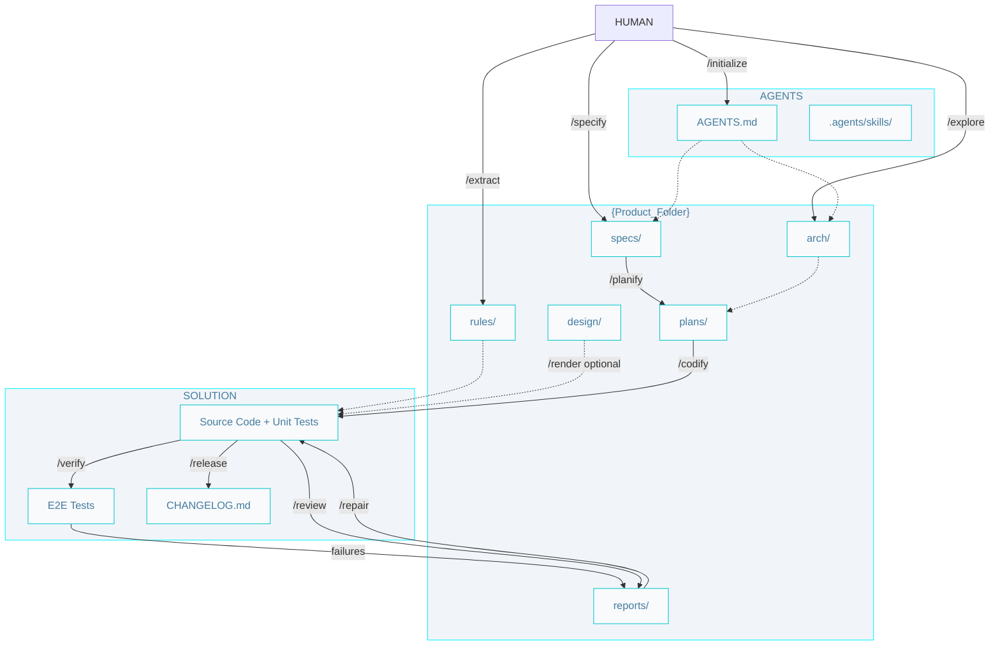

# AIDD Workflow

## Commands

- `/initialize` - Create initial technology documentation (`AGENTS.md`) and confirm `.agents/skills/` is present.

- `/explore` - Reverse-engineer an existing codebase to discover its architecture and infer the ADRs. 

- `/extract` - Extract coding rules from an existing codebase.

- `/specify` - Create a new specification from a requirement (defines problem, solution, and verification).

- `/planify` - Create a set of implementation plans for a specification or bug-fix (back, front, and data).

- `/codify` - Writes the code and unit tests following a plan, or a minor requirement.

- `/verify` - Run end-to-end tests to ensure code meets specifications. On failure, writes a report for `/repair`.

- `/render` - *(experimental)* Implement production-grade frontend UI from a design specification (`DESIGN.md` or `{Product_Folder}/design/{slug}/`).

- `/review` - Review code for guideline compliance and best practices.

- `/repair` - Apply fixes from a review or verify report (preferred path for all reported defects).

- `/release` - Bump version, update `CHANGELOG.md` and docs, set spec `status: released`. Merge feature branches to the default branch before release unless the user confirms otherwise.

- `/repository` - Git branches and conventional commits. Not a separate pipeline step; every skill that produces artifacts reads and follows it before finishing. `/codify` creates `feat/{slug}` before coding; `/repair` uses `fix/{slug}` only outside an active feature cycle.

## Git workflow

1. **Product artifacts** (`/specify`, `/planify`, `/explore`, `/extract`, `/review`, failed `/verify`) — committed with `docs` (or `chore` for `AGENTS.md`) on the default branch or on `feat/{slug}` once the feature branch exists.
2. **Implementation** (`/codify`) — create `feat/{slug}` first (save any uncommitted work so nothing is lost), then commit code in related groups with `feat` / `test`.
3. **Fixes** (`/repair`) — stay on `feat/{slug}` during a feature cycle; use `fix/{slug}` only for standalone defects not tied to an open feature branch.
4. **Release** (`/release`) — `chore` commits for `CHANGELOG.md` and spec status; prefer merging `feat/{slug}` to the default branch first.

See [repository skill](../.agents/skills/repository/SKILL.md), [artifact conventions](../.agents/skills/repository/artifact-conventions.md), and [skills index](../.agents/skills/README.md).

Pipeline detail: [architect](./architect.pipelines.md) · [builder](./builder.pipelines.md) · [design](./design.pipelines.md) · [craftsman](./craftsman.pipelines.md)

## Artifacts

Paths below are relative to `{Product_Folder}` (default `.product/`, set in `AGENTS.md`) unless noted.

### Technology

- `AGENTS.md` - The entry point for any agent joining the project, with product and technology information.

- `.agents/skills/` - Agent skills (from AIDDbot or custom). Not under `{Product_Folder}`; lives at project root per `AGENTS.md`.

### Product

- `arch/` - Architecture documentation with system and tier-level diagrams and inferred ADRs. 

- `rules/` - Define rules that agents must follow when writing code. Can be linked to agents' custom folder.

- `design/{slug}/` - Optional design specifications for `/render` (e.g. `DESIGN.md`).

- `specs/{slug}.spec.md` - A detailed specification (problem, solution, verification) of a feature or technical requirement. YAML frontmatter includes `status` (`draft` → `planned` → `in-progress` → `verified` → `released`); see [spec status](../.agents/skills/specify/spec-status.md).

- `plans/{slug}.{source?}.{tier?}.plan.md` - Implementation plans (fullstack: `{slug}.{source}.plan.md`).

- `reports/{slug}.{type}.report.md` - Findings from `/review` or `/verify` (`{type}`: `quality`, `compliance`, `accessibility`, `verify`). Consumed by `/repair`.

### Solution

- `Source Code + Unit Tests` - The implementation of the system. Unit tests are produced as part of `/codify`, not as a separate step.

- `E2E Tests` - End-to-end tests that verify the implemented code meets the defined specifications and acceptance criteria.

- `CHANGELOG.md` - A log of all notable changes made to the codebase, generated during the release process.
