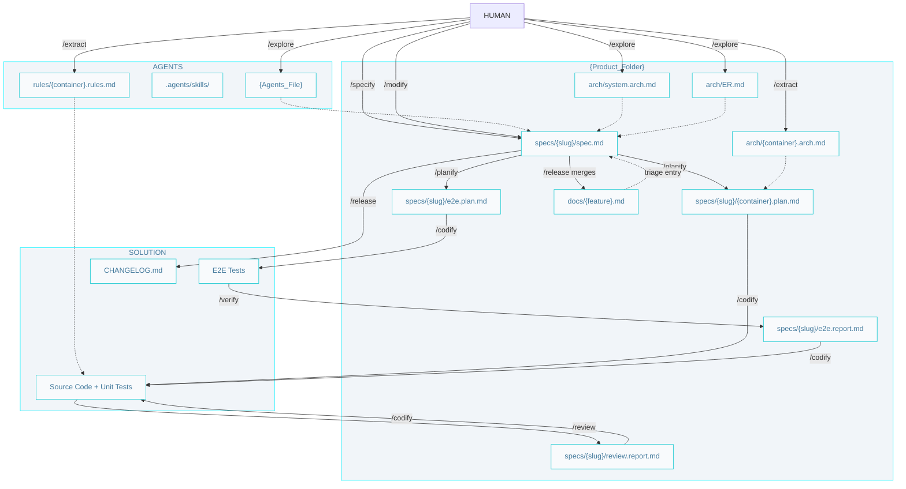

# AIDD Workflow

## Commands

- **When to use each skill:** [Skills catalog](../.agents/skills/skills.catalog.md) · [Skills lifecycle](../.agents/skills/skills.lifecycle.md)
- **Install, loops, and prompts:** [Getting started](./getting-started.md)
- **Phase diagrams:** [architect](./architect.pipelines.md) · [builder](./builder.pipelines.md) · [craftsman](./craftsman.pipelines.md)
- **Producers and consumers:** [Skills interrelationships](./skills-interrelationships.md)
- **Why it is shaped this way:** [Design decisions](./design.decisions.md)

## Glossary

- **Container** — a named runnable unit in `system.arch.md` (`api`, `web`, `db`...) — C4 L2. Units are always identified by container name.
- **Tier** — the technological layer a container belongs to (`front | back | db | e2e | fullstack`); classifies containers, never identifies one.
- **e2e container** — runnable like any container, but transversal: it verifies the others. Planned via `e2e.plan.md` and implemented by `/codify` like any container; only its verdict belongs to `/verify`.
- **Mode** — `greenfield` (no code → prescribe) or `brownfield` (code exists → extract). Resolved per container by `/extract`.

## Git

Branch naming, conventional commits, and git safety rules live in the root `{Agents_File}` (written by `/explore`).

## SDD Artifacts (Source, Context, Output, Status)

Builder artifacts in pipeline order. `Status` is the `status` frontmatter value; artifacts without frontmatter show `—`.

| Artifact | Source | Context | Output | Status |
|----------|--------|---------|--------|--------|
| **Spec** | `/specify` | `system.arch.md`, `ER.md` | `specs/{slug}/spec.md` | `pending` (`/specify`) -> `in-progress` (first `/codify`) -> `done` (`/release`) |
| **Container plan** | `/planify` | `{container}.arch.md` | `specs/{slug}/{container}.plan.md` | — (steps checked `[x]` by `/codify`) |
| **E2E plan** | `/planify` | `spec.md` acceptance criteria | `specs/{slug}/e2e.plan.md` | — (steps checked `[x]` by `/codify`) |
| **Code** | `/codify` | `rules/{container}.rules.md` | `{Source_Folders}` | — |
| **E2E tests** | `/codify` | `e2e.plan.md`, `e2e.arch.md` / `e2e.rules.md` | `e2e/` | — |
| **E2E report** | `/verify` | `spec.md`, E2E run | `specs/{slug}/e2e.report.md` | one entry per defect: `code bug \| test bug \| structural`, each with a handoff |

`/verify` also marks the spec's acceptance criteria `[x]/[ ]` — the spec carries the durable acceptance state; the report carries the transient run details.

### Workflow index

- `{Agents_File}` (`AGENTS.md` | `CLAUDE.md`) — Entry point: environment, paths, git rules, status chain, and product brief (`/explore`).
- `{Agents_Folder}/skills/` — Agent skills (from AIDDbot or custom).
- `{Agents_Folder}/rules/` — Coding rules per container.
  - `{container}.rules.md` — Naming, conventions, canonical example (`/extract`).

### Product

- `arch/` — Architecture set for planning and coding.
  - `system.arch.md` — Containers diagram (C4 L2) (`/explore`).
  - `ER.md` — Domain Entity-Relationship diagram (`/explore`).
  - `{container}.arch.md` — Components (C4 L3), code organization, contract surface (`/extract`).
  - `db.schema.md` / `api.schema.md` — System-wide field-level database/API schema, split out as they grow large; written when the owning container is extracted, linked from any container that benefits (`/extract`, when applicable).

- `docs/` — Living functional docs, one per feature: current behavior, one statement per line, each linking its governing spec (`/release` merges; on conflict the spec wins).
- `specs/` — One folder per feature, named with the feature `{slug}`; all of the feature's artifacts live inside it.
  - `{slug}/spec.md` — Problem, per-container expected results, acceptance criteria (`/specify`). `/verify` marks its criteria `[x]/[ ]`; `/release` closes it.
  - `{slug}/{container}.plan.md` — Implementation plan for one container (`/planify`).
  - `{slug}/e2e.plan.md` — The e2e container's plan: one scenario per acceptance criterion (`/planify`).
  - `{slug}/e2e.report.md` — Defects report: expected vs actual, affected container, severity, kind, handoff (`/verify`).
  - `{slug}/review.report.md` — Findings report: dimension, severity, kind, handoff (`/review`).

### Solution

- `{Source_Folders}` — The source code and unit tests of each container.
- `e2e/` — End-to-end tests (written by `/codify` from `e2e.plan.md`; judged by `/verify`).
- `CHANGELOG.md` — Keep-a-Changelog log of all notable changes (`/release`).

## Maintenance

Specs are commits; arch docs and feature docs are HEAD. A `done` spec is immutable — changes to released features enter via `/modify`, which starts at `docs/{feature}.md` and follows its link to the governing spec:

- Implementation defect → direct fix + regression test → patch `/release`.
- Requirement change → a plain new spec via `/specify` → full pipeline → `/release` merges the feature doc, derives the supersession, and stamps `superseded-by:` on the old spec.

See the [Skills lifecycle](../.agents/skills/skills.lifecycle.md) for the full maintenance and refactoring map.
