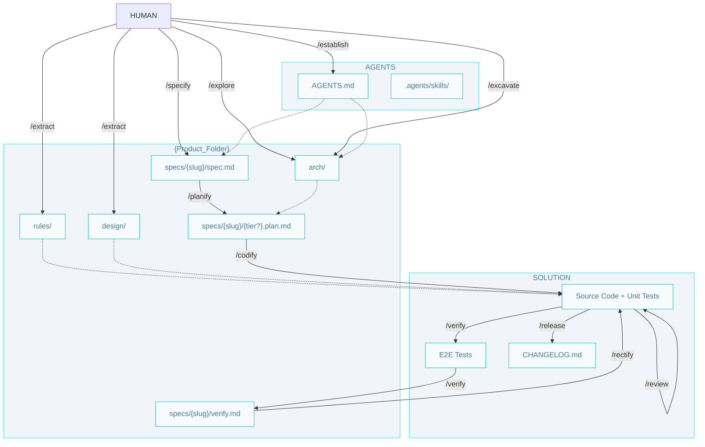

# AIDD Workflow

## Commands

- **When to use each skill:** [Skills catalog](../.agents/AIDD.skills-catalog.md) 
- **Install, loops, and prompts:** [Getting started](./getting-started.md)
- **Phase diagrams:** [architect](./architect.pipelines.md) · [builder](./builder.pipelines.md) · [craftsman](./craftsman.pipelines.md)

## Git

Branch naming and git safety rules live in project `SOUL.md` (from `/establish`).

## SDD Artifacts (Source, Context, Output, Status)

Builder artifacts in pipeline order. `Status` is the `status` frontmatter value; artifacts without frontmatter show `—`.

| Artifact | Source | Context | Output | Status |
|----------|--------|---------|--------|--------|
| **Spec** | `/specify` | `system.arch.md`, `ADR.md` | `specs/{slug}/spec.md` | `pending` (`/specify`) -> `in-progress` (`/planify`, on branching) -> `done` (`/release`) |
| **Plan** | `/planify` | `{tier}.arch.md`, `ER.md` | `specs/{slug}/{tier?}.plan.md` | `pending` -> `done` |
| **Code** | `/codify` | `{tier}.rules.md`, `DESIGN.md` | `{tier}/` | — |
| **E2E** | `/verify` | `e2e.rules.md` | `e2e/` | — |
| **Verify report** | `/verify` | `spec.md`, E2E run | `specs/{slug}/verify.md` | `pending` -> `pass` \| `fail` |

### Workflow index

- `AGENTS.md` - Entry point, configurations, paths and product brief.

- `.agents/skills/` - Agent skills (from AIDDbot or custom). 

### Product

- `arch/` - Full architecture set for planning and coding. 
  - `system.arch.md` - Containers and technology stack (`/explore`).
  - `{tier}.arch.md` - Per-tier stack, dev commands, code organization (`/excavate`).
  - `ADR.md` - Architectural decisions (`/explore`).
  - `ER.md` - Domain model (`/excavate` when all tiers are done).

- `rules/` - Coding rules for each tier
  - `{tier}.rules.md` - Coding rules for the tier (`/extract`).

- `design/` - UI design specification (`/extract`, presentation tiers); implemented by `/codify`.
  - `DESIGN.md` - Design tokens (color, typography, spacing, radius, elevation) and component behavior for the product UI.

- `specs/` - One folder per feature, named with the feature `{slug}`; all of the feature's artifacts live inside it.
  - `{slug}/spec.md` - Feature specification (problem, solution, acceptance criteria). `/verify` marks its criteria `[x]/[ ]`.
  - `{slug}/{tier?}.plan.md` - Implementation plans for the feature in each tier (`/planify`).
  - `{slug}/verify.md` - E2E verification report: run summary plus a Rectify guide for `/rectify` when there are failures (`/verify`).

### Solution

- `{tier}/`- The source code and unit tests of the tier.
- `e2e/` - End-to-end tests 
- `CHANGELOG.md` - A log of all notable changes made to the codebase.
