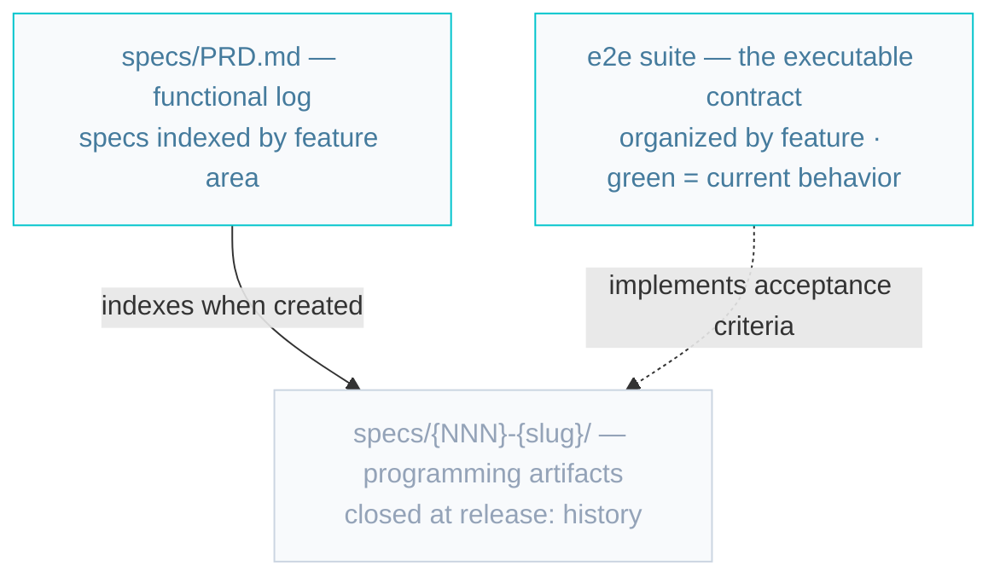
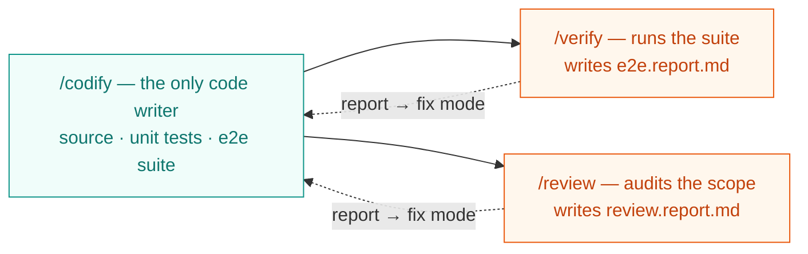
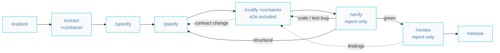
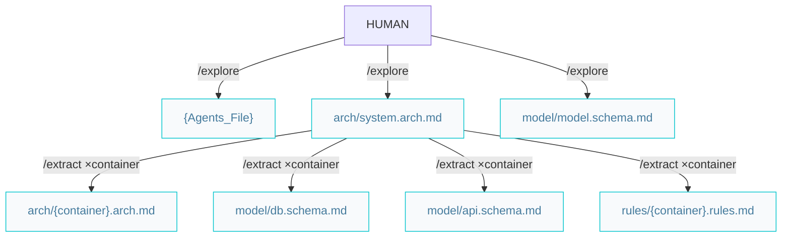
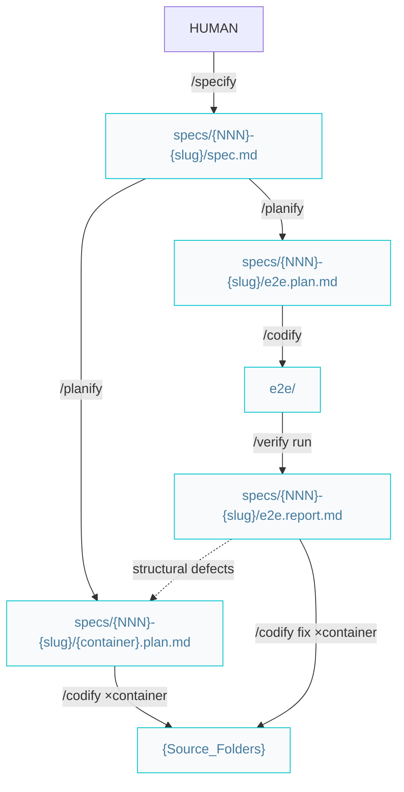
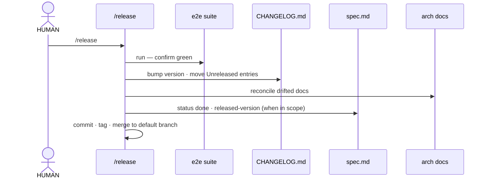
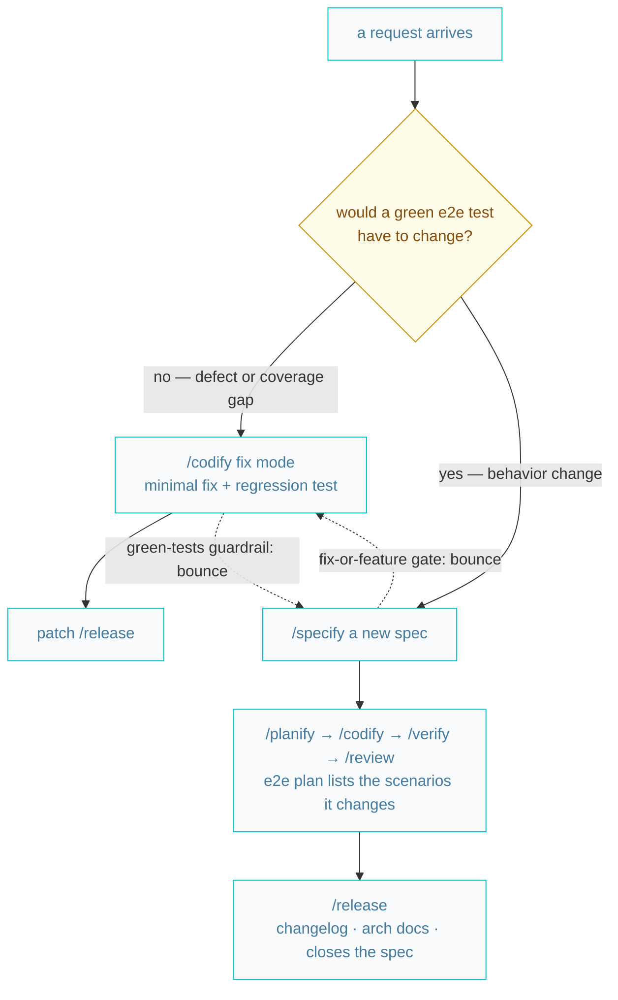
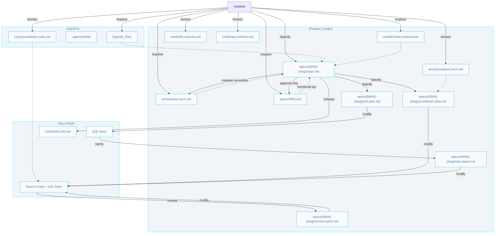
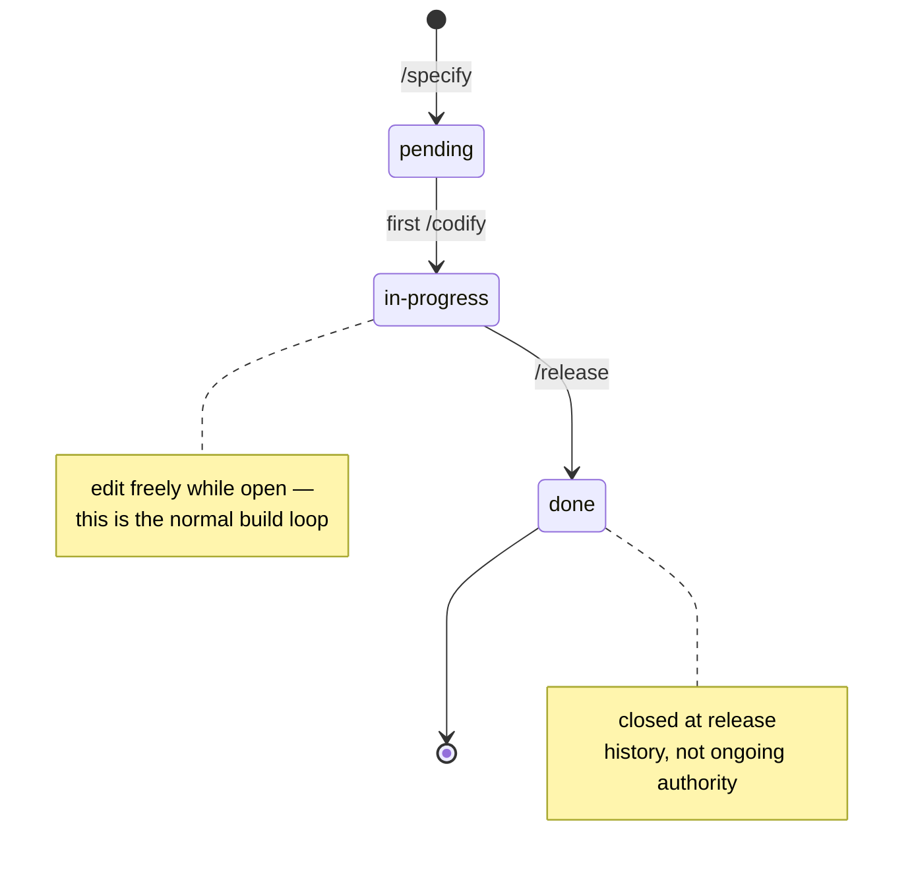

# AIDD Workflow

The whole system, visually: the model, the pipeline, the phases, the routing, and the
artifacts. The [catalog](../.agents/skills/skills.catalog.md) is the inventory, the
[lifecycle](../.agents/skills/skills.lifecycle.md) is the map, the
[design decisions](./design.decisions.md) are the why — this is the picture.
For install and first steps, see [Getting started](./getting-started.md).

## The model

**The green e2e suite is the contract.** The PRD (`specs/PRD.md`) is the functional
log — shell from `/explore`, specs indexed by feature area when `/specify` creates them.
Released specs are closed — history, not ongoing authority.



Green tests change only through a plan — a plan step authorizes a test edit exactly the
way it authorizes a code edit.

**One writer, two evaluators.** `/codify` is the only skill that writes code — source,
unit tests, and the e2e suite alike. `/verify` and `/review` only evaluate and report;
implementation and evaluation never share a session.



Each report entry carries a **kind** and a **handoff**: `code bug` / `test bug` →
`/codify` (per container); `structural` → `/planify`; `behavioral` → `/specify`;
`mechanical` → `/review --fix` or `/codify`.

## The pipeline

Eight skills: two set up the context, four build and prove, two guard and ship.



Every feedback edge is a **report**, and every fix lands through `/codify` — the skill
that wrote the code fixes the code; the evaluators never touch what they judge.
The commands under [`.agents/commands/`](../.agents/skills/skills.catalog.md#commands)
chain whole stretches of this pipeline, one subagent per skill run.

## Set up the context



```markdown
/explore -> /extract (×container)
```

Both steps apply **evidence wins**: document what exists, prescribe defaults (marked
*intended*) where it doesn't. The rule resolves per gap: one repo can mix extracted
containers and prescribed ones. **Scope split:** `/explore` uses the tree and Guide
files only; `/extract` reads that container's source.

- `/explore` sets up AIDD and documents the system (C4 L2):
  - Root `{Agents_File}` (`AGENTS.md` | `CLAUDE.md`) — environment, paths, git rules, status chain, product brief.
  - `arch/system.arch.md` — containers diagram; each container has **Tier** and a **Detail** link.
  - `model/model.schema.md` — conceptual ER diagram and entity list (no attributes).
  - `specs/PRD.md` — functional log shell (product problem/goals); feature lines come from `/specify`.
- `/extract` documents **one container per invocation**:
  - `arch/{container}.arch.md` — C4 L3 components and code organization (non-`db` tiers).
  - `model/db.schema.md` — relational schema (**instead of** arch when tier is `db`).
  - `model/api.schema.md` — when the container exposes an API (merge into the shared file).
  - `{Agents_Folder}/rules/{container}.rules.md` — naming, conventions, one canonical example.
  - Updates the container **Detail** link in `system.arch.md`.

When every container is documented, start features with `/specify`.

## Build a feature

From idea to verified code in four steps: one skill per step, one artifact per step.
All feature artifacts live together in `specs/{NNN}-{slug}/`; `specs/PRD.md` indexes
the specs by feature area. E2E test code stays in the solution (`e2e/`), organized by
feature.



1. **`/specify`** — the **what**: a one-page ticket with the problem, expected results
   per container, and acceptance criteria numbered `AC-{NNN}.{n}`; appends its line to
   `specs/PRD.md`. No technology, no steps.
2. **`/planify`** — the **how**: one plan per affected container, the transversal
   `e2e.plan.md` included (one scenario step per AC id). Shared contracts (API shapes,
   schemas) are stated verbatim in every sibling plan.
3. **`/codify`** — one container plan per run; sessions can run in parallel. Functional
   code + unit tests — and the e2e suite, built like any other container (its tests
   stay red until the features land — that's expected). If an in-scope change would
   alter a shared contract, it hands back to `/planify` — never improvises a
   cross-container change.
4. **`/verify`** — **report-only**: runs the suite, writes `e2e.report.md` with a
   verdict per AC id plus a kind and handoff per defect, and marks the spec's
   acceptance criteria `[x]/[ ]`. It never fixes.

When the suite is red, verify reports, codify fixes, verify re-runs — until green:

```markdown
code bug | test bug  -> /codify the e2e.report.md (×affected container) -> /verify re-runs
structural           -> escalate: /planify the e2e.report.md -> /codify -> /verify
```

The prompts, end to end:

```markdown
/specify riders can rate a trip 1 to 5 stars
/planify the specification
/codify the api plan
/codify the web plan
/codify the e2e plan
/verify the feature
/codify the e2e report          (only if defects)
/verify the feature             (until green)
/review the feature branch
/release
```

## Quality and release

```markdown
/verify (green) -> /review -> /codify fixes (or --fix) -> /verify -> /release
```

`/review` audits a code scope (feature branch, plan/spec files, or explicit paths) for
**a11y, security, performance, and clean-code/DRY**, and writes `review.report.md` —
each finding with a dimension, severity, kind, and handoff. Report-only by default:
fixes land via `/codify` with the report; an explicit `--fix` applies the mechanical
findings (renames, dead code, extractions) directly. Guardrails worth knowing:

- **Green baseline** — it refuses to start on a failing suite; run `/verify` first.
- **Behavior findings are not its call** — a finding whose fix would change observable
  behavior is handed to `/specify`; contract or component moves are handed to `/planify`.

`/release` ships verified work — the same sequence with or without a spec in scope:



## Maintenance

No triage skill. Changes to **released** features route on one mechanical question —
*would satisfying the request change what a green e2e test asserts?* Either door
bounces a misrouted request to the other, so the human never has to choose right.



The old "no silent behavior changes" rule is structural: `/codify` cannot flip a green
test without a plan, and a plan needs a spec — a disguised behavior change has no
hot-fix path through the system. Behavior-preserving refactors need no spec and route
by blast radius — see the [lifecycle map](../.agents/skills/skills.lifecycle.md).

## The artifacts

Who writes what, who reads it, in pipeline order:



### Producer → artifact → consumers

| Producer | Artifact | Consumers | Status |
|----------|----------|-----------|--------|
| `/explore` | `{Agents_File}` (`AGENTS.md` \| `CLAUDE.md`) | every skill — paths, conventions, git rules, start/test commands | — |
| `/explore` | `arch/system.arch.md` (C4 L2, Tier + Detail per container) | `/extract`, `/specify`, `/planify`, `/codify`, `/release` | — |
| `/explore` | `model/model.schema.md` (conceptual ER, no attributes) | `/specify`, `/release` | — |
| `/explore` | `specs/PRD.md` (functional log shell) | `/specify` (appends lines) | — |
| `/extract` | `arch/{container}.arch.md` (C4 L3, non-`db`) | `/planify`, `/codify`, `/release` (doc sync) | — |
| `/extract` | `model/db.schema.md` (`db` tier, instead of arch) | `/planify`, `/codify`, `/verify` | — |
| `/extract` | `model/api.schema.md` (when container exposes an API; merge) | `/planify`, `/codify`, `/verify` | — |
| `/extract` | `{Agents_Folder}/rules/{container}.rules.md` | `/codify` | — |
| `/specify` | `specs/{NNN}-{slug}/spec.md` + its line appended to `specs/PRD.md` | `/planify`, `/verify` (criteria), `/release`; the PRD helps the next `/specify` spot overlap | `pending` → `in-progress` (first `/codify`) → `done` (`/release`) |
| `/planify` | `specs/{NNN}-{slug}/{container}.plan.md` | `/codify`, `/review` (plan scope) | steps checked `[x]` by `/codify` |
| `/planify` | `specs/{NNN}-{slug}/e2e.plan.md` | `/codify` (implements the suite), `/verify` (scenario ↔ AC id mapping) | steps checked `[x]` by `/codify` |
| `/codify` | source + unit tests (`{Source_Folders}`); e2e tests (`e2e/`, titles carry AC ids) | `/verify`, `/review`; green-baseline gates; refactor safety net | — |
| `/verify` | `specs/{NNN}-{slug}/e2e.report.md` (verdict per AC id) + spec criteria `[x]/[ ]` | `/codify` (fix mode, per container), `/planify` (structural), `/release` | — |
| `/review` | `specs/{NNN}-{slug}/review.report.md` (+ `refactor` commit with `--fix`) | `/codify` (fix mode), `/release` | — |
| `/release` | `CHANGELOG.md`, version bump + tag, reconciled arch docs; spec closed when in scope | HUMAN / every skill | — |

The implementer can never mark its own work verified: `/codify` checks plan steps,
only `/verify` checks acceptance criteria, `/release` gates on criteria all `[x]`.

### The spec lifecycle



### Workflow index

- `{Agents_File}` (`AGENTS.md` | `CLAUDE.md`) — Entry point: environment, paths, git rules, status chain, and product brief (`/explore`).
- `{Agents_Folder}/skills/` — Agent skills (from AIDDbot or custom); `{Agents_Folder}/commands/` — phase orchestrators.
- `{Agents_Folder}/rules/{container}.rules.md` — Naming, conventions, canonical example (`/extract`).
- `arch/` — Architecture set for planning and coding.
  - `system.arch.md` — Containers diagram (C4 L2), Tier + Detail per container (`/explore`).
  - `{container}.arch.md` — Components (C4 L3), code organization (`/extract`, non-`db`).
- `model/` — Domain and field-level schemas.
  - `model.schema.md` — Conceptual ER + entity list, no attributes (`/explore`).
  - `db.schema.md` — Relational schema for the `db` container (instead of arch) (`/extract`).
  - `api.schema.md` — API field shapes when a container exposes an API (`/extract`).
- `specs/` — One folder per spec, named `{NNN}-{slug}` (`{NNN}` is a 3-digit sequential id); all of the spec's artifacts live inside it.
  - `PRD.md` — Functional log: shell from `/explore`; specs indexed by feature area when `/specify` creates them. No status — that lives in each spec.
  - `{NNN}-{slug}/spec.md` — Problem, per-container expected results, acceptance criteria (`/specify`).
  - `{NNN}-{slug}/{container}.plan.md` — Implementation plan for one container (`/planify`).
  - `{NNN}-{slug}/e2e.plan.md` — The e2e container's plan: one scenario per AC id (`/planify`).
  - `{NNN}-{slug}/e2e.report.md` — Verdict per AC id + defects: expected vs actual, container, severity, kind, handoff (`/verify`).
  - `{NNN}-{slug}/review.report.md` — Findings report: dimension, severity, kind, handoff (`/review`).
- `docs/` — Human-oriented documentation (README, guides); not maintained by `/release`.
- `{Source_Folders}` — The source code and unit tests of each container.
- `e2e/` — End-to-end tests, organized by feature (written by `/codify`; judged by `/verify`).
- `CHANGELOG.md` — Keep-a-Changelog log of all notable changes (`/release`).

## Glossary

- **Container** — a runnable unit in `system.arch.md` (`api`, `web`, `db`...) — C4 L2. Units are always identified by container name.
- **Tier** — a container's layer: `front | back | db | e2e | fullstack`. Classifies containers, never identifies one.
- **e2e container** — transversal; verifies the others; written by `/codify`, judged by `/verify`. Planned via `e2e.plan.md`.
- **Evidence wins** — extract what exists, prescribe what is missing (marked *intended*). Applied per question, not per repo.

## Git

Branch naming, conventional commits, and git safety rules live in the root
`{Agents_File}` (written by `/explore`). Spec work starts on `feat/{NNN}-{slug}`
(`/specify`), spec-less fixes on `fix/{slug}` (`/codify`); `/release` merges to the
default branch and tags.
