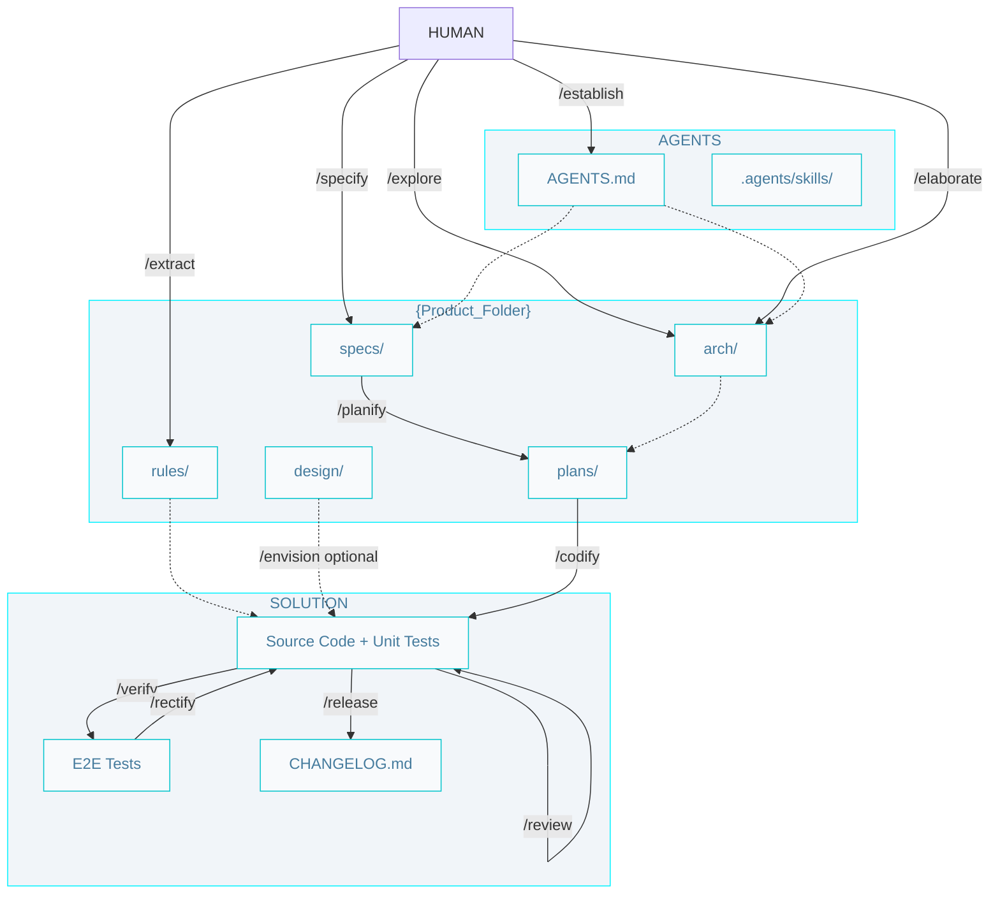

# AIDD Workflow

## Commands

- **When to use each skill:** [Skills catalog](../.agents/AIDD.skills-catalog.md) 
- **Install, loops, and prompts:** [Getting started](./getting-started.md)
- **Phase diagrams:** [architect](./architect.pipelines.md) · [builder](./builder.pipelines.md) · [craftsman](./craftsman.pipelines.md)

## Git

Branch naming and git safety rules live in project `SOUL.md` (from `/establish`).

## Artifacts

## SDD (Source, Context, Lifecycle)

| Artifact | Source | Context | Lifecycle |
|----------|--------|---------|-----------|
| **Spec** | `/specify` | `system.arch.md`, `ADR.md` | `pending` -> `in-progress` -> `done` |
| **Plan** | `/planify` | `{tier}.arch.md`,  `ER.md` | `pending` -> `done` |
| **Code** | `/codify`  | `{tier}.rules.md` | - |
| **E2E**  | `/verify`  | `e2e.rules.md` | - |

### Workflow index

- `AGENTS.md` - Entry point, configurations, paths and product brief.

- `.agents/skills/` - Agent skills (from AIDDbot or custom). 

### Product

- `arch/` - Full architecture set for planning and coding. 
  - `system.arch.md` - Containers and technology stack (`/explore`).
  - `{tier}.arch.md` - Per-tier stack, dev commands, code organization (`/elaborate`).
  - `ADR.md` - Architectural decisions (`/explore`).
  - `ER.md` - Domain model (`/elaborate` when all tiers are done).

- `rules/` - Coding rules for each tier
  - `{tier}.rules.md` - Coding rules for the tier (`/extract`).

- `design/` - UI design specifications (`/envision`).
  - `{slug}/DESIGN.md` - Typography, color, motion, and component behavior for a feature or surface.

- `specs/` - Feature specifications. 
  - `{slug}.spec.md` - Feature specification (problem, solution, acceptance criteria). Failed `/verify` runs add a Rectify section for `/rectify`.

- `plans/` - Implementation plans.
  - `{slug}.{tier?}.plan.md` - Implementation plans for the feature in each tier.

### Solution

- `{tier}/`- The source code and unit tests of the tier.
- `e2e/` - End-to-end tests 
- `CHANGELOG.md` - A log of all notable changes made to the codebase.
