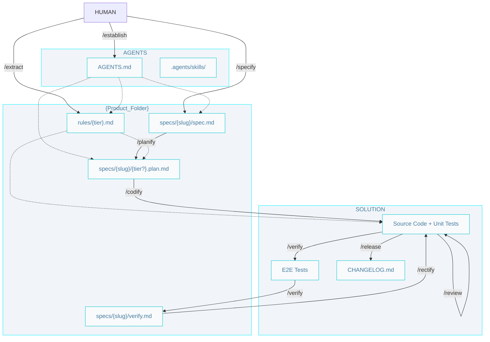

# AIDD Workflow

## Commands

- **When to use each skill:** [Skills catalog](../.agents/AIDD.skills-catalog.md) 
- **Install, loops, and prompts:** [Getting started](./getting-started.md)
- **Phase diagrams:** [architect](./architect.pipelines.md) · [builder](./builder.pipelines.md) · [craftsman](./craftsman.pipelines.md)

## Git

Branch naming and git safety rules live in project `SOUL.md` (from `/establish`).

## SDD Artifacts (Source, Context, Output, Status)

Builder artifacts in pipeline order. `Status` is the `status` frontmatter value; artifacts without frontmatter show `—`.

| Artifact | Source | Context | Output | Status |
|----------|--------|---------|--------|--------|
| **Spec** | `/specify` | `AGENTS.md` (Architecture) | `specs/{slug}/spec.md` | `pending` (`/specify`) -> `in-progress` (`/planify`, on branching) -> `done` (`/release`) |
| **Plan** | `/planify` | `AGENTS.md`, `{tier}.md` | `specs/{slug}/{tier?}.plan.md` | `pending` -> `done` |
| **Code** | `/codify` | `{tier}.md` | `{tier}/` | — |
| **E2E** | `/verify` | `e2e.md` | `e2e/` | — |
| **Verify report** | `/verify` | `spec.md`, E2E run | `specs/{slug}/verify.md` | `pending` -> `pass` \| `fail` |

### Workflow index

- `AGENTS.md` - Entry point, configurations, paths and product brief.

- `.agents/skills/` - Agent skills (from AIDDbot or custom). 

### Product

- `AGENTS.md` - Environment, product brief, and **system architecture** (C4 L2 containers, inter-container communication, and the decisions that constrain planning) — from `/establish`.

- `rules/` - One file per tier, the single source of truth for that tier.
  - `{tier}.md` - Tier architecture (C4 L3 components, code organization, contracts), domain entities, and coding conventions (`/extract`).

- `specs/` - One folder per feature, named with the feature `{slug}`; all of the feature's artifacts live inside it.
  - `{slug}/spec.md` - Feature specification (problem, solution, acceptance criteria). `/verify` marks its criteria `[x]/[ ]`.
  - `{slug}/{tier?}.plan.md` - Implementation plans for the feature in each tier (`/planify`).
  - `{slug}/verify.md` - E2E verification report: run summary plus a Rectify guide for `/rectify` when there are failures (`/verify`).

### Solution

- `{tier}/`- The source code and unit tests of the tier.
- `e2e/` - End-to-end tests 
- `CHANGELOG.md` - A log of all notable changes made to the codebase.
