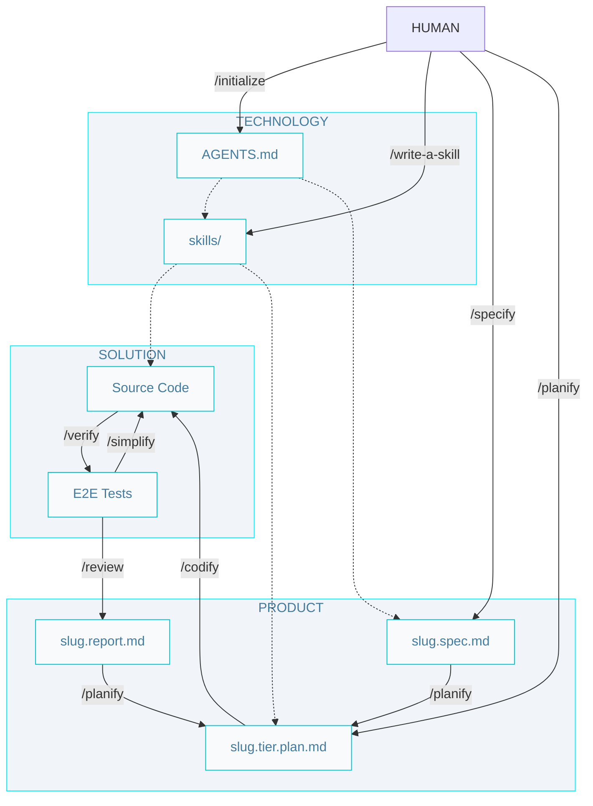

# AIDD Workflow

## Commands

- `/initialize` - Create initial technology documentation (/AGENTS.md and skills/) for a project.

- `/write-a-skill` - Create a new skill from a human need (Can be a rule set, a workflow, or a utility command).

- `/specify` - Create a new specification from a requirement (defines problem, solution, and verification).

- `/planify` - Create a set of implementation plans for an specification or bug-fix (back, front and data)

- `/codify` - Run the implementation cycle for one specification: generate plans, produce code, and validate with tests.

- `/verify` - Run end-to-end tests to ensure code meets specifications.

- `/simplify` - Refactor and improve existing code while preserving functionality and architecture.

- `/review` - Review code for guidelines compliance and best practices.

## Artifacts

- `/AGENTS.md` - The entry point for any agent joining the project; defines how agents should operate, including rules, workflows, and artifact conventions.

- `skills/` - Teach your agent how to do things. Make them easy to know when to use.

- `spec-slug.spec` - A detailed specification (problem, solution, verification) of a feature or technical requirement.

- `spec-slug.tier.plan` - A set of implementation plans derived from a single specification, or bug-fix, defining ordered steps and tasks for each involved tier.

- `Source Code` - The implementation of the system, including unit tests.

- `E2E Tests` - End-to-end tests that verify the implemented code meets the defined specifications and acceptance criteria.

- `slug.report.md` - A report generated during the review process, such as accessibility and compliance reports.

