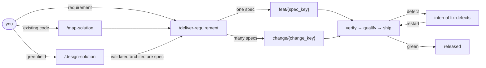

# AIDD Workflow

ABC: Architect, Builder, Craftsman. Three agents, one delivery loop.

You invoke a public **workflow**. The current session orchestrates it, executes linked internal **commands**, and spawns the named agent to run a **skill**. Agents execute skills, never commands.

## What holds

**The green E2E suite is the contract.** A green test changes only through a plan, preventing silent behavior drift.

**One writer, two evaluators.** `/codify` writes code. `/verify` and `/qualify` judge and report.

**Every delivery starts from a specification.** Architect writes it, Builder implements it, and Craftsman ships only after green verification and qualification.

**Delivery commands own branches.** One specification uses `feat/{spec_key}`. A coordinated change uses `change/{change_key}`. Skills write on the active branch.

## Public workflows

| Workflow | Job |
|---|---|
| `/scaffold-workshop` | Assemble, install, smoke-test, and commit a catalogued monorepo |
| `/map-solution` | Map an existing codebase before delivery |
| `/design-solution` | Design greenfield architecture and validate its technical specification |
| `/deliver-requirement` | Scope and deliver one specification or a coordinated change |
| `/clean-solution` | Find and fix CRAP, coverage, and lint defects |
| `/clean-drift` | Find and fix orphaned decay and code drift |

These six root `.workflow.md` files are the only human slash entrypoints. Root `.command.md` files are internal composition and have no harness adapters.


```mermaid
flowchart LR
  YOU([you]) -->|existing code| MAP["/map-solution"]
  YOU -->|greenfield| DESIGN["/design-solution"]
  YOU -->|requirement| DELIVER["/deliver-requirement"]
  MAP --> DELIVER
  DESIGN -->|validated architecture spec| DELIVER
  DELIVER -->|one spec| FEAT["feat/{spec_key}"]
  DELIVER -->|many specs| CHANGE["change/{change_key}"]
  FEAT --> REVIEW["verify → qualify → ship"]
  CHANGE --> REVIEW
  REVIEW -->|defect| FIX["internal fix-defects"]
  FIX -->|restart| REVIEW
  REVIEW -->|green| RELEASED[released]
```

## Requirement delivery

`/deliver-requirement` first executes internal `scope-feature`. Architect runs `/scope-change` and returns whether the requirement affects one specification or several coordinated specifications.

### One specification

Internal `deliver-spec`:

1. Creates and checks out `feat/{spec_key}`.
2. Executes `specify-spec` once. Architect runs `/specify`; without YOLO, the workflow stops for human approval.
3. Executes `implement-spec` once. Builder runs `/planify` for affected containers in parallel, then `/codify` for the resulting plans in parallel.
4. Executes `ship-implementation` once for the specification.

### Coordinated change

Internal `deliver-change`:

1. Creates and checks out `change/{change_key}`.
2. Executes `specify-spec` for every affected specification in parallel.
3. _ONCE_ all specifications are validated, executes `implement-spec` for each specification sequentially.
4. _ONCE_ all specifications are implemented, executes `ship-implementation` once for the complete change.

The change ships atomically: one review cycle, one merge, one tag, and one release version.

## Review and defect loops

Internal `ship-implementation` preserves evaluator order:

1. Craftsman runs `/verify` against the complete delivery scope.
2. _IF_ functional or E2E defects exist, internal `fix-defects` spawns Builder with `/codify`, then review restarts from `/verify`.
3. _ONCE_ verify is green, Craftsman runs `/qualify`.
4. _IF_ technical or quality defects exist, `fix-defects` applies them, then review restarts from `/verify`.
5. _ONCE_ verify and qualify are green, Craftsman runs `/shipify` once.

## Status chain

```markdown
pending → planned → in-progress → verified → qualified → released
```

## Next

- [Getting started](./getting-started.md)
- [Skills catalog](../.agents/skills/skills.catalog.md)
- [GitHub](https://github.com/AIDDbot/AIDDbot)
