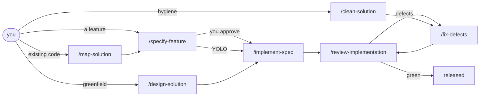
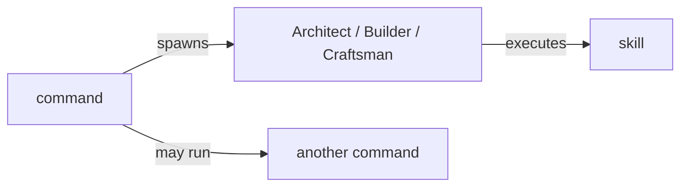
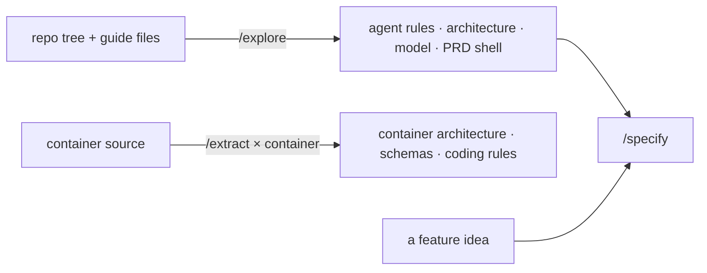
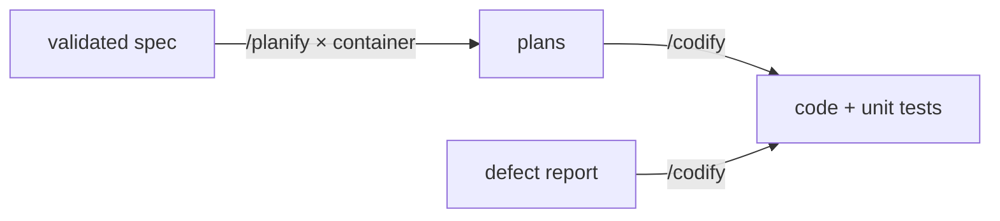

# AIDD Workflow

ABC: Architect, Builder, Craftsman. Three agents, one loop.

You invoke a **command**. The current session is the orchestrator: it spawns the named agent, and that agent executes a **skill**. Agents never run commands. A command may run another command.

AIDDbot applies AI-Driven Development with practices teams already trust.
This page is the short version.

## What holds

**The green e2e suite is the contract.**
A green test changes only through a plan, preventing silent behavior drift.

**One writer, two evaluators.**
`/codify` is the only skill that writes code. `/verify` and `/qualify` only judge and report.

**Every cycle starts from a spec.**
Architect writes it. Builder never starts without one. Craftsman never ships without a green review.

## Commands

| Command | Spawns | Job |
|---|---|---|
| `/map-solution` | Architect | Map an existing codebase before anyone builds |
| `/design-solution` | Architect | Design a greenfield architecture and its scaffold spec |
| `/specify-feature` | Architect | Write a feature spec and stop for your approval |
| `/implement-spec` | Builder, then `/review-implementation` | Plan and code from a validated spec, then review |
| `/fix-defects` | Builder | Apply a defect report in code |
| `/review-implementation` | Craftsman; `/fix-defects` when red | Verify, qualify, and ship |
| `/clean-solution` | Craftsman; `/fix-defects` when red | Hunt CRAP and lint across the codebase |
| `/scaffold-workshop` | — (command body) | Assemble, install, smoke-test, and commit a catalogued monorepo |


```mermaid
flowchart LR
  YOU([you])
  YOU -->|existing code| MAP["/map-solution"]
  YOU -->|greenfield| DES["/design-solution"]
  YOU -->|a feature| FEAT["/specify-feature"]
  MAP --> FEAT
  FEAT -->|you approve| IMP["/implement-spec"]
  FEAT -->|YOLO| IMP
  DES --> IMP
  IMP --> REV["/review-implementation"]
  REV -->|defects| FIX["/fix-defects"]
  FIX --> REV
  REV -->|green| REL[released]
  YOU -->|hygiene| CLEAN["/clean-solution"]
  CLEAN --> FIX
```

Map or design once. Then the feature loop is specify → implement. `/implement-spec` runs `/review-implementation` itself.

How a command runs:


```mermaid
flowchart LR
  CMD[command] -->|spawns| AGT[Architect / Builder / Craftsman]
  AGT -->|executes| SKL[skill]
  CMD -->|may run| CMD2[another command]
```

## Architect

```markdown
/map-solution
/design-solution
/specify-feature riders can rate a trip 1 to 5 stars
```


```mermaid
flowchart LR
  TREE[repo tree + guide files] -->|/explore| SYS[agent rules · architecture · model · PRD shell]
  SRC[container source] -->|/extract × container| DET[container architecture · schemas · coding rules]
  SYS --> SPEC["/specify"]
  FEAT[a feature idea] --> SPEC
```

- `/map-solution` spawns Architect to run `/explore` once, then `/extract` per container.
- `/design-solution` spawns Architect to run `/explore`, then `/specify` for the architecture to scaffold.
- `/specify-feature` spawns Architect to run `/specify` for a feature and **stops so you can read the spec**. YOLO continues into `/implement-spec`.
- All three apply evidence-first behavior: document what exists, ask where evidence is missing.

## Builder

```markdown
/implement-spec
/fix-defects
```


```mermaid
flowchart LR
  SPEC[validated spec] -->|/planify × container| PLAN[plans]
  PLAN -->|/codify| CODE[code + unit tests]
  RPT[defect report] -->|/codify| CODE
```

1. `/implement-spec` spawns Builder to plan each affected container (and e2e when the spec is functional), then to code from those plans. When coding is done, it runs `/review-implementation`.
2. `/fix-defects` spawns Builder with a Craftsman report. No new spec. The orchestrator calls this command when a review is red.
3. Builder does not run the acceptance suite. That is Craftsman's job.

Builder owns delivery from an approved spec to code that compiles and unit-tests green.

## Craftsman

```markdown
/review-implementation
/clean-solution
```


```mermaid
flowchart LR
  CODE[implementation] -->|/verify| VER[e2e report]
  VER -->|defects| FIX["/fix-defects"]
  VER -->|green| QLF["/qualify"]
  QLF -->|failed| FIX
  QLF -->|passed| REL["/shipify"]
  BASE[whole codebase] -->|lint · coverage| CLEAN["/clean-solution"]
  CLEAN --> FIX
```

`/review-implementation` spawns Craftsman to run `/verify`, then `/qualify`, then `/shipify`. A red report is a call to `/fix-defects`, then the review continues — not a rewrite of the spec.

`/clean-solution` spawns Craftsman to hunt cyclomatic complexity, poor coverage, and lint. It is not tied to a spec. A red report goes through `/fix-defects`.

## Specs

Architect names the kind when it calls `/specify`: `functional` (product change — PRD and e2e) or `technical` (engineering work — plans and review, no PRD, no functional e2e). `/specify-feature` passes `functional`; `/design-solution` passes `technical`. You review the page, not the kind name.

Status chain:

```markdown
pending → planned → in-progress → verified → qualified → released
```

## Next

- [Getting started](./getting-started.md)
- [Skills catalog](../.agents/skills/skills.catalog.md)
- [GitHub](https://github.com/AIDDbot/AIDDbot)
