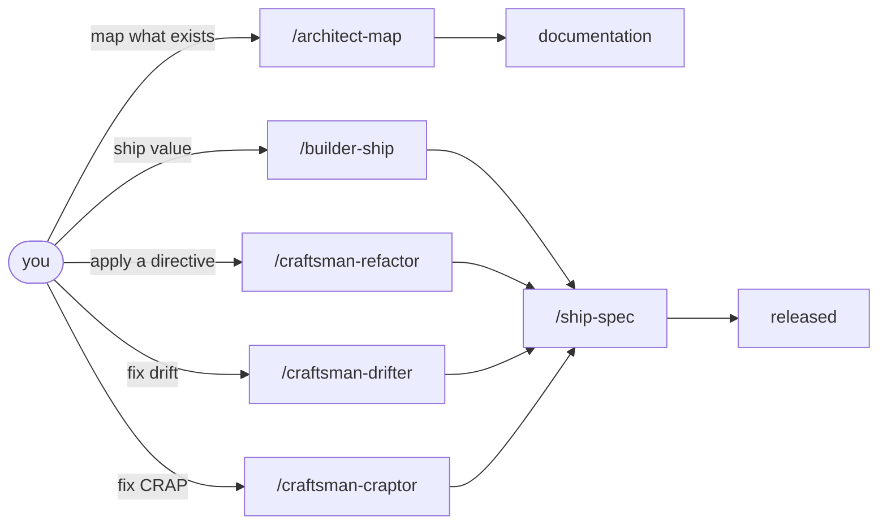
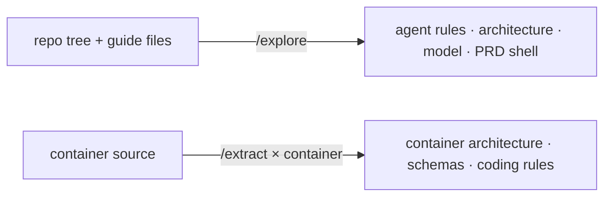
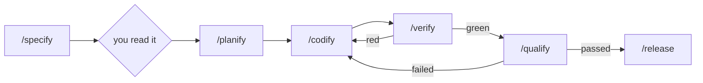
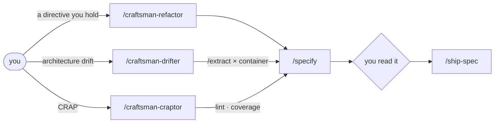

# AIDD Workflow

ABC: Architect, Builder, Craftsman. Three roles, one machine.

AIDDbot applies AI-Driven Development with practices teams already trust.  
This page is the short version.

## What holds

**The green e2e suite is the contract.**  
A green test changes only through a plan, preventing silent behavior drift.

**One writer, two evaluators.**  
`/codify` is the only skill that writes code. `/verify` and `/qualify` only judge and report.

**Every cycle starts from a spec.**  
What changes is which ABC role opens the door.

## ABC

| Role | Command | Job |
|---|---|---|
| **Architect** | `/architect-map` | Map what exists before anyone builds |
| **Builder** | `/builder-ship` | Spec a change, then ship it through `/ship-spec` |
| **Craftsman** | `/craftsman-refactor` | Apply a structural directive through `/ship-spec` |
|  | `/craftsman-drifter` | Detect architecture drift, then ship through `/ship-spec` |
|  | `/craftsman-craptor` | Find CRAP violations, then ship through `/ship-spec` |


```mermaid
flowchart LR
  YOU([you])
  YOU -->|map what exists| ARC["/architect-map"]
  YOU -->|ship value| BLD["/builder-ship"]
  YOU -->|apply a directive| REF["/craftsman-refactor"]
  YOU -->|fix drift| DFT["/craftsman-drifter"]
  YOU -->|fix CRAP| CRP["/craftsman-craptor"]
  ARC --> DOC[documentation]
  BLD --> MACH["/ship-spec"]
  REF --> MACH
  DFT --> MACH
  CRP --> MACH
  MACH --> REL[released]
```

Architect goes first. Builder and Craftsman use the same shipping machine.

## Architect

```markdown
/architect-map
```


```mermaid
flowchart LR
  TREE[repo tree + guide files] -->|/explore| SYS[agent rules · architecture · model · PRD shell]
  SRC[container source] -->|/extract × container| DET[container architecture · schemas · coding rules]
```

- `/explore` reads repo tree and guide files only for the system-level map.
- `/extract` reads source one container at a time for detailed documentation.
- Both apply evidence-first behavior: document what exists, ask where evidence is missing.

## Builder

```markdown
/builder-ship riders can rate a trip 1 to 5 stars
```


```mermaid
flowchart LR
  SPEC["/specify"] --> CHECK{you read it}
  CHECK --> PLAN["/planify"]
  PLAN --> CODE["/codify"]
  CODE --> VER["/verify"]
  VER -->|red| CODE
  VER -->|green| QLF["/qualify"]
  QLF -->|failed| CODE
  QLF -->|passed| REL["/release"]
```

1. `/specify` writes the spec: problem, outcomes, acceptance criteria.
2. You approve the spec (the manual checkpoint).
3. Loops close through `/codify` until verify and qualify are green.

Builder owns delivery from approved intent to release.

## Craftsman

Three doors, one machine. Each writes a refactor spec, stops for your check, then `/ship-spec`.

A directive you already hold:

```markdown
/craftsman-refactor extract shared validation into one module
```

Architecture drift against current docs:

```markdown
/craftsman-drifter
```

CRAP — cyclomatic complexity and poor test coverage:

```markdown
/craftsman-craptor
```


```mermaid
flowchart LR
  YOU([you])
  YOU -->|a directive you hold| REF["/craftsman-refactor"]
  YOU -->|architecture drift| DFT["/craftsman-drifter"]
  YOU -->|CRAP| CRP["/craftsman-craptor"]
  REF --> SPEC["/specify"]
  DFT -->|/extract × container| SPEC
  CRP -->|lint · coverage| SPEC
  SPEC --> CHK{you read it}
  CHK --> SHIP["/ship-spec"]
```

`/craftsman-refactor` takes a structural directive you already hold.  
`/craftsman-drifter` compares each container to current architecture docs.  
`/craftsman-craptor` hunts cyclomatic complexity and poor coverage.  
All three ship through `/ship-spec`, which enforces suite non-regression first.

## Two spec kinds

Both are written by `/specify`; the command names the kind.

| Functional | Refactor |
|---|---|
| Starts from a requirement | Starts from a structural directive |
| Branch: `feat/{spec_key}` | Branch: `refactor/{spec_key}` |
| Judged by `/verify` + e2e suite | Judged by `/qualify` + `/verify` non-regression |

Status chain:

```markdown
pending → planned → in-progress → verified → qualified → released
```

## Next

- [Getting started](./getting-started.md)
- [Skills catalog](../.agents/skills/skills.catalog.md)
- [GitHub](https://github.com/AIDDbot/AIDDbot)
