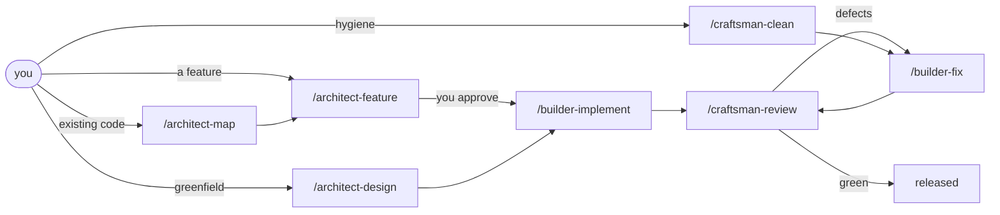
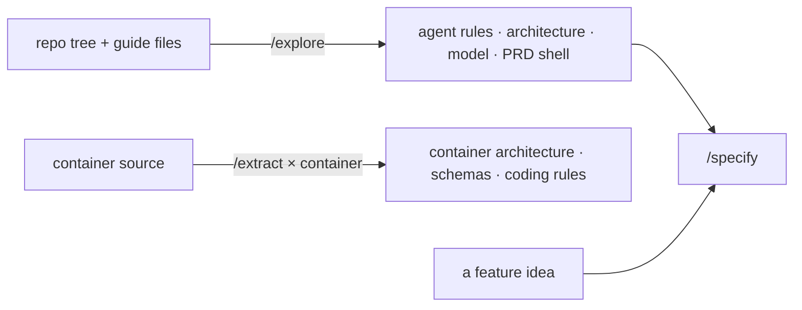
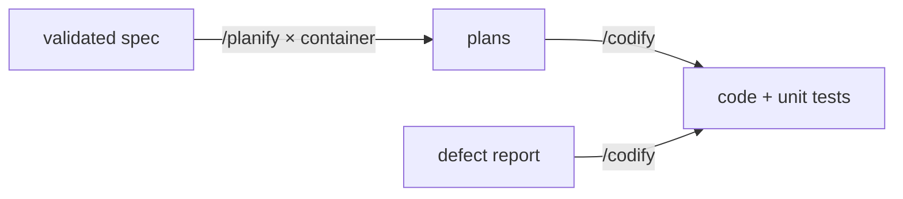
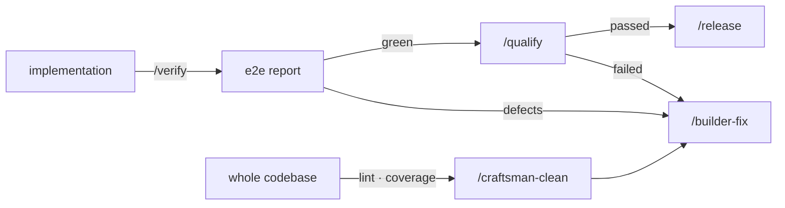

# AIDD Workflow

ABC: Architect, Builder, Craftsman. Three roles, one loop.

AIDDbot applies AI-Driven Development with practices teams already trust.  
This page is the short version.

## What holds

**The green e2e suite is the contract.**  
A green test changes only through a plan, preventing silent behavior drift.

**One writer, two evaluators.**  
`/codify` is the only skill that writes code. `/verify` and `/qualify` only judge and report.

**Every cycle starts from a spec.**  
Architect writes it. Builder never starts without one. Craftsman never ships without a green review.

## ABC

| Role | Command | Job |
|---|---|---|
| **Architect** | `/architect-map` | Map an existing codebase before anyone builds |
|  | `/architect-design` | Design a greenfield architecture and its scaffold spec |
|  | `/architect-feature` | Write a feature spec and stop for your approval |
| **Builder** | `/builder-implement` | Plan and code from a validated spec |
|  | `/builder-fix` | Apply a defect report in code |
| **Craftsman** | `/craftsman-review` | Verify, qualify, and ship; defects go back to `/builder-fix` |
|  | `/craftsman-clean` | Hunt CRAP and lint across the codebase, then `/builder-fix` |


```mermaid
flowchart LR
  YOU([you])
  YOU -->|existing code| MAP["/architect-map"]
  YOU -->|greenfield| DES["/architect-design"]
  YOU -->|a feature| FEAT["/architect-feature"]
  MAP --> FEAT
  FEAT -->|you approve| IMP["/builder-implement"]
  DES --> IMP
  IMP --> REV["/craftsman-review"]
  REV -->|defects| FIX["/builder-fix"]
  FIX --> REV
  REV -->|green| REL[released]
  YOU -->|hygiene| CLEAN["/craftsman-clean"]
  CLEAN --> FIX
```

Map or design once. Then the feature loop is specify → implement → review.

## Architect

```markdown
/architect-map
/architect-design
/architect-feature riders can rate a trip 1 to 5 stars
```


```mermaid
flowchart LR
  TREE[repo tree + guide files] -->|/explore| SYS[agent rules · architecture · model · PRD shell]
  SRC[container source] -->|/extract × container| DET[container architecture · schemas · coding rules]
  SYS --> SPEC["/specify"]
  FEAT[a feature idea] --> SPEC
```

- `/architect-map` runs `/explore` once, then `/extract` per container.
- `/architect-design` runs `/explore`, then `/specify` for the architecture to scaffold.
- `/architect-feature` runs `/specify` for a feature and **stops so you can read the spec**.
- All three apply evidence-first behavior: document what exists, ask where evidence is missing.

## Builder

```markdown
/builder-implement
/builder-fix
```


```mermaid
flowchart LR
  SPEC[validated spec] -->|/planify × container| PLAN[plans]
  PLAN -->|/codify| CODE[code + unit tests]
  RPT[defect report] -->|/codify| CODE
```

1. `/builder-implement` plans each affected container (and e2e when the spec is functional), then codes from those plans.
2. `/builder-fix` takes a Craftsman report and codes the fixes. No new spec.
3. Builder does not run the acceptance suite. That is Craftsman's job.

Builder owns delivery from an approved spec to code that compiles and unit-tests green.

## Craftsman

```markdown
/craftsman-review
/craftsman-clean
```


```mermaid
flowchart LR
  CODE[implementation] -->|/verify| VER[e2e report]
  VER -->|defects| FIX["/builder-fix"]
  VER -->|green| QLF["/qualify"]
  QLF -->|failed| FIX
  QLF -->|passed| REL["/release"]
  BASE[whole codebase] -->|lint · coverage| CLEAN["/craftsman-clean"]
  CLEAN --> FIX
```

`/craftsman-review` runs `/verify`, then `/qualify`, then `/release`. A red report is a handoff to `/builder-fix`, not a rewrite of the spec.

`/craftsman-clean` hunts cyclomatic complexity, poor coverage, and lint. It is not tied to a spec. The report goes to `/builder-fix`.

## Specs

Architect names the kind when it calls `/specify`: `functional` (product change — PRD and e2e) or `technical` (engineering work — plans and review, no PRD, no functional e2e). You review the page, not the kind name.

Status chain:

```markdown
pending → planned → in-progress → verified → qualified → released
```

## Next

- [Getting started](./getting-started.md)
- [Skills catalog](../.agents/skills/skills.catalog.md)
- [GitHub](https://github.com/AIDDbot/AIDDbot)
