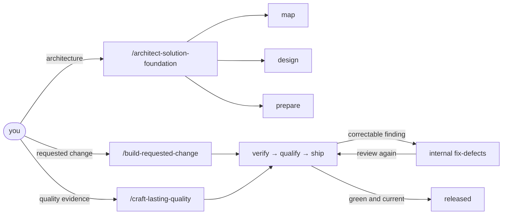

# AIDD Workflow

ABC: Architect, Builder, Craftsman. Three needs, three public entrypoints, one proof cycle.

You invoke a public **orchestrator skill**. The current session follows linked internal **worker skills** and spawns the named agent to run a **primitive skill**.

## What holds

**The green E2E suite is the behavior contract.** A green test changes only through a plan, preventing silent behavior drift. Technical criteria are proved separately by `/qualify` using their stated method and evidence.

**Initial materialization, one delivery writer, two evaluators.** `/scaffoldify` creates the initial solution. `/codify` writes delivery code. `/verify` and `/qualify` judge and report.

**Requested changes start from a specification; maintenance starts from accepted findings.** Architect writes requested-change specs. Craft preserves behavior or restores an approved contract from durable evidence. Craftsman ships only after green verification and qualification.

**Delivery owners control Git.** They record the base and create or compatibly resume the branch before any write: functional `feat/{spec_key}`, technical `chore/{spec_key}`, coordinated `change/{change_key}`, or findings `fix/{fix_key}`. Primitives keep the active branch; `/shipify` integrates only by express delegation.

## Public orchestrators

| Skill | Job |
|---|---|
| Need | Skill | Public flow |
|---|---|---|
| Understand or define architecture | `/architect-solution-foundation` | Understand → design → prepare when requested |
| Develop functionality or a technical change | `/build-requested-change` | Specify → validate → implement → prove → deliver |
| Maintain existing quality | `/craft-lasting-quality` | Review evidence → prioritize → repair → prove → deliver |

These three `orchestrator` skills are the stable public starting entrypoints. Focused primitives remain available as an advanced interface; `worker` skills are internal composition and are never rendered as command or prompt adapters.


```mermaid
flowchart LR
  YOU([you]) -->|architecture| ARCH["/architect-solution-foundation"]
  YOU -->|requested change| BUILD["/build-requested-change"]
  YOU -->|quality evidence| CRAFT["/craft-lasting-quality"]
  ARCH --> MAP["map"]
  ARCH --> DESIGN["design"]
  ARCH --> PREPARE["prepare"]
  BUILD --> PROOF["verify → qualify → ship"]
  CRAFT --> PROOF
  PROOF -->|correctable finding| REPAIR["internal fix-defects"]
  REPAIR -->|review again| PROOF
  PROOF -->|green and current| RELEASED[released]
```

`/architect-solution-foundation` resolves the intended result before choosing its route. Understanding an existing solution runs `map-solution`. Designing a new solution or an evolution uses the existing map and documents a technical design without requiring a scaffold. Preparing a new executable foundation also resolves material choices, runs `/scaffoldify`, and maps the resulting containers. Existing documentation is evidence to reuse or reconcile, not an automatic greenfield signal.

Design work uses the technical `chore/{spec_key}` lifecycle owned by `design-solution`. `/scaffoldify` stays on the branch it receives and creates no branch or commit. An executable evolution of existing application code continues through requested-change delivery rather than scaffolding over it.

## Requirement delivery

`/build-requested-change` first follows internal `scope-feature`. Architect runs read-only `/scope-change` triage and returns the delivery base plus a reserved `key`, `kind`, and `action` for every affected spec. A single-spec route creates no manifest; an approved multi-spec route persists one only after its delivery branch exists.

### One specification

Internal `deliver-spec` worker:

1. Creates or compatibly resumes `feat/{spec_key}` for functional work or `chore/{spec_key}` for technical work from the recorded base.
2. Executes `specify-spec` once. Architect runs `/specify`; without YOLO, the workflow stops for human approval.
3. Executes `implement-spec` once. Builder runs `/planify` sequentially for affected containers, agrees shared contracts, then runs `/codify` sequentially. The worker alone sets `planned` after all plans and `in-progress` before the first implementation write.
4. Executes `ship-implementation` once for the specification.

### Coordinated change

Internal `deliver-change` worker:

1. Creates or compatibly resumes `change/{change_key}` from the recorded base and persists the approved manifest.
2. Executes `specify-spec` for every affected specification sequentially, avoiding concurrent PRD, ID, spec, and index writes.
3. Once all specifications are validated, executes `implement-spec` for each specification sequentially.
4. _ONCE_ all specifications are implemented, executes `ship-implementation` once for the complete change.

The change ships atomically: one review cycle, one merge, one tag, and one release version.

## Review and defect loops

Internal `ship-implementation` worker preserves evaluator order:

1. Craftsman runs `/verify` against the complete delivery scope and records base, evaluated revision, commands, and results. It marks functional criteria only.
2. Correctable functional or E2E defects go through `fix-defects` sequentially by container, then review restarts from `/verify`. An unavailable check reports `blocked`; it does not invent a defect or spec status.
3. Once verify is green, Craftsman runs `/qualify` against the complete diff. Six gates apply: blocker/major fail, minor is recorded without blocking, and `n/a` requires a reason. Technical criteria need their own method and evidence.
4. Correctable quality defects restart the cycle from `/verify`. A blocked check returns to the caller; changing criteria or behavior requires a scope decision.
5. Once both reports are green and current, `/shipify` validates later changes, integrates, writes one final release commit, tags that exact commit, and only then deletes the branch. Content-changing conflict resolution requires review again. If interrupted after the release commit, it validates the recorded closure and finishes only the missing tag or branch cleanup, without requiring pre-release statuses or creating another version.

## Solution improvement

`/craft-lasting-quality` normalizes concrete evidence supplied by the caller before selection. When asked for a current review, it refreshes complexity, coverage, and strict-lint evidence even if work is already recorded; these checks are its automatic discovery scope, not a complete security or architecture audit. Without that request, it discovers new evidence only when no eligible work exists.

Craft first honors a named finding, then resumes an unfinished accepted group, then selects the most important eligible pending finding supported by recorded evidence. It confirms the violated state still exists; obsolete evidence becomes `stale`. An eligible fix preserves observable behavior or restores an approved contract backed by an active criterion, valid test, or applicable documented rule. Changing that contract, or asserting expected behavior without evidence, requires a specification and remains pending.

Before writing, Craft accepts one scope, assigns or reuses a `fix_key`, records its base, and creates or resumes `fix/{fix_key}`. `fix-defects` applies it and `ship-implementation` runs the existing E2E suite as a regression net, qualifies the diff, and ships a green patch. If nothing is eligible, Craft terminates without a branch, code changes, or a claimed release.

## Status chain

```markdown
pending → planned → in-progress → verified → qualified → released
```

## Next

- [Getting started](./getting-started.md)
- [Skills catalog](../.agents/skills/skills.catalog.md)
- [GitHub](https://github.com/AIDDbot/AIDDbot)
