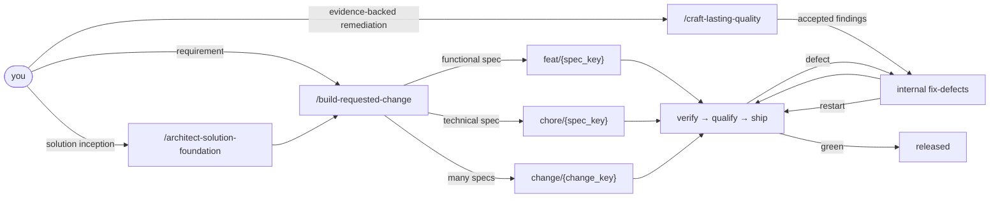

# AIDD Workflow

ABC: Architect, Builder, Craftsman. Three agents, one delivery loop.

You invoke a public **orchestrator skill**. The current session follows linked internal **worker skills** and spawns the named agent to run a **primitive skill**.

## What holds

**The green E2E suite is the behavior contract.** A green test changes only through a plan, preventing silent behavior drift. Technical criteria are proved separately by `/qualify` using their stated method and evidence.

**Initial materialization, one delivery writer, two evaluators.** `/scaffoldify` creates the initial solution. `/codify` writes delivery code. `/verify` and `/qualify` judge and report.

**Requested changes start from a specification; maintenance starts from accepted findings.** Architect writes requested-change specs; Craft preserves behavior from durable evidence. Craftsman ships only after green verification and qualification.

**Delivery owners control Git.** They record the base and create or compatibly resume the branch before any write: functional `feat/{spec_key}`, technical `chore/{spec_key}`, coordinated `change/{change_key}`, or findings `fix/{fix_key}`. Primitives keep the active branch; `/shipify` integrates only by express delegation.

## Public orchestrators

| Skill | Job |
|---|---|
| `/architect-solution-foundation` | Map an existing solution, or design, scaffold, and map a greenfield solution |
| `/build-requested-change` | Build one requested change or a coordinated delivery |
| `/craft-lasting-quality` | Turn durable quality findings into behavior-preserving remediation |

These three `orchestrator` skills are the stable public starting entrypoints. Focused primitives remain available as an advanced interface; `worker` skills are internal composition and are never rendered as command or prompt adapters.


```mermaid
flowchart LR
  YOU([you]) -->|solution inception| ESTABLISH["/architect-solution-foundation"]
  YOU -->|requirement| DELIVER["/build-requested-change"]
  YOU -->|evidence-backed remediation| IMPROVE["/craft-lasting-quality"]
  ESTABLISH --> DELIVER
  IMPROVE -->|accepted findings| FIX["fix/{fix_key}"]
  DELIVER -->|functional spec| FEAT["feat/{spec_key}"]
  DELIVER -->|technical spec| CHORE["chore/{spec_key}"]
  DELIVER -->|many specs| CHANGE["change/{change_key}"]
  FEAT --> REVIEW["verify → qualify → ship"]
  CHORE --> REVIEW
  CHANGE --> REVIEW
  FIX --> REVIEW
  REVIEW -->|defect| FIX["internal fix-defects"]
  FIX -->|restart| REVIEW
  REVIEW -->|green| RELEASED[released]
```

For greenfield work, Architect first expands the `init` agent seed into project rules and empty documentation shells, validates the design, then always runs `/scaffoldify`. It resolves and confirms missing name, tier, and technology choices before materializing one scaffold, then maps the resulting containers. It creates no branch or commit.

## Requirement delivery

`/build-requested-change` first follows internal `scope-feature`. Architect runs read-only `/scope-change` triage and returns the delivery base plus a reserved `key`, `kind`, and `action` for every affected spec. A single-spec route creates no manifest; an approved multi-spec route persists one only after its delivery branch exists.

### One specification

Internal `deliver-spec` worker:

1. Creates or compatibly resumes `feat/{spec_key}` for functional work or `chore/{spec_key}` for technical work from the recorded base.
2. Executes `specify-spec` once. Architect runs `/specify`; without YOLO, the workflow stops for human approval.
3. Executes `implement-spec` once. Builder runs `/planify` sequentially for affected containers, agrees shared contracts, then runs `/codify` sequentially. The worker alone sets `planned` after all plans and `in-progress` before the first implementation write.
4. Executes `ship-implementation` once for the specification.

### Coordinated change

Internal `deliver-change` worker:

1. Creates or compatibly resumes `change/{change_key}` from the recorded base and persists the approved manifest.
2. Executes `specify-spec` for every affected specification sequentially, avoiding concurrent PRD, ID, spec, and index writes.
3. Once all specifications are validated, executes `implement-spec` for each specification sequentially.
4. _ONCE_ all specifications are implemented, executes `ship-implementation` once for the complete change.

The change ships atomically: one review cycle, one merge, one tag, and one release version.

## Review and defect loops

Internal `ship-implementation` worker preserves evaluator order:

1. Craftsman runs `/verify` against the complete delivery scope and records base, evaluated revision, commands, and results. It marks functional criteria only.
2. Correctable functional or E2E defects go through `fix-defects` sequentially by container, then review restarts from `/verify`. An unavailable check reports `blocked`; it does not invent a defect or spec status.
3. Once verify is green, Craftsman runs `/qualify` against the complete diff. Six gates apply: blocker/major fail, minor is recorded without blocking, and `n/a` requires a reason. Technical criteria need their own method and evidence.
4. Correctable quality defects restart the cycle from `/verify`. A blocked check returns to the caller; changing criteria or behavior requires a scope decision.
5. Once both reports are green and current, `/shipify` validates later changes, integrates, writes one final release commit, tags that exact commit, and only then deletes the branch. Content-changing conflict resolution requires review again. If interrupted after the release commit, it validates the recorded closure and finishes only the missing tag or branch cleanup, without requiring pre-release statuses or creating another version.

## Solution improvement

`/craft-lasting-quality` runs internal `clean-solution`, then `collect-findings` once. The collector consolidates E2E reports, qualification reports and their accumulated debt, and the current quality report into the durable finding ledger. After approval, Craft assigns a `fix_key`, creates `fix/{fix_key}`, and applies the accepted findings through `fix-defects`. `ship-implementation` runs the complete E2E suite as a regression net, qualifies the fix diff, and ships a green patch. A finding that needs changed observable behavior remains pending because it is outside Craft's contract.

## Status chain

```markdown
pending → planned → in-progress → verified → qualified → released
```

## Next

- [Getting started](./getting-started.md)
- [Skills catalog](../.agents/skills/skills.catalog.md)
- [GitHub](https://github.com/AIDDbot/AIDDbot)
