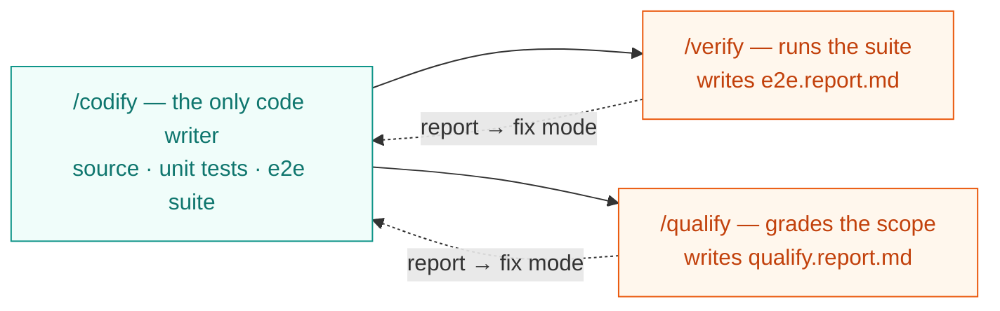
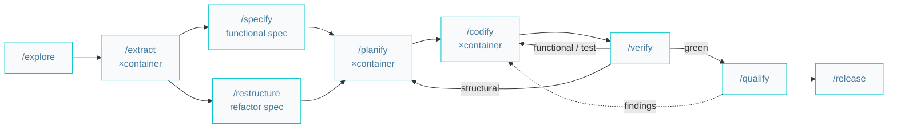
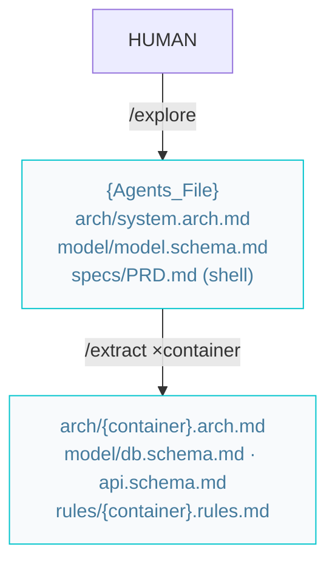
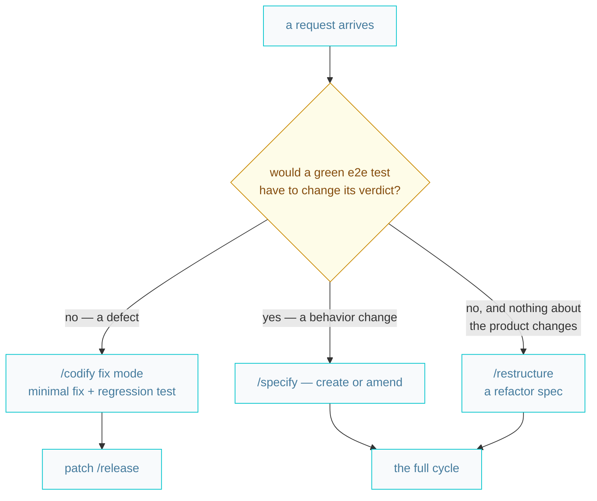
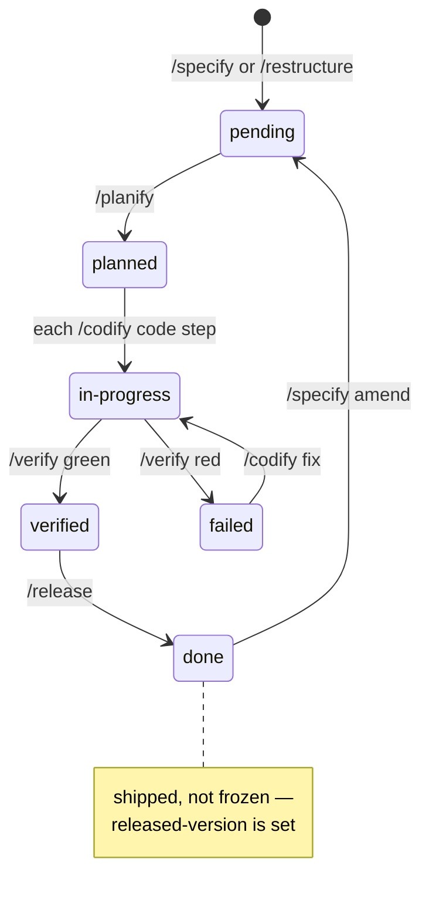

# AIDD Workflow

The system in pictures: the model it rests on, the pipeline, how a change is routed, and what
gets written. The [catalog](../.agents/skills/skills.catalog.md) is the inventory, the
[lifecycle](../.agents/skills/skills.lifecycle.md) is the map, the
[design decisions](./design.decisions.md) are the why. To install and run it, start with
[Getting started](./getting-started.md).

## The model

**The green e2e suite is the contract.** It is the executable statement of what the product
does today. A green test changes only through a plan — a plan step authorizes a test edit
exactly the way it authorizes a code edit — which is what makes a silent behavior change
structurally impossible rather than merely discouraged.

**One writer, two evaluators.** `/codify` is the only skill that writes code — source, unit
tests and the e2e suite alike. `/verify` and `/qualify` only judge and report. Implementation
and evaluation never share a session, so nothing ever grades its own work.

```mermaid
flowchart LR
  classDef wr fill:#f0fdfa,stroke:#0d9488,color:#0f766e
  classDef ev fill:#fff7ed,stroke:#ea580c,color:#c2410c

  COD["/codify — the only code writer<br/>source · unit tests · e2e suite"]:::wr
  VER["/verify — runs the suite<br/>writes e2e.report.md"]:::ev
  QLF["/qualify — grades the scope<br/>writes qualify.report.md"]:::ev

  COD --> VER
  COD --> QLF
  VER -.report → fix mode.-> COD
  QLF -.report → fix mode.-> COD
```

Every feedback edge is a **report**, and every fix lands back through `/codify`.

## The pipeline

Nine skills: two set up the context, two capture demand, three build and prove, two guard and
ship. Every cycle starts from a spec — what differs is which door it came through.

```mermaid
flowchart LR
  classDef nd fill:#f8fafc,stroke:#00c4cc,color:#457b9d

  EXP["/explore"]:::nd --> EXT["/extract<br/>×container"]:::nd
  EXT --> SPC["/specify<br/>functional spec"]:::nd
  EXT --> REF["/restructure<br/>refactor spec"]:::nd
  SPC --> PLN["/planify<br/>×container"]:::nd
  REF --> PLN
  PLN --> COD["/codify<br/>×container"]:::nd
  COD --> VER["/verify"]:::nd
  VER -->|green| QLF["/qualify"]:::nd
  QLF --> REL["/release"]:::nd

  VER -->|functional / test| COD
  VER -->|structural| PLN
  QLF -.findings.-> COD
```

| Phase | Skills | Produces |
|---|---|---|
| Context | `/explore`, `/extract` | agent rules, architecture, schemas, per-container coding rules |
| Capture | `/specify` or `/restructure` | one spec, `pending` |
| Build | `/planify`, `/codify` | one plan and one implementation per container |
| Prove | `/verify`, `/qualify` | e2e verdicts, gate verdicts — report only |
| Ship | `/release` | version, changelog, reconciled docs, tag |

The commands under [`.agents/commands/`](../.agents/skills/skills.catalog.md#commands) chain
whole stretches of this, one subagent per skill run.

## Setting up the context

Both context skills apply **evidence wins**: describe what exists, propose a default where
nothing does. The rule resolves per gap, so one repo can mix documented containers and
prescribed ones — which is why an empty repository and a mature one both work.

They differ in what they are allowed to read. `/explore` sees the repo tree and the Guide files
only — README, changelog, manifests — and produces the system-level view. `/extract` does read
source, one container at a time, and produces that container's detail.

```mermaid
flowchart TD
  classDef nd fill:#f8fafc,stroke:#00c4cc,color:#457b9d

  HUM[HUMAN] -->|/explore| SYS["{Agents_File}<br/>arch/system.arch.md<br/>model/model.schema.md<br/>specs/PRD.md (shell)"]:::nd
  SYS -->|"/extract ×container"| DET["arch/{container}.arch.md<br/>model/db.schema.md · api.schema.md<br/>rules/{container}.rules.md"]:::nd
```

## Two doors, one spec

A cycle can only start from a spec, and there are two ways to get one.

| | functional | refactor |
|---|---|---|
| Written by | `/specify` | `/restructure` |
| From | a requirement | a structural directive you give |
| Id series | `001`, `002`… | `R001`, `R002`… |
| Branch | `feat/{spec_key}` | `refactor/{spec_key}` |
| Listed in the PRD | yes — it is a business catalog | no |
| Amendable | yes; amend always replans | no — a later decision is a new spec |
| Judged by | `/verify`, with the e2e suite | `/qualify`'s gates, plus `/verify` for non-regression |

They converge at `/planify` and from there the cycle is identical. A refactor spec's first
criterion is always suite non-regression: its e2e plan may change *how* a scenario reaches its
result, never *what* it asserts.

## Routing a change

There is no triage skill. Every request against released work routes on one mechanical
question, and either door bounces a misrouted request to the other — so you never have to
classify correctly on the first try.

```mermaid
flowchart TD
  classDef nd fill:#f8fafc,stroke:#00c4cc,color:#457b9d
  classDef q fill:#fefce8,stroke:#ca8a04,color:#854d0e

  REQ["a request arrives"]:::nd --> Q{"would a green e2e test<br/>have to change its verdict?"}:::q

  Q -->|"no — a defect"| FIX["/codify fix mode<br/>minimal fix + regression test"]:::nd
  FIX --> PREL["patch /release"]:::nd

  Q -->|"yes — a behavior change"| SPEC["/specify — create or amend"]:::nd
  SPEC --> PIPE["the full cycle"]:::nd

  Q -->|"no, and nothing about<br/>the product changes"| REF["/restructure<br/>a refactor spec"]:::nd
  REF --> PIPE
```

A "bug" the suite disagrees with is a behavior change in disguise: code, tests and docs all
agree with each other and are wrong together. It has no hot-fix path — `/codify` cannot flip a
green test without a plan, and a plan needs a current spec.

## The spec's life

```mermaid
stateDiagram-v2
  state "pending" as p
  state "planned" as pl
  state "in-progress" as ip
  state "verified" as v
  state "failed" as f
  state "done" as d

  [*] --> p: /specify or /restructure
  p --> pl: /planify
  pl --> ip: each /codify code step
  ip --> v: /verify green
  ip --> f: /verify red
  f --> ip: /codify fix
  v --> d: /release
  d --> p: /specify amend

  note right of d
    shipped, not frozen —
    released-version is set
  end note
```

The implementer never marks its own work done: `/codify` checks off plan steps, only `/verify`
sets `verified` or `failed`, and `/release` gates on `verified` before closing as `done`.

## What gets written

Every artifact has exactly one producer.

| Producer | Artifact |
|---|---|
| `/explore` | `{Agents_File}`, `arch/system.arch.md`, `model/model.schema.md`, `specs/PRD.md` (shell) |
| `/extract` | `arch/{container}.arch.md` or `model/db.schema.md`, `model/api.schema.md`, `rules/{container}.rules.md` |
| `/specify` · `/restructure` | `specs/{spec_key}/spec.md` (+ a PRD line, functional only) |
| `/planify` | `specs/{spec_key}/{container}.plan.md`, `e2e.plan.md` |
| `/codify` | source, unit tests, the e2e suite |
| `/verify` | `specs/{spec_key}/e2e.report.md` |
| `/qualify` | `specs/{spec_key}/qualify.report.md` |
| `/release` | `CHANGELOG.md`, version bump, tag, reconciled arch docs |

All of a spec's artifacts live together in `specs/{spec_key}/`. The paths themselves are yours
to choose — `/explore` records them in `{Agents_File}`, and every skill reads them from there.

## Glossary

- **Container** — a unit that runs or deploys on its own (`api`, `web`, `db`, `e2e`); C4 L2.
  It is the unit `/extract`, `/planify` and `/codify` all work in, one per run.
- **Tier** — a container's layer: `front | back | db | e2e | fullstack`. It classifies a
  container, it never identifies one.
- **e2e container** — transversal, verifies the others. Planned like any container, written by
  `/codify` compile-only, judged by `/verify`.
- **AC id** — `AC-{spec_id}.{n}`, an acceptance criterion. Unique across the repo and never
  reused, because it travels all the way into an e2e test title.
- **Evidence wins** — describe what exists, propose what is missing. Applied per question, not
  per repository.

## Git

Branch naming, conventional commits and git safety live in the root `{Agents_File}`, written by
`/explore`. A functional spec works on `feat/{spec_key}`, a refactor spec on
`refactor/{spec_key}`, a spec-less fix on `fix/{slug}`. Every cycle branches fresh from current
default and never reopens a merged branch — the spec file on default is the durable record, not
the branch. `/release` merges first, then tags default's post-merge tip and deletes the branch.
