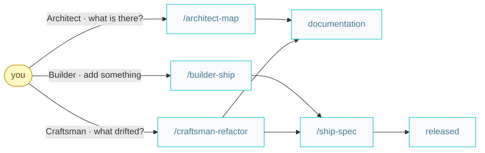
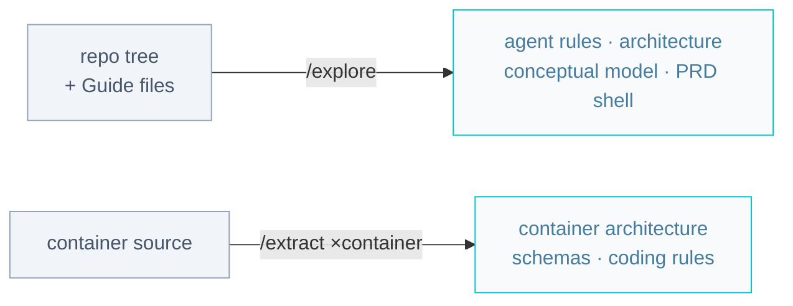
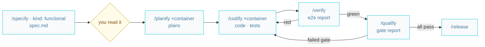
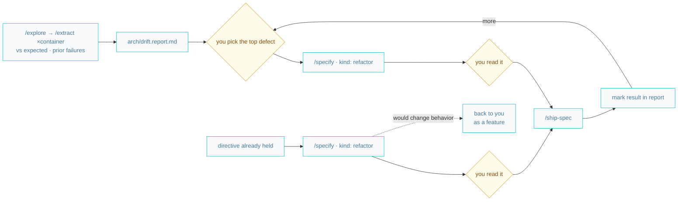

# AIDD Workflow

The system, one case at a time. Each section below is self-contained: a prompt, a small picture,
and what it leaves behind. The [catalog](../.agents/skills/skills.catalog.md) is the inventory and
the map, the [design decisions](./design.decisions.md) are the why. To install it, start with
[Getting started](./getting-started.md).

## What holds it together

**The green e2e suite is the contract.** It is the executable statement of what the product does
today. A green test changes only through a plan — a plan step authorizes a test edit exactly the
way it authorizes a code edit — which makes a silent behavior change structurally impossible
rather than merely discouraged.

**One writer, two evaluators.** `/codify` is the only skill that writes code: source, unit tests
and the e2e suite alike. `/verify` and `/qualify` only judge and report, and every fix lands back
through `/codify`. Implementation and evaluation never share a session, so nothing grades its
own work.

**Every cycle starts from a spec.** What differs is which ABC door it came through.

## The ABC doors

**A**rchitect maps, **B**uilder ships, **C**raftsman restores craft.


```mermaid
flowchart LR
  classDef nd fill:#f8fafc,stroke:#00c4cc,color:#457b9d
  classDef hum fill:#fef9c3,stroke:#ca8a04,color:#713f12

  YOU([you]):::hum

  YOU -->|"Architect · what is there?"| EXP["/architect-map"]:::nd
  YOU -->|"Builder · add something"| FEA["/builder-ship"]:::nd
  YOU -->|"Craftsman · what drifted?"| DRF["/craftsman-refactor"]:::nd

  EXP --> DOC["documentation"]:::nd
  FEA --> SHIP["/ship-spec"]:::nd
  DRF --> DOC
  DRF --> SHIP
  SHIP --> REL["released"]:::nd
```

Architect first: documentation the other doors read. Builder and Craftsman both converge on
`/ship-spec` — Craftsman after a drift report (or straight from a directive you already hold).
The machine is the same; what changes is which role walked the door.

## Architect — understanding what is there

```markdown
/architect-map
```


```mermaid
flowchart LR
  classDef nd fill:#f8fafc,stroke:#00c4cc,color:#457b9d
  classDef in fill:#f1f5f9,stroke:#94a3b8,color:#475569

  TREE["repo tree<br/>+ Guide files"]:::in -->|/explore| SYS["agent rules · architecture<br/>conceptual model · PRD shell"]:::nd
  SRC["container source"]:::in -->|"/extract ×container"| DET["container architecture<br/>schemas · coding rules"]:::nd
```

The two steps differ in what they may read. `/explore` sees the repo tree and the Guide files
only — README, changelog, manifests — and produces the system-level view. `/extract` does read
source, one **container** at a time, and produces that container's detail.

Both apply **evidence wins**: describe what exists, propose a default where nothing does. The
rule resolves per gap, so one repository can mix documented containers and prescribed ones —
which is why an empty repo and a mature one both work. That map is what Architect leaves for
Builder and Craftsman.

## Builder — shipping a feature

```markdown
/builder-ship riders can rate a trip 1 to 5 stars
```


```mermaid
flowchart LR
  classDef nd fill:#f8fafc,stroke:#00c4cc,color:#457b9d
  classDef q fill:#fefce8,stroke:#ca8a04,color:#854d0e

  SPEC["/specify · kind: functional<br/>spec.md"]:::nd --> CHK{"you read it"}:::q
  CHK --> PLAN["/planify ×container<br/>plans"]:::nd
  PLAN --> CODE["/codify ×container<br/>code · tests"]:::nd
  CODE --> VER["/verify<br/>e2e report"]:::nd
  VER -->|red| CODE
  VER -->|green| QLF["/qualify<br/>gate report"]:::nd
  QLF -->|failed gate| CODE
  QLF -->|all pass| REL["/release"]:::nd
```

The spec holds the problem, the expected outcome per container, and numbered acceptance criteria
`AC-{spec_id}.{n}`. Each id travels all the way into an e2e test title, which is what keeps a
criterion and its proof attached.

The one manual step is yours: everything downstream is derived from the spec, so a wrong spec
buys correct code for the wrong problem. After that the loops close on their own — `/verify`
and `/qualify` report, `/codify` fixes, and nothing ships until both are green. That arc —
spec to released — is Builder's job.

## Craftsman — correcting drift

One door, two entries.

```markdown
/craftsman-refactor
```

```markdown
/craftsman-refactor homogenize how the api exposes its routes
```


```mermaid
flowchart LR
  classDef nd fill:#f8fafc,stroke:#00c4cc,color:#457b9d
  classDef q fill:#fefce8,stroke:#ca8a04,color:#854d0e

  EXP["/explore → /extract ×container<br/>vs expected · prior failures"]:::nd --> RPT["arch/drift.report.md"]:::nd
  RPT --> PICK{"you pick the top defect"}:::q
  PICK --> SPEC["/specify · kind: refactor"]:::nd
  SPEC --> CHK{"you read it"}:::q
  CHK --> SHIP["/ship-spec"]:::nd
  SHIP --> MARK["mark result in report"]:::nd
  MARK -->|more| PICK

  DIR["directive already held"]:::nd --> SPEC2["/specify · kind: refactor"]:::nd
  SPEC2 --> CHK2{"you read it"}:::q
  CHK2 --> SHIP
  SPEC2 -.->|"would change behavior"| OUT["back to you<br/>as a feature"]:::nd
```

**Craftsman** restores craft when shape drifts from the docs and rules Architect wrote on day
one. With no directive: same documentation pass as `/architect-map`, plus a comparison against
what those docs already expect; the work product is `arch/drift.report.md`. You choose which
defect matters most; each item runs `/specify` (`kind: refactor`), your check, and `/ship-spec`,
then the report is updated and the next defect offered. With a directive already clear: skip
detection and take that same specify → check → `/ship-spec` path.

A refactor spec says what the code looks like once the decision is applied, and how each part of
that is checked. Its first criterion is always **suite non-regression**: the e2e plan may change
*how* a scenario reaches its result, never *what* it asserts. If the suite still passes, the
product still behaves.

Anything in the directive that would change what the product does is not structural — it comes
back to you as a feature.

## The two kinds of spec

Both kinds are written by `/specify`. Builder and Craftsman name the kind; the skill never
classifies it.

| | functional | refactor |
|---|---|---|
| Written by | `/specify` (`kind: functional`) | `/specify` (`kind: refactor`) |
| From | a requirement | a structural directive you give |
| Id series | `F001`, `F002`… | `R001`, `R002`… |
| Branch | `feat/{spec_key}` | `refactor/{spec_key}` |
| Listed in the PRD | yes — it is a business catalog | no |
| Amendable | yes; an amend always replans | no — a later decision is a new spec |
| Judged by | `/verify`, with the e2e suite | `/qualify`'s gates, plus `/verify` for non-regression |

Status chain, the same for both:

```markdown
pending → planned → in-progress → verified | failed → done
```

`/codify` checks off plan steps but never sets the verdict; only `/verify` moves a spec to
`verified` or `failed`, and `/release` gates on `verified` before closing it as `done`. A `done`
spec is shipped, not frozen — `/specify` can amend it, which resets it to `pending` and replans.

## What gets written

Every artifact has exactly one producer.

| Producer | Artifact |
|---|---|
| `/explore` | `{Agents_File}`, `arch/system.arch.md`, `model/model.schema.md`, `specs/PRD.md` (shell) |
| `/extract` | `arch/{container}.arch.md` or `model/db.schema.md`, `model/api.schema.md`, `rules/{container}.rules.md` |
| `/specify` | `specs/{spec_key}/spec.md` (+ a PRD line, functional only) |
| `/planify` | `specs/{spec_key}/{container}.plan.md`, `e2e.plan.md` |
| `/codify` | source, unit tests, the e2e suite |
| `/verify` | `specs/{spec_key}/e2e.report.md` |
| `/qualify` | `specs/{spec_key}/qualify.report.md` |
| `/release` | `CHANGELOG.md`, version bump, tag, reconciled arch docs |

All of a spec's artifacts live together in `specs/{spec_key}/`. The paths themselves are yours to
choose — `/explore` records them in `{Agents_File}`, and every skill reads them from there.

## Glossary

- **Container** — a unit that runs or deploys on its own (`api`, `web`, `db`, `e2e`); C4 L2. It
  is the unit `/extract`, `/planify` and `/codify` all work in, one per run.
- **Tier** — a container's layer: `front | back | db | e2e | fullstack`. It classifies a
  container, it never identifies one.
- **e2e container** — transversal, verifies the others. Planned like any container, written by
  `/codify` compile-only, judged by `/verify`.
- **AC id** — `AC-{spec_id}.{n}`, an acceptance criterion. Unique across the repo and never
  reused, because it travels into an e2e test title.
- **Evidence wins** — describe what exists, propose what is missing. Applied per question, not
  per repository.

## Git

Branch naming, conventional commits and git safety live in the root `{Agents_File}`, written by
`/explore`. A functional spec works on `feat/{spec_key}`, a refactor spec on
`refactor/{spec_key}`, a spec-less fix on `fix/{slug}`. Every cycle branches fresh from current
default and never reopens a merged branch — the spec file on default is the durable record, not
the branch. `/release` merges first, then tags default's post-merge tip and deletes the branch.
