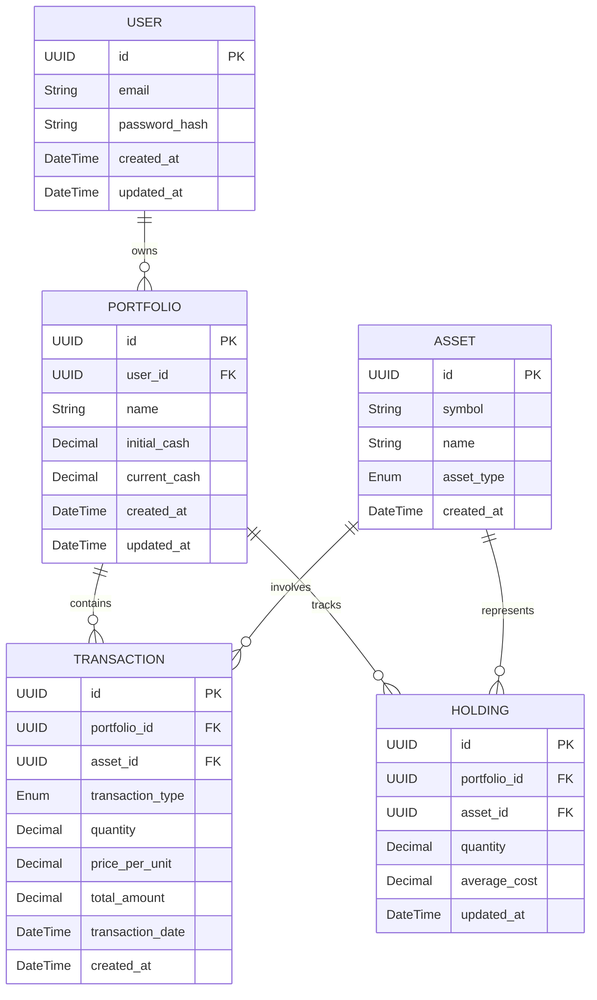

# Domain Model for AssetsBoard

## Overview

**AssetsBoard** operates in the investment portfolio management domain, managing user portfolios, financial assets, and investment transactions. The system provides a centralized platform for individual investors to track their holdings and monitor their investment activities across different asset types.

## Main Entities

### E1 User

**Description:** Represents an individual investor who uses the platform to track their investment portfolios.

**Attributes:**
- id: UUID - Unique identifier for the user
- email: String - User's email address for authentication and communication
- password_hash: String - Encrypted password for secure authentication
- created_at: DateTime - Timestamp when the user account was created
- updated_at: DateTime - Timestamp of the last account modification

### E2 Portfolio

**Description:** Represents an investment portfolio that belongs to a user, containing an initial cash amount and tracking all investment activities.

**Attributes:**
- id: UUID - Unique identifier for the portfolio
- user_id: UUID - Foreign key referencing the owner user
- name: String - User-defined name for the portfolio
- initial_cash: Decimal - Initial cash amount in USD when portfolio was created
- current_cash: Decimal - Current available cash balance in USD
- created_at: DateTime - Timestamp when the portfolio was created
- updated_at: DateTime - Timestamp of the last portfolio modification

### E3 Asset

**Description:** Represents a financial instrument (stock, cryptocurrency, etc.) that can be bought or sold within portfolios.

**Attributes:**
- id: UUID - Unique identifier for the asset
- symbol: String - Asset symbol or ticker (e.g., AAPL, BTC)
- name: String - Full name of the asset
- asset_type: Enum - Type of asset (STOCK, CRYPTO, BOND, etc.)
- created_at: DateTime - Timestamp when the asset was first registered

### E4 Transaction

**Description:** Represents a buy or sell operation performed by a user for a specific asset within a portfolio.

**Attributes:**
- id: UUID - Unique identifier for the transaction
- portfolio_id: UUID - Foreign key referencing the portfolio
- asset_id: UUID - Foreign key referencing the asset
- transaction_type: Enum - Type of transaction (BUY, SELL)
- quantity: Decimal - Number of asset units traded
- price_per_unit: Decimal - Price paid/received per unit in USD
- total_amount: Decimal - Total transaction value (quantity × price_per_unit)
- transaction_date: DateTime - When the transaction was executed
- created_at: DateTime - Timestamp when the transaction was recorded

### E5 Holding

**Description:** Represents the current quantity of a specific asset owned within a portfolio.

**Attributes:**
- id: UUID - Unique identifier for the holding
- portfolio_id: UUID - Foreign key referencing the portfolio
- asset_id: UUID - Foreign key referencing the asset
- quantity: Decimal - Current number of asset units owned
- average_cost: Decimal - Average cost per unit across all purchases
- updated_at: DateTime - Timestamp of the last holding update

## Entity Relationships

### R1 User ↔ Portfolio

**Relationship Type:** One-to-Many
**Description:** A user can own multiple portfolios, but each portfolio belongs to exactly one user
**Business Rule:** Users need separate portfolios to organize different investment strategies or goals

### R2 Portfolio ↔ Transaction

**Relationship Type:** One-to-Many
**Description:** A portfolio contains multiple transactions, but each transaction belongs to exactly one portfolio
**Business Rule:** All investment activities must be tracked within a specific portfolio context

### R3 Asset ↔ Transaction

**Relationship Type:** One-to-Many
**Description:** An asset can be involved in multiple transactions, but each transaction involves exactly one asset
**Business Rule:** Each buy/sell operation must specify which asset is being traded

### R4 Portfolio ↔ Holding

**Relationship Type:** One-to-Many
**Description:** A portfolio contains multiple holdings, but each holding belongs to exactly one portfolio
**Business Rule:** Current asset positions must be tracked per portfolio

### R5 Asset ↔ Holding

**Relationship Type:** One-to-Many
**Description:** An asset can be held in multiple portfolios, but each holding represents one asset in one portfolio
**Business Rule:** The same asset can be owned across different portfolios with different quantities

## Business Rules and Validations

### Data Validation Rules

1. **User Authentication**
   - Email must be unique across all users
   - Password must meet minimum security requirements
   - Email format must be valid

2. **Portfolio Management**
   - Initial cash amount must be positive
   - Current cash cannot be negative
   - Portfolio name must be unique per user

3. **Transaction Validation**
   - Quantity must be positive
   - Price per unit must be positive
   - Transaction date cannot be in the future

### Business Operation Rules

1. **Purchase Operations**
   - User can only buy assets if total amount ≤ current portfolio cash
   - After purchase, portfolio cash is reduced by total transaction amount
   - Asset holding quantity is increased or created

2. **Sale Operations**
   - User can only sell assets if quantity ≤ current holding quantity
   - After sale, portfolio cash is increased by total transaction amount
   - Asset holding quantity is decreased (removed if quantity becomes zero)

3. **Portfolio Operations**
   - Users cannot delete portfolios that contain active holdings
   - Portfolio cash balance must reflect all transaction history
   - Holdings must be consistent with transaction history

## Entity-Relationship Diagram

## Additional Information

- [Git repository](https://github.com/AIcodeAcademy/AIDDbot)
- [PRD Document](./PRD.md)
- [SYSTEMS Architecture](./SYSTEMS.md)
- [BACKLOG of features](./BACKLOG.md)

> End of DOMAIN for AssetsBoard, last updated on July 28, 2025.
