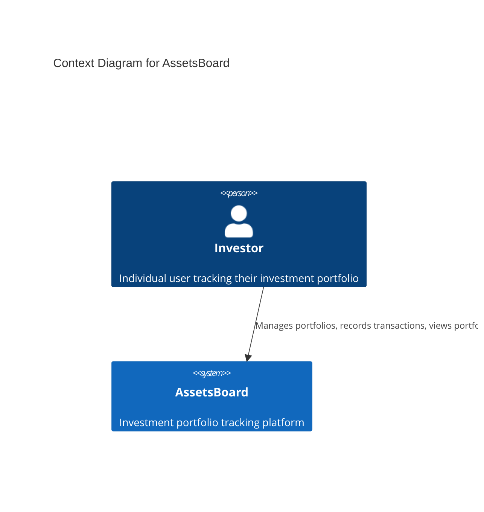

# Project Requirements Document for AssetsBoard

## Overview

**AssetsBoard** aims to provide a platform for users to track their investment portfolios, allowing them to manage their assets and monitor their transactions with a simple and efficient interface.

The system addresses the need for individual investors to have a centralized place to track their investments across different asset types (stocks, cryptocurrencies, etc.) without the complexity of real-time market data integration.

### Goals

- Provide users with a simple platform to track their investment portfolios
- Enable users to record and manage buy/sell transactions for various assets
- Ensure data integrity by preventing invalid transactions (insufficient funds or assets)
- Offer clear visibility into current portfolio status and transaction history
- Maintain user data security through basic authentication mechanisms

## Requirements

### R1 User Authentication
Users must be able to register and authenticate using email and password credentials to access their personal investment data securely.

### R2 Portfolio Management
Users must be able to create investment portfolios with an initial cash amount in USD, providing the foundation for their investment tracking.

### R3 Transaction Recording
Users must be able to record buy and sell transactions for assets (stocks, cryptocurrencies, etc.) by specifying the asset name, quantity, and price per unit.

### R4 Transaction Validation
The system must prevent invalid transactions by:
- Blocking purchases that exceed the user's current available cash
- Blocking sales of assets that exceed the user's current holdings

### R5 Portfolio Visualization
Users must be able to view their current portfolio status, including:
- List of owned assets with quantities
- Remaining available cash balance

### R6 Transaction History
Users must be able to view a complete list of all their historical transactions for auditing and tracking purposes.

## Technical Constraints

- The system will be implemented as a REST API without real-time updates
- Asset prices will be manually provided by users (no external market data API required)
- Basic email/password authentication is sufficient for user security
- The system must maintain data persistence for portfolios and transactions
- All monetary values will be handled in USD

### Context diagram

## Additional Information

- [Git repository](https://github.com/AIcodeAcademy/AIDDbot)
- [DOMAIN Models](./DOMAIN.md)
- [SYSTEMS Architecture](./SYSTEMS.md)
- [BACKLOG of features](./BACKLOG.md)

> End of PRD for AssetsBoard, last updated on July 28, 2025.
