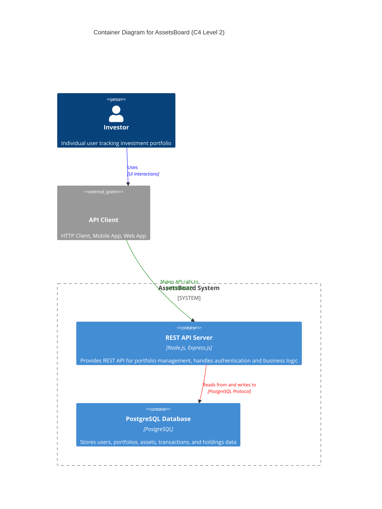

# Systems Architecture for AssetsBoard

## Overview

**AssetsBoard** follows a three-tier architecture, designed for simplicity and maintainability with a REST API approach. The system prioritizes data consistency and user experience over real-time performance, making it ideal for individual portfolio tracking.

## System Components

### S1 REST API Server

**Purpose:** Core backend service that handles all business logic, data validation, and API endpoints for portfolio management.

**Technology Stack:**
- **Language**: Node.js
- **Framework**: Express.js
- **Key Libraries**: bcrypt (password hashing), jsonwebtoken (JWT authentication), joi (validation)

**Responsibilities:**
- Handle user authentication and authorization
- Process portfolio and transaction operations
- Validate business rules and data integrity
- Expose REST endpoints for all system operations
- Manage user sessions and security

### S2 Database Layer

**Purpose:** Persistent storage for all application data including users, portfolios, assets, transactions, and holdings.

**Technology Stack:**
- **Language**: SQL
- **Framework**: PostgreSQL
- **Key Libraries**: pg (PostgreSQL driver), knex.js (query builder)

**Responsibilities:**
- Store user accounts and authentication data
- Maintain portfolio and asset information
- Track all transaction history
- Calculate and store current holdings
- Ensure data consistency and referential integrity

### S3 Client Interface Layer

**Purpose:** API client interface that communicates with the REST API server to perform all user operations.

**Technology Stack:**
- **Language**: HTTP/REST
- **Framework**: RESTful API endpoints
- **Key Libraries**: Standard HTTP methods (GET, POST, PUT, DELETE)

**Responsibilities:**
- Provide endpoints for user registration and authentication
- Expose portfolio management operations
- Handle transaction recording and validation
- Serve portfolio status and transaction history
- Return structured JSON responses

## Data Layer

### Database Design

**Database Type:** Relational Database
**Technology:** PostgreSQL

**Data Access Patterns:**
- **CRUD Operations**: Standard Create, Read, Update, Delete operations for all entities
- **Transaction Patterns**: Atomic operations for buy/sell transactions with portfolio balance updates
- **Aggregation Queries**: Calculate current holdings from transaction history

**Key Design Decisions:**
- Use UUIDs as primary keys for better scalability and security
- Implement database-level constraints to enforce business rules
- Store calculated fields (current_cash, total_amount) for performance
- Use decimal types for all monetary values to avoid floating-point errors

## Integration Patterns

### I1 REST API Endpoints

**Type:** REST API
**Purpose:** Provide standardized HTTP endpoints for all system operations
**Protocol:** HTTPS
**Data Format:** JSON

**Endpoint Categories:**
- Authentication: `/api/auth/*`
- Users: `/api/users/*`
- Portfolios: `/api/portfolios/*`
- Assets: `/api/assets/*`
- Transactions: `/api/transactions/*`
- Holdings: `/api/holdings/*`

### I2 Database Connections

**Type:** Database Connection Pool
**Purpose:** Manage efficient database connections and query execution
**Protocol:** TCP/PostgreSQL Protocol
**Data Format:** SQL Queries and Results

## Deployment Architecture

### Infrastructure Requirements

**Deployment Model:** Docker Containerization
**Platform:** Docker with Docker Compose for local development

**Environment Setup:**
- **Development**: Docker Compose with PostgreSQL and Node.js containers
- **Staging**: Single server deployment with containerized services
- **Production**: Cloud deployment (AWS/Azure) with managed database service

**Scalability Approach:**
- Horizontal scaling through load balancers for API servers
- Database read replicas for query performance
- Connection pooling for efficient database utilization

## Security Architecture

### Authentication & Authorization

**Authentication Method:** JWT (JSON Web Tokens) with email/password
**Session Management:** Stateless JWT tokens with expiration
**Authorization Pattern:** Role-based access control (user owns portfolios)

**Security Flow:**
1. User provides email/password credentials
2. Server validates against hashed password in database
3. Server generates JWT token with user ID and expiration
4. Client includes JWT token in Authorization header for all requests
5. Server validates JWT token and extracts user ID for authorization

### Data Security

**Encryption:** Passwords hashed using bcrypt with salt rounds
**Data Protection:** HTTPS for all API communications, input validation and sanitization

**Security Measures:**
- Password complexity requirements
- SQL injection prevention through parameterized queries
- Input validation using Joi schemas
- Rate limiting for API endpoints
- CORS configuration for web client security

## System Architecture Diagram

### Container Responsibilities

**REST API Server:**
- User registration, authentication, and session management
- Portfolio creation, management, and balance tracking
- Asset registration and management
- Transaction recording with business rule validation
- Holdings calculation and portfolio status reporting

**PostgreSQL Database:**
- User account storage with secure password hashing
- Portfolio data persistence with cash balance tracking
- Asset catalog maintenance
- Complete transaction history storage
- Current holdings calculation and caching

## Technical Constraints and Decisions

### Architectural Decisions

1. **Three-Tier Architecture**
   - **Decision**: Implement classic three-tier pattern (Client, API Server, Database)
   - **Rationale**: Simple, well-understood pattern suitable for the scope and complexity
   - **Trade-offs**: Less flexibility than microservices, but reduced operational complexity

2. **Stateless JWT Authentication**
   - **Decision**: Use JWT tokens instead of server-side sessions
   - **Rationale**: Scalability and simplicity, no session storage required
   - **Trade-offs**: Tokens cannot be easily revoked, but suitable for simple auth requirements

3. **PostgreSQL Relational Database**
   - **Decision**: Use PostgreSQL instead of NoSQL database
   - **Rationale**: Strong consistency requirements, complex relationships, ACID compliance
   - **Trade-offs**: Less flexible schema changes, but better data integrity guarantees

4. **Calculated Holdings Storage**
   - **Decision**: Store calculated holdings separately from transactions
   - **Rationale**: Performance optimization for portfolio queries
   - **Trade-offs**: Data duplication, but significantly faster portfolio views

### Technical Constraints

- No real-time data updates or WebSocket connections required
- Manual price entry eliminates need for external market data APIs
- Single currency (USD) simplifies monetary calculations
- Basic authentication sufficient, no OAuth or social login needed
- Data consistency prioritized over eventual consistency patterns

## Additional Information

- [Git repository](https://github.com/AIcodeAcademy/AIDDbot)
- [PRD Document](./PRD.md)
- [DOMAIN Models](./DOMAIN.md)
- [BACKLOG of features](./BACKLOG.md)

> End of SYSTEMS for AssetsBoard, last updated on July 28, 2025.
