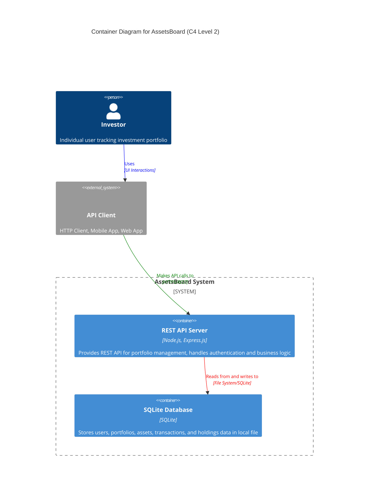

# Systems Architecture for AssetsBoard

## Overview

**AssetsBoard** follows a three-tier architecture, designed for simplicity and maintainability with a REST API approach. The system prioritizes data consistency and user experience over real-time performance, making it ideal for individual portfolio tracking.

## System Components

### S1 REST API Server

**Purpose:** Core backend service that handles all business logic, data validation, and API endpoints for portfolio management.

**Technology Stack:**
- **Language**: Node.js
- **Framework**: Express.js
- **Key Libraries**: Built-in crypto module (password hashing), express built-in middleware

**Responsibilities:**
- Handle user authentication and authorization
- Process portfolio and transaction operations
- Validate business rules and data integrity
- Expose REST endpoints for all system operations
- Manage user sessions and security

### S2 Database Layer

**Purpose:** Persistent storage for all application data including users, portfolios, assets, transactions, and holdings.

**Technology Stack:**
- **Language**: SQL
- **Framework**: SQLite
- **Key Libraries**: Built-in sqlite3 module

**Responsibilities:**
- Store user accounts and authentication data
- Maintain portfolio and asset information
- Track all transaction history
- Calculate and store current holdings
- Ensure data consistency and referential integrity

### S3 Client Interface Layer

**Purpose:** API client interface that communicates with the REST API server to perform all user operations.

**Technology Stack:**
- **Language**: HTTP/REST
- **Framework**: RESTful API endpoints
- **Key Libraries**: Standard HTTP methods (GET, POST, PUT, DELETE)

**Responsibilities:**
- Provide endpoints for user registration and authentication
- Expose portfolio management operations
- Handle transaction recording and validation
- Serve portfolio status and transaction history
- Return structured JSON responses

## Data Layer

### Database Design

**Database Type:** Lightweight Relational Database
**Technology:** SQLite

**Data Access Patterns:**
- **CRUD Operations**: Standard Create, Read, Update, Delete operations using direct SQL queries
- **Transaction Patterns**: SQLite transactions for buy/sell operations with portfolio balance updates
- **Aggregation Queries**: Calculate current holdings from transaction history using SQL queries

**Key Design Decisions:**
- Use integer IDs as primary keys for simplicity
- Implement application-level constraints to enforce business rules
- Store calculated fields (current_cash, total_amount) for performance
- Use TEXT type for all monetary values with decimal formatting

## Integration Patterns

### I1 REST API Endpoints

**Type:** REST API
**Purpose:** Provide standardized HTTP endpoints for all system operations
**Protocol:** HTTPS
**Data Format:** JSON

**Endpoint Categories:**
- Authentication: `/api/auth/*`
- Users: `/api/users/*`
- Portfolios: `/api/portfolios/*`
- Assets: `/api/assets/*`
- Transactions: `/api/transactions/*`
- Holdings: `/api/holdings/*`

### I2 Database Connections

**Type:** Direct SQLite Connection
**Purpose:** Direct file-based database access for data persistence
**Protocol:** File System Access
**Data Format:** SQL Queries and SQLite Database File

## Deployment Architecture

### Infrastructure Requirements

**Deployment Model:** Local Development Environment
**Platform:** Node.js runtime on local machine

**Environment Setup:**
- **Development**: Local Node.js server with SQLite database file
- **Staging**: Single server deployment with file-based database
- **Production**: Simple server deployment with SQLite database backup

**Scalability Approach:**
- Single-instance deployment suitable for individual use
- Database backups for data protection
- Simple file-based persistence for minimal complexity

## Security Architecture

### Authentication & Authorization

**Authentication Method:** Session-based authentication with email/password
**Session Management:** In-memory session storage with express-session
**Authorization Pattern:** Simple user ownership validation

**Security Flow:**
1. User provides email/password credentials
2. Server validates against hashed password in SQLite database
3. Server creates session and stores user ID in session storage
4. Client receives session cookie for subsequent requests
5. Server validates session and extracts user ID for authorization

### Data Security

**Encryption:** Passwords hashed using Node.js built-in crypto module
**Data Protection:** HTTPS for production, basic input validation and sanitization

**Security Measures:**
- Password hashing with salt using crypto.pbkdf2Sync
- SQL injection prevention through parameterized SQLite queries
- Basic input validation using manual checks
- Session security with httpOnly cookies
- CORS configuration for basic web security

## System Architecture Diagram

### Container Responsibilities

**REST API Server:**
- User registration, authentication, and session management
- Portfolio creation, management, and balance tracking
- Asset registration and management
- Transaction recording with business rule validation
- Holdings calculation and portfolio status reporting

**SQLite Database:**
- User account storage with secure password hashing
- Portfolio data persistence with cash balance tracking
- Asset catalog maintenance in local database file
- Complete transaction history storage
- Current holdings calculation and storage

## Technical Constraints and Decisions

### Architectural Decisions

1. **Minimal Dependency Architecture**
   - **Decision**: Use only Node.js built-in modules and Express.js
   - **Rationale**: Reduce complexity, eliminate external dependencies, easier maintenance
   - **Trade-offs**: Manual implementation of some features, but complete control over codebase

2. **Session-Based Authentication**
   - **Decision**: Use traditional sessions instead of JWT tokens
   - **Rationale**: Simpler implementation without additional libraries, better for single-server deployment
   - **Trade-offs**: Less scalable than JWT, but suitable for simple deployment model

3. **SQLite File Database**
   - **Decision**: Use SQLite instead of PostgreSQL or other databases
   - **Rationale**: Zero configuration, no external database server required, perfect for development and simple deployments
   - **Trade-offs**: Limited concurrency compared to PostgreSQL, but adequate for individual use

4. **Direct SQL Implementation**
   - **Decision**: Write raw SQL queries instead of using an ORM
   - **Rationale**: No additional dependencies, better performance, complete control over queries
   - **Trade-offs**: More manual work, but clearer understanding of data operations

### Technical Constraints

- No real-time data updates or WebSocket connections required
- Manual price entry eliminates need for external market data APIs
- Single currency (USD) simplifies monetary calculations
- Basic authentication sufficient, no OAuth or social login needed
- No external dependencies beyond Node.js and Express.js
- File-based database eliminates need for database server setup
- Single-server deployment model for simplicity

## Additional Information

- [Git repository](https://github.com/AIcodeAcademy/AIDDbot)
- [PRD Document](./PRD.md)
- [DOMAIN Models](./DOMAIN.md)
- [BACKLOG of features](./BACKLOG.md)

> End of SYSTEMS for AssetsBoard, last updated on July 28, 2025.
