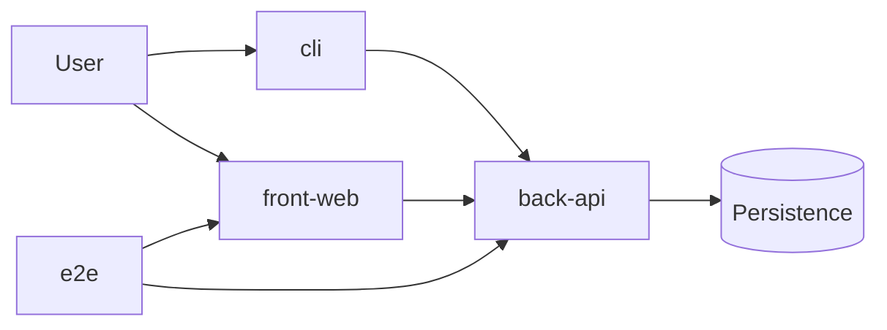
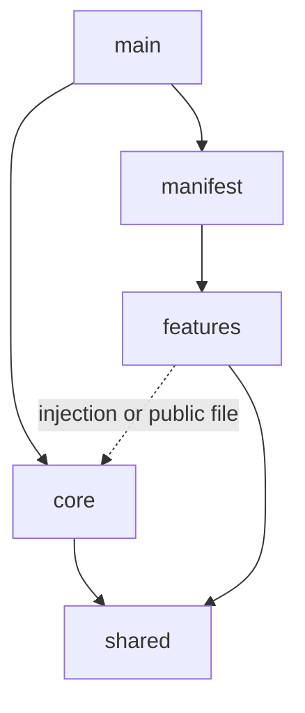
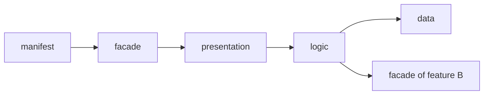

# Project Architecture

This document shows the parts of a project, the permitted dependencies, and the files. See [`coding-rules.md`](./coding-rules.md) for the code requirements. The rules apply to all projects. Each archetype gives the file names for its framework.

> **Sources.** If you change a rule here, also change its source file. Use `/maintain-skills`. The source files are:
>
> - The Blueprint section of [`AGENTS.template.md`](../.agents/skills/outline-system/assets/AGENTS.template.md).
> - Sections 4 and 5 of [`project.AGENTS.template.md`](../.agents/skills/architect-system-foundation/assets/project.AGENTS.template.md).
> - [`oxlint.boundaries.json`](../.agents/skills/architect-system-foundation/assets/oxlint.boundaries.json) and [`ecosystems.md`](../.agents/skills/architect-system-foundation/assets/ecosystems.md).

## System view



The `e2e` project tests the flows. It is not part of the product.

## Parts of a project



- `shared` contains generic elements with no domain. It depends on nothing.
- `core` contains the platform services: configuration, logger, connections, server or shell, router. It depends only on `shared`. It does not import a feature or the manifest. It does not contain business rules.
- `main` is the composition root. It is the only part that knows the features. It gets the features only through the manifest.
- `manifest` is the one place that registers each feature by name. Do not use automatic discovery. The linter cannot see it.
- A feature depends on `shared`. It gets the services of `core` by one mechanism: injection, or import of the public file of `core`. The archetype selects the mechanism. A feature uses a different feature only through the facade of that feature.

## Inside a feature

A feature is **one flat folder**. The suffix of each file shows its layer. If a feature becomes too large, divide it into two features.



- `facade` contains the registration and the public types. It is the only file that the manifest or a different feature can import.
- `presentation` contains the input and the output: route, page or command. It depends on `logic`.
- `logic` contains the rules and the decisions. It depends on `data` and on the facades of other features.
- `data` reads and writes outside the project: database, remote API, files. It does not depend on other layers.
- `types` contains the types and the value objects. They have no layer. All layers can use `types` and `shared`.

## Shared

- Put an element in `shared` when it has no domain. Do this also when only one part uses it now.
- Keep an element with domain words in its feature. Other features get it through the facade.
- Make one folder for each technical concern, for example `http/` or `database/`. Do not name a folder `utils`, `helpers`, `common` or `misc`.

## Variations

| | `back-api` | `front-web` | `cli` | `e2e` |
| --- | --- | --- | --- | --- |
| `core` | server, connections | shell, router, theme | argument parser, output | runner, start of projects |
| features | endpoints | pages | commands | tests by spec domain, no layers |

In sections 4 and 5 of its `AGENTS.md`, each archetype gives the location of `main`, `manifest` and `facade`. It also gives the mechanism to get the services of `core`. Examples:

- Express: `features.manifest.ts`, import of the public file of `core`.
- NestJS: `AppModule.imports`, injection.
- Angular: `app.routes.ts`, injection with `inject()`.

The `lint` slot checks the imports. The review checks that `core` and `presentation` do not contain business rules. A violation stops the delivery.

## Files

This tree shows a `back-api` with Express. The file names use the pattern `{business}.{role}.ts`. The role shows the layer.

```text
src/
├── app.main.ts                 # entry: calls createApp()
├── app.compose.ts              # main: createApp()
├── core/
│   ├── core.api.ts             # public file of core
│   └── app.config.ts
├── shared/
│   ├── app-error.type.ts
│   └── http/body.middleware.ts
└── features/
    ├── features.manifest.ts
    └── users/
        ├── users.api.ts        # facade
        ├── users.controller.ts # presentation
        ├── users.service.ts    # logic
        ├── users.repository.ts # data
        └── user.type.ts        # types
```
