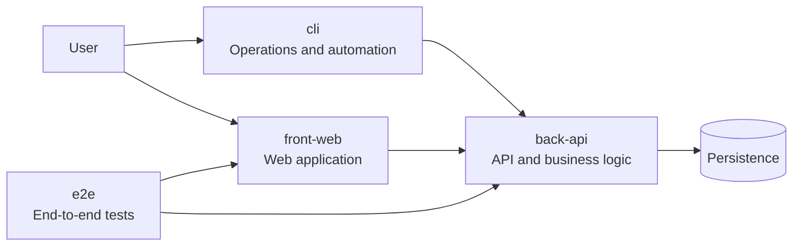
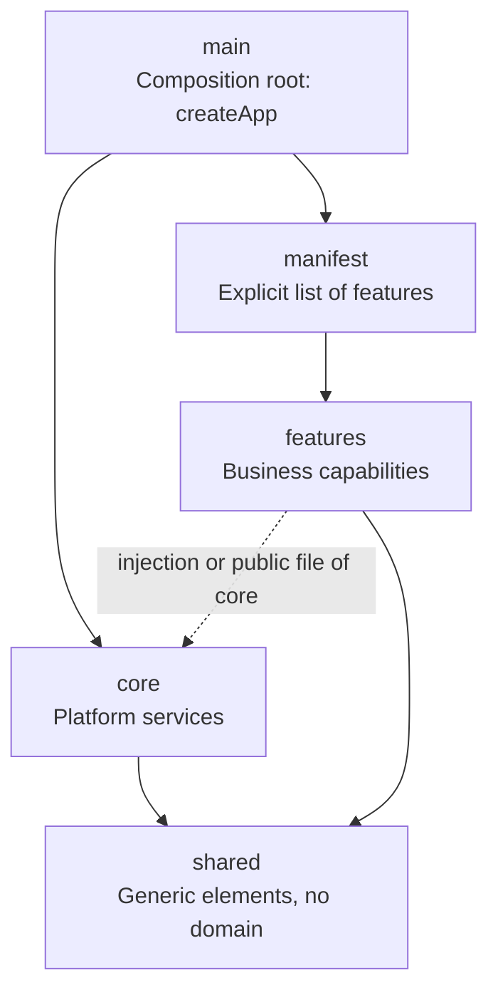
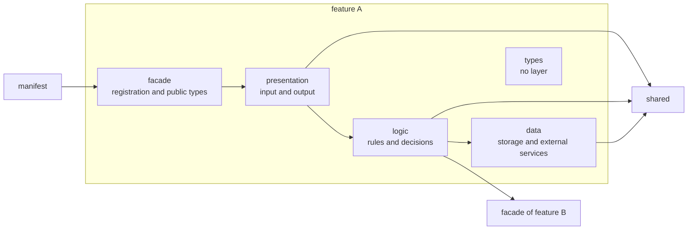

# Project Architecture

This document gives the parts of each project in a new system, the dependencies between the parts, and the files. For the rules about how to write the code in these parts, see [`coding-rules.md`](./coding-rules.md). The examples use TypeScript. The rules apply to all technologies.

> **Sources.** The foundation copies this architecture into the `AGENTS.md` of each project. If you change a rule here, change it in its source file too, with `/maintain-skills`.
>
> - Parts and rules: [`project.AGENTS.template.md`](../.agents/skills/architect-system-foundation/assets/project.AGENTS.template.md), sections 4 and 5.
> - JS / TS boundaries: [`oxlint.boundaries.json`](../.agents/skills/architect-system-foundation/assets/oxlint.boundaries.json).
> - JS / TS file names: [`ecosystems.md`](../.agents/skills/architect-system-foundation/assets/ecosystems.md).

## Contents

- [System view](#system-view)
- [Parts of a project](#parts-of-a-project)
- [Boundary rules](#boundary-rules)
- [Inside a feature](#inside-a-feature)
- [Shared](#shared)
- [Variations by project type](#variations-by-project-type)
- [Files](#files)

## System view

A system has typed projects. This diagram shows the usual projects and their connections.



The `front-web` and the `cli` use the `back-api`. The `e2e` project tests the flows through these projects. The `e2e` project is not part of the product.

## Parts of a project

Each project has four parts and one manifest. An arrow shows a permitted dependency.



| Part | Contents |
| --- | --- |
| `main` | The composition root. It exports `createApp()`. This function makes the services of `core`, gets the features from the manifest and connects them. The entry file only calls `createApp()` and starts the process. Thus a test can start the application and not open a port. |
| `core` | The platform services: configuration, logger, connections, server or shell, router. |
| manifest | One file that lists the registration of each feature. Write each feature in it. Do not use automatic discovery (folder scans or global decorators): the boundary linter cannot see those dependencies. |
| features | One folder for each feature: endpoints, pages or commands. |
| `shared` | Generic elements with no domain: types, checks, conversions and technical helpers. |

`core` does not know which features exist. `main` gives data to `core`: routes, menu links and commands.

## Boundary rules

A violation of a boundary rule blocks the delivery. The `lint` slot checks the imports. The review checks rule 5.

1. `main` is the only part that knows all of the features. It gets them only through the manifest.
2. `core` never uses a feature or the manifest. It never imports a page, an endpoint or a command.
3. A feature uses a different feature only through the **facade** of that feature.
4. `shared` uses no part of the application.
5. `core` contains no business rules.
6. In a feature, the direction is `presentation` → `logic` → `data`.
7. A feature gets the services of `core` by one method. The archetype selects the method and writes it in its `AGENTS.md`.

| Method for rule 7 | Operation | Usual technologies |
| --- | --- | --- |
| Injection | `main` gives the services to each feature when it registers the feature. Or the injector of the framework gives them. | Angular, NestJS, `register(app, deps)` without a framework |
| Direct import | The feature imports the public file of `core`. It never imports a different file of `core`. | Express, a web application without a framework |

With the two methods, `core` never imports a feature. Thus a dependency cycle cannot occur.

## Inside a feature

A feature is **one flat folder**. The suffix of each file tells its layer. Never add subfolders in a feature: the boundary linter checks only the files at the top of the feature folder. If a feature becomes too large, divide it into two features.



| Element | Contents |
| --- | --- |
| facade | The only file that the manifest or a different feature can import. It contains the registration of the feature and the types that other features use. |
| `presentation` | The input from the caller and the output to the caller: route, page or command. |
| `logic` | The rules and the decisions. It does not know how the data is stored or found. |
| `data` | All that the project reads or writes outside itself: database, remote API, files. |
| types | The types and the value objects of the feature. They have no layer. Each layer can use them. |

Keep the rules in `logic`. Do not put them in `presentation` or in `data`.

## Shared

`shared` contains the generic elements of the project. They have no domain.

```text
shared/
├── {topic}.{role}.ts      # Primitives: types, checks, conversions, generic value objects
├── http/                  # A folder for each technical concern, named with a noun
└── database/
```

- Put a generic element in `shared` (a type, a check, a conversion, a technical helper, a test helper), also when only one part uses it now.
- Put an element in `shared` when `core` and the features both use it. An example is the error type of the application.
- Keep an element with business rules or domain words in its feature. When a different feature needs it, expose it through the facade. Never move it to `shared`.
- Never name a folder `utils`, `helpers`, `common` or `misc`.
- The internal dependencies of `shared` are free.
- Write each element in the index of shared primitives in the `AGENTS.md` of the project.

## Variations by project type

| Item | `back-api` | `front-web` | `cli` | `e2e` |
| --- | --- | --- | --- | --- |
| `main` | `createApp()` and the process entry | `createApp()` and the browser entry | `createApp()` and the executable entry | n/a: the test runner is the entry |
| `core` | server, configuration, logger, connections | shell, router, configuration, theme | argument parser, configuration, output | runner configuration, start of the projects |
| manifest | registrations of routes | registrations of pages and menu links | registrations of commands | n/a: the runner finds the tests by name |
| features | endpoints | pages | commands | tests, one folder for each spec domain |
| layers | `presentation`, `logic`, `data` | `presentation`, `logic`, `data` | `presentation`, `logic`, `data` | no layers |

In the `e2e` project, `core` uses `shared`. Tests use `shared`, never `core` and never a different feature. `shared` uses no `core` and no test. `shared` has `page-objects/` and `test-data/`, and folders by technical concern as in the other projects.

## Files

This tree shows a `back-api` in TypeScript.

```text
src/
├── app.main.ts                     # Entry: calls createApp() and starts
├── app.compose.ts                  # createApp(): composition root
├── core/                           # Platform services, no business rules
│   ├── core.api.ts                 # Public file of core, only with direct import
│   ├── app.config.ts
│   ├── app.logger.ts
│   ├── app.server.ts
│   └── migrations/                 # Schema of the database, numbered files
├── shared/                         # Generic elements, no domain
│   ├── app-error.type.ts           # Error type of core and the features
│   ├── email.value.ts              # Generic value object
│   ├── text.check.ts               # Generic check
│   └── http/
│       └── body.middleware.ts      # Technical concern: HTTP
└── features/
    ├── features.manifest.ts        # Registration of each feature
    └── users/                      # One flat folder
        ├── users.api.ts            # Facade
        ├── users.controller.ts     # presentation
        ├── users.service.ts        # logic
        ├── user.policy.ts          # logic
        ├── users.repository.ts     # data
        └── user.type.ts            # types, no layer
```

The file names use the pattern `{business}.{role}.ts`. The role tells the layer.

| Concept | File |
| --- | --- |
| `main` | `src/app.main.ts` (entry) and `src/app.compose.ts` (`createApp()`) |
| `core` | `src/core/app.{service}.ts` |
| public file of `core` | `src/core/core.api.ts`, only with direct import |
| manifest | `src/features/features.manifest.ts` |
| facade | `src/features/{feature}/{feature}.api.ts` |
| `presentation` | `*.controller.ts`, `*.request.ts`, `*.command.ts`, `*.page.ts`, `*.component.ts` (or `.vue`) |
| `logic` | `*.service.ts`, `*.policy.ts`, `*.store.ts` |
| `data` | `*.repository.ts`, `*.client.ts` |
| types, no layer | `*.type.ts`, `*.value.ts` |
| `shared` | primitives in `src/shared/{topic}.{role}.ts`; other elements in `src/shared/{concern}/{topic}.{role}.ts` |

The concept is the facade. Only the JS / TS file has the name `api`.
