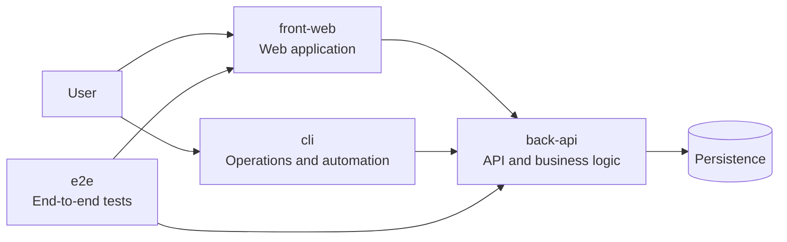
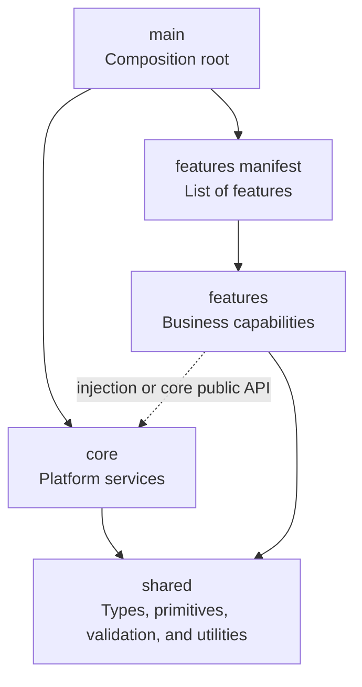
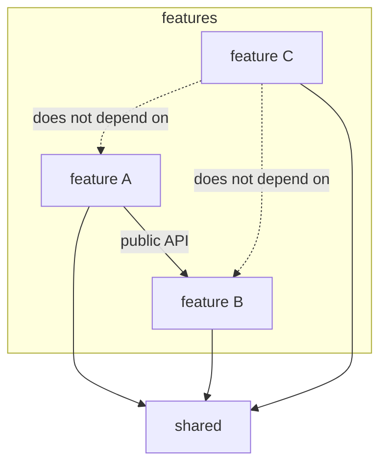
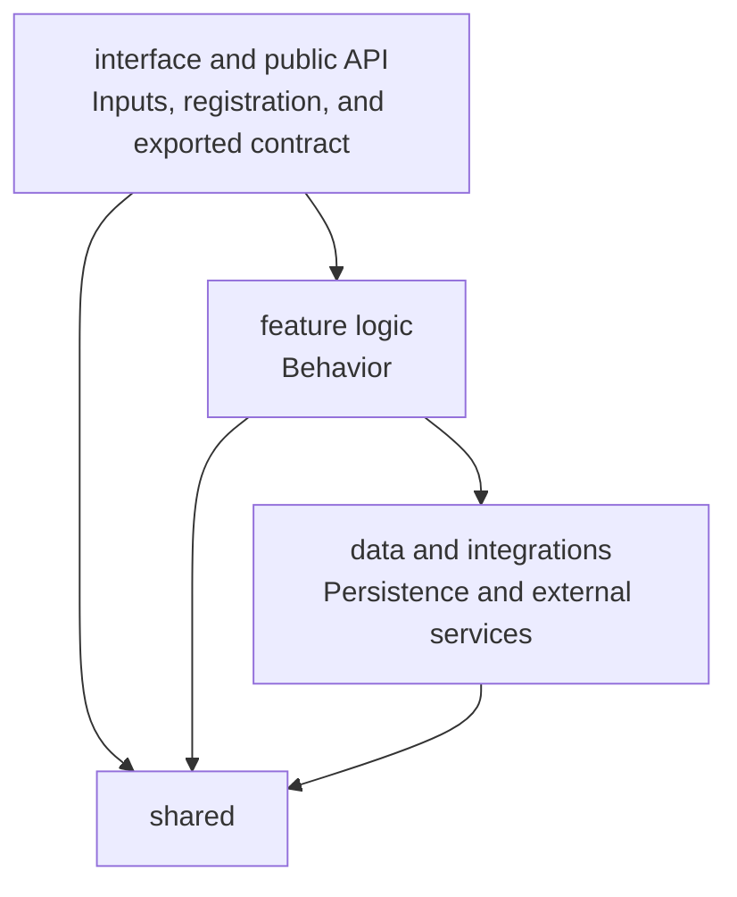

# Foundation Project Dependency Architecture

This document gives the structure of each project in a new system. For the coding rules and limits, see [`coding-rules.md`](./coding-rules.md). Each project has four parts: composition, platform services, features and shared elements. The examples use TypeScript. The rules apply to all technologies.

## Contents

- [System view](#system-view)
- [High-level view](#high-level-view)
- [Fixed rules and free choices](#fixed-rules-and-free-choices)
- [Feature detail](#feature-detail)
- [Logical layers in a feature](#logical-layers-in-a-feature)
- [Shared](#shared)
- [Variations by project type](#variations-by-project-type)
- [TypeScript file structure](#typescript-file-structure)

## System view

This diagram shows the usual projects and their main connections.



The `front-web` and the `cli` use the `back-api`. The `e2e` project tests the flows that go through these projects. The `e2e` project is not part of the product.

## High-level view

This diagram shows the permitted dependencies in a project.



`main` connects the parts of the system. It makes the platform services of `core`. It gets the features from the manifest. Then it connects the features to the services. `core` does not know which features exist.

## Fixed rules and free choices

These rules apply to all projects. The boundary linter checks them. A violation stops the delivery.

1. **`main` is the composition root.** Only `main` knows all of the features. It gets them only through the manifest.
2. **`core` never uses a feature or the manifest.** `main` gives data to `core`: routes, menu links and commands. `core` never imports a page, an endpoint or a command.
3. **A feature uses a different feature only through the public API of that feature.**
4. **`shared` uses no part of the application.**
5. **`core` contains no business rules.**

The archetype selects how a feature gets the services of `core`: configuration, logger, connections and store. The archetype writes this selection in the technology rules of its `AGENTS.md`.

| Selection | Operation | Usual technologies |
| --- | --- | --- |
| Injection | `main` gives the services to each feature when it registers the feature. Or the injector of the framework gives them. | Angular, NestJS, `register(app, deps)` without a framework |
| Direct import | The feature imports the public API of `core`. It never imports a different file of `core`. | Express, a web application without a framework |

The two selections obey the fixed rules. `core` never imports a feature. Thus a dependency cycle cannot occur.

`main` exports a `createApp()` function. The entry file only calls this function and starts the process. Thus a test can start the application and not open a port.

## Feature detail

This diagram shows how a feature uses the shared elements and a different feature.



Each feature can use `shared`. A feature can use only the public API of a different feature. It does not know the internal files of that feature.

## Logical layers in a feature

This diagram shows the three layers in a feature.



The public API is the only file that the manifest or a different feature can import. It contains the registration of the feature. It also contains the types that other features use. Keep the logic in the logic layer. Do not put it in the inputs or in the data layer.

## Shared

`shared` contains the elements that more than one part of the project uses. Its folders divide these elements by type. Its internal dependencies are free, because it contains only primitives.

- Put an element in `shared` only when two or more parts use it.
- Do not put business rules in `shared`.
- Put an element in `shared` when `core` and the features both import it. An example is the error type of the application.
- Add each element to the index of shared primitives in the `AGENTS.md` of the project.
- If a folder has more than approximately 16 files, divide it by topic. The `quality` slot records this as debt. It does not stop the delivery.

## Variations by project type

| Item | `back-api` | `front-web` | `cli` | `e2e` |
| --- | --- | --- | --- | --- |
| `main` | `createApp()` and the process entry | `createApp()` and the browser entry | `createApp()` and the executable entry | n/a — the test runner is the entry |
| `core` | server, configuration, logger, connections | shell, router, configuration, theme | argument parser, configuration, output | runner configuration, startup check of the projects |
| manifest | route registry | page and menu registry | command registry | n/a — the runner finds the tests by convention |
| features | endpoints | pages | commands | tests, one folder for each spec domain |

## TypeScript file structure

This tree shows one possible location for each file and folder.

```text
src/
├── app.main.ts                     # Entry: calls createApp() and starts
├── app.compose.ts                  # createApp(): composition root
├── core/                           # Platform services, no business rules
│   ├── core.api.ts                 # Public API, only for direct import
│   ├── app.config.ts
│   ├── app.logger.ts
│   └── app.server.ts
├── shared/                         # Shared elements, by type
│   ├── types/
│   │   ├── app-error.type.ts       # Error type for core and features
│   │   ├── result.type.ts          # Shared type
│   │   └── page.type.ts            # Shared pagination type
│   ├── primitives/
│   │   ├── money.value.ts          # Shared primitive
│   │   └── email.value.ts          # Shared primitive
│   ├── validation/
│   │   ├── value.validation.ts     # Shared validation
│   │   └── schema.validation.ts    # Schema validation
│   └── utils/
│       ├── date.util.ts            # Shared utility
│       └── string.util.ts          # Shared utility
└── features/
    ├── features.manifest.ts        # Registration of each feature
    └── users/
        ├── users.api.ts            # Interface: registration and public API
        ├── users.controller.ts     # Interface: HTTP, CLI or event input
        ├── users.request.ts        # Interface: input data
        ├── users.service.ts        # Logic: feature behavior
        ├── user.type.ts            # Logic: feature types
        ├── user.policy.ts          # Logic: access rules
        ├── users.repository.ts     # Data: persistence and integrations
        └── users.client.ts         # Data: external user service
```

The files of a feature follow the order of the layers, from interface to data. The manifest and the other features import only `users.api.ts`. All other files are private.

The manifest lists each feature explicitly. Do not use automatic discovery: no folder scans and no global decorators. The boundary linter cannot see these dependencies.

The file names use the pattern `business.technology.ts`, for example `users.controller.ts`, `user.type.ts` or `money.value.ts`. The second part is the technical role. The last part is always the extension.
