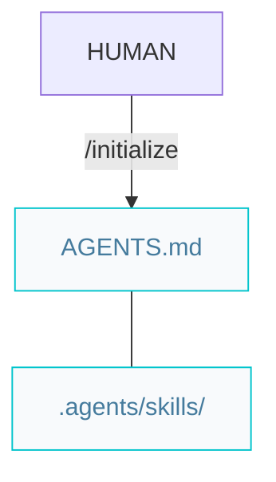
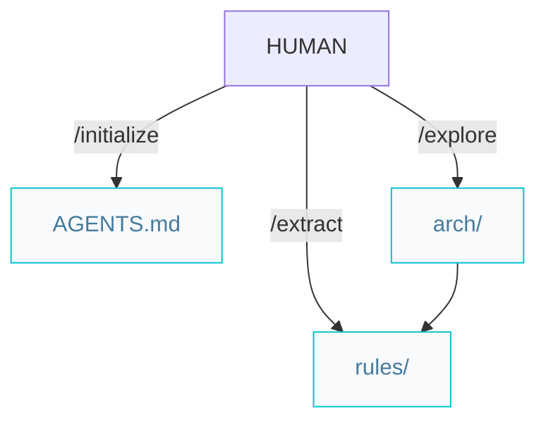

# Architect pipelines

Paths below are under `{Product_Folder}` (default `.product/`).

## Greenfield projects from scratch

`/initialize` confirms `.agents/skills/` exists and commits `AGENTS.md` via [shared/git.md](../.agents/skills/shared/git.md).

## Brownfield projects with legacy code

`/explore` and `/extract` use the [incremental artifact pattern](../.agents/skills/shared/incremental-artifact.md) — one file per run. Git: [shared/git.md](../.agents/skills/shared/git.md). When complete, start features with `/specify`.
