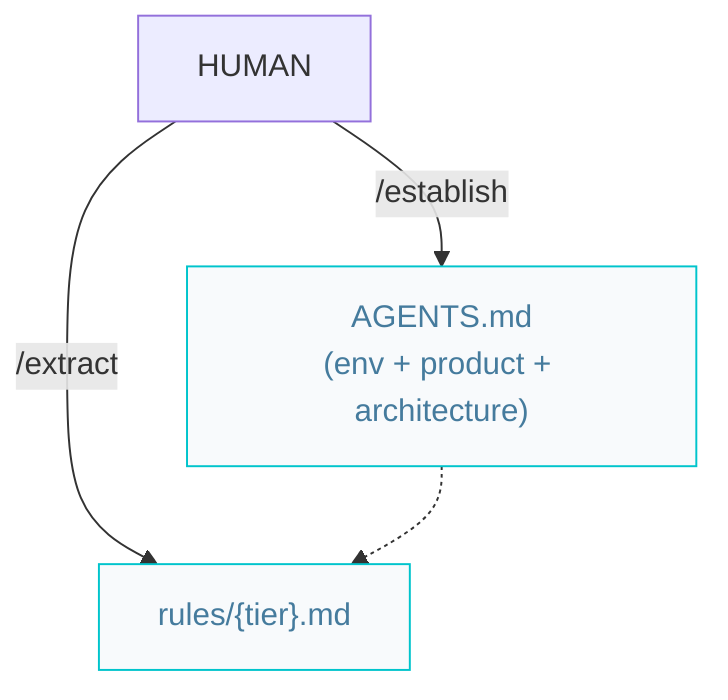

# Architect pipelines

Per-tier files live under `{Rules_Folder}` (default `rules/`); the system architecture lives in root `AGENTS.md`.

## Architecture pipeline (greenfield or brownfield)



### Workflow

```markdown
/establish -> /extract
```

Both steps are **mode-aware**: they prescribe on greenfield (no source code) and describe from the codebase on brownfield.

- `/establish` writes root `AGENTS.md` and `SOUL.md`. `AGENTS.md` carries the environment, the product brief, and the **Architecture** section — C4 L2 containers, inter-container communication, and the decisions that constrain planning.
- `/extract` produces one `{tier}.md` per invocation under `{Rules_Folder}`. Each combines the tier's C4 L3 architecture, the domain entities it owns, and its coding conventions, with `globs` frontmatter so it auto-applies to the tier's sources. When every tier is documented, start features with `/specify`.

## UI

There is no separate design spec. UI behavior is captured two ways: durable conventions and tokens for a presentation tier live in that tier's `{tier}.md` (`/extract`); per-feature UI behavior lives in the feature's spec (`/specify`) as UI acceptance criteria. `/codify` implements UI surfaces from those. After UI is built, run `/review` (a11y, security, performance — fixed in the same pass); optionally `/refactor` for clean-code passes.
