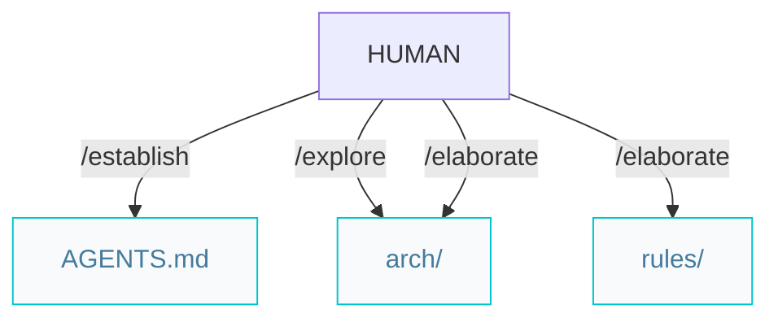
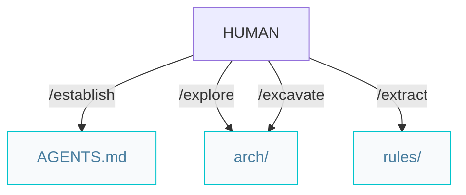
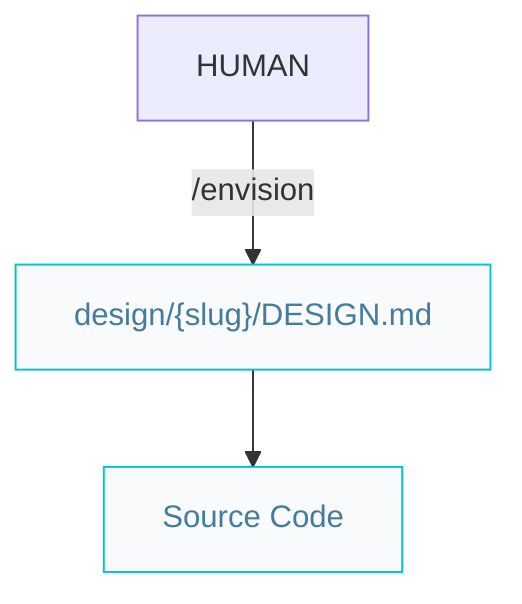

# Architect pipelines

Paths below are under `{Product_Folder}` (default `.product/`).

## Greenfield projects from scratch


### Workflow

```markdown
/establish -> /explore -> /elaborate
```

`/elaborate` prescribes one tier per invocation: `{tier}.arch.md` and `{tier}.rules.md`. When every tier is done, it writes `ER.md`, then you can start features with `/specify`.

## Brownfield projects with legacy code



### Workflow

```markdown
/establish -> /explore -> /excavate -> /extract
```

## UI from design spec

Paths below are under `{Product_Folder}` (default `.product/`).

### Standalone UI



Place the design spec at `design/{slug}/DESIGN.md` or pass a path explicitly. Use existing `feat/{slug}` or create it per `AGENTS.md` before UI commits (same as `/codify`). Format reference: [DESIGN.md](../.agents/skills/envision/DESIGN.md). Git: [`/envision`](../.agents/skills/envision/SKILL.md) and [`/repository`](../.agents/skills/repository/SKILL.md).

### Optional: spec-driven UI work

For design systems that are part of a product feature:


Then `/review` on the implementation (a11y, security, performance — findings are fixed in the same pass); optionally `/refactor` for clean-code passes.