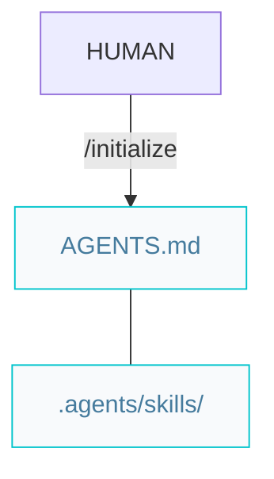
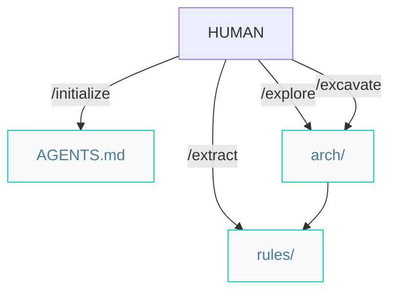

# Architect pipelines

Paths below are under `{Product_Folder}` (default `.product/`).

## Greenfield projects from scratch

`/initialize` confirms `.agents/skills/` exists and commits `AGENTS.md` via `/repository` per `AGENTS.md` git rules.

## Brownfield projects with legacy code

`/explore` and `/excavate` and `/extract` run incrementally — one file per invocation ([explore](../.agents/skills/explore/SKILL.md), [excavate](../.agents/skills/excavate/SKILL.md), [extract](../.agents/skills/extract/SKILL.md)). Mode order: explore `system` → tier arch → `adr` / `er`; excavate `naming` → tier rules → `testing` (or `all` for every missing mode). Each invocation commits via [`/repository`](../.agents/skills/repository/SKILL.md). When arch is complete, `/explore` suggests `/extract`; when rules are complete, start features with `/specify`.
