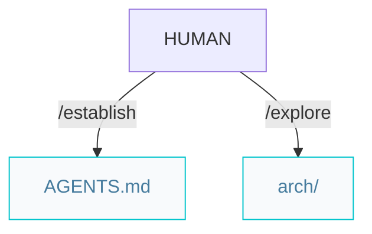
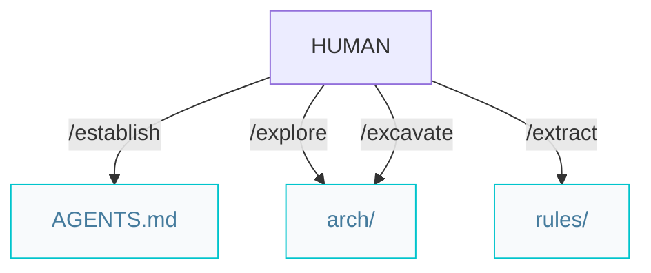

# Architect pipelines

Paths below are under `{Product_Folder}` (default `.product/`).

## Greenfield projects from scratch


### Workflow

```markdown
/establish -> /explore
```

## Brownfield projects with legacy code



### Workflow

```markdown
/establish -> /explore -> /excavate -> /extract
```